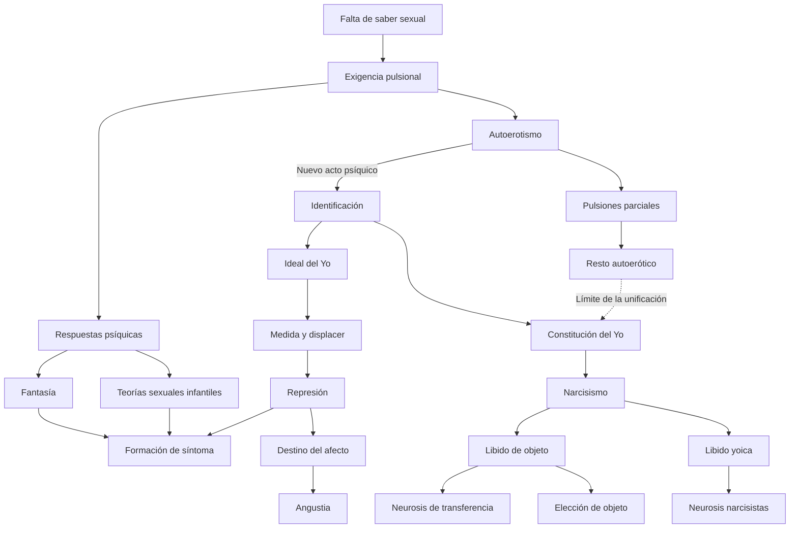
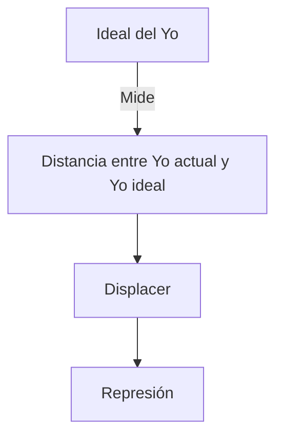
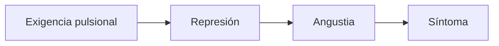

# Seminarios

## La pregunta que organiza el espacio

Seminarios aporta el puente entre la exigencia pulsional y la constitución del yo. Su pregunta podría formularse así:

> ¿Qué respuestas construye el psiquismo frente a una sexualidad que no dispone de instinto, objeto natural ni saber completo?

El recorrido enlaza fantasía, teorías sexuales infantiles, narcisismo, identificación, elección de objeto, ideales y angustia.

## Mapa conceptual del recorrido

Seminarios muestra que el psiquismo no recibe pasivamente una sexualidad ya organizada. Construye respuestas, unidades e ideales. La \concept{identificación} constituye al \concept{Yo}, pero no absorbe toda la parcialidad: queda un *resto autoerótico*. Desde esa organización, ciertas satisfacciones producen conflicto, pueden caer bajo la \concept{represión} y retornar como síntoma o angustia.

## 1. De la teoría traumática a la fantasía

Freud abandona la necesidad de un adulto seductor real como causa universal. En la Carta 69 reconoce haber sobrevalorado la realidad efectiva e infravalorado la fantasía.

El desplazamiento puede resumirse así:

| Antes | Después |
|---|---|
| Factor accidental: seducción por un adulto | Factor constitutivo: pulsión |
| Realidad acontecida como garantía causal | Realidad psíquica y fantasía eficaz |
| Sexualidad patógena en ciertos casos | Sexualidad infantil universal |

La fantasía constituye una respuesta del aparato a la exigencia pulsional. No es lo opuesto de una causa real: posee eficacia para el síntoma porque el inconsciente no dispone por sí mismo de un signo que distinga lo ocurrido de lo fantaseado.

## 2. Juego, fantaseo y creación literaria

El niño que juega crea un mundo e inserta los elementos de la realidad en un orden que le agrada. El juego es serio por el monto de afecto que emplea; su contrario no es la seriedad, sino la realidad efectiva.

Nadie renuncia fácilmente a una fuente de placer. Al crecer, el juego no desaparece: se permuta en fantasía o sueño diurno.

El motor del fantaseo son deseos insatisfechos. La fantasía enlaza:

La creación literaria transforma el fantaseo privado mediante encubrimiento y variación. Además ofrece una prima de placer formal o estético que permite acceder a satisfacciones que, presentadas directamente, producirían rechazo o vergüenza.

La fantasía inconsciente participa en la formación del síntoma y puede funcionar como un estadio previo a él.

## 3. Teorías sexuales infantiles

Los niños investigan porque encuentran una falta en el saber. Preguntan por su origen y reciben respuestas que no concuerdan con las exigencias y sensaciones de su propio cuerpo.

La \concept{ignorancia que no se deja sustituir} no equivale a falta de información accidental. Surge de la imposibilidad de disponer de un saber instintivo completo sobre la sexualidad.

Las teorías son falsas para el conocimiento adulto y contienen fragmentos de verdad respecto de la organización sexual infantil.

### Premisa universal del pene

El niño atribuye el mismo genital a todos y desmiente la diferencia percibida. La teoría parte de la organización genital infantil y tropieza con una diferencia que no puede integrar.

### Teoría de la cloaca

Los niños serían concebidos por la boca y expulsados por el ano. La teoría se sostiene en las organizaciones oral y anal y en el desconocimiento de la vagina.

### Concepción sádica del coito

La escena sexual se interpreta como dominación, lucha o ejercicio de poder. La actividad y la pasividad se organizan según el apoderamiento.

Estas teorías son reprimidas, pero permanecen eficaces en síntomas, sueños, chistes y modos posteriores de investigar o inhibirse.

## 4. Pies o zapatos abochornados

El ejemplo muestra cómo una teoría infantil puede conservar eficacia. La paciente asocia aprender algo nuevo con una escena infantil de comparación con el hermano y envidia del pene. La investigación sexual reprimida retorna como inhibición.

El caso permite articular:

- premisa universal del pene;
- investigación sexual infantil;
- represión;
- inhibición ante el saber;
- transferencia y resistencia.

## 5. Órgano de doble función

En *La perturbación psicógena de la visión*, el ojo sirve simultáneamente a la autoconservación y a la sexualidad. Cuando la pulsión sexual toma al órgano como zona de satisfacción, entra en conflicto con las exigencias yoicas. La represión sexual deja al órgano perturbado.

Este modelo introduce el primer dualismo:

| Pulsiones yoicas o de autoconservación | Pulsiones sexuales |
|---|---|
| Energía: interés | Energía: libido |
| Conservación del individuo | Placer de órgano y satisfacción sexual |

La ceguera histérica muestra que el síntoma no es irracional desde el punto de vista pulsional: el órgano queda tomado por el conflicto y la satisfacción sustitutiva.

## 6. Introducción del narcisismo

Freud retira el narcisismo del campo exclusivo de la perversión y lo sitúa como colocación libidinal regular del desarrollo sexual.

La serie trabajada es:

### Autoerotismo

- campo de pulsiones parciales;
- zonas erógenas no unificadas;
- satisfacción en el cuerpo propio;
- apuntalamiento en funciones de autoconservación.

El yo no existe todavía como unidad originaria.

### Nuevo acto psíquico

Una identificación permite constituir al yo como primer objeto unificado de la libido. El narcisismo requiere esa unidad y no debe confundirse sin más con el autoerotismo.

### Libido yoica y libido de objeto

No son dos energías heterogéneas. Son localizaciones de una misma libido, que puede desplazarse económicamente:

En el enamoramiento se engrandece el objeto y se empobrece el yo. En la retirada narcisista se concentra libido en el yo y disminuye el interés libidinal por el mundo.

El \concept{narcisismo primario} no se observa directamente: se reconstruye como supuesto lógico. La sobreestimación parental permite inferirlo cuando los padres depositan en el niño la perfección y los deseos que debieron resignar, condensados en la fórmula *His Majesty the Baby*.

## 7. Campo parcial, unificación y resto

El pasaje al narcisismo no unifica toda la sexualidad. Queda un resto autoerótico que no pasa al yo ni a los objetos unificados.

| Campo parcial | Campo unificado |
|---|---|
| Zonas erógenas | Yo y objetos totales |
| Pulsiones parciales | Libido yoica y de objeto |
| Resto no integrable | Síntesis yoica |

El yo funciona como unidad, pero esa unidad es incompleta. El resto autoerótico marca un punto de irreversibilidad y limita toda pretensión de satisfacción total.

## 8. Elección de objeto

### Anaclítica o por apuntalamiento

El objeto se elige siguiendo las funciones de cuidado, nutrición y protección ejercidas por las figuras primarias.

### Narcisista

El objeto vale por su relación con el propio yo. Freud distingue cuatro modalidades:

- lo que uno es;
- lo que uno fue;
- lo que uno quisiera ser;
- la persona que alguna vez fue parte de uno, como el hijo.

El acento puede recaer en ser amado más que en amar.

Toda elección conserva rasgos de parcialidad y funciona como reencuentro con marcas anteriores.

### Diferencia psicopatológica

La clase del 06/08 marca como eje del parcial la diferencia entre:

- \concept{neurosis de transferencia}: la libido conserva o recupera investiduras de objeto y puede dirigirse al analista;
- \concept{neurosis narcisistas}: la libido se encuentra retirada hacia el yo, lo que dificulta constituir al analista como objeto transferencial.

## 9. Yo ideal e Ideal del Yo

Las notas distinguen tres términos:

- **\concept{Yo actual}:** estado presente del yo;
- **\concept{Yo ideal}:** imagen de completitud que conserva el narcisismo infantil;
- **\concept{Ideal del Yo}:** instancia ordenadora que mide la distancia entre el yo actual y una exigencia ideal.

El Ideal del Yo se arma con identificaciones y rasgos de las figuras parentales y sociales. Es condición de la represión porque determina qué satisfacciones resultan inconciliables y producen displacer.

La clase recuperada agrega que el origen de la represión no se reduce a una prohibición externa: parte del *respeto del yo por sí mismo*, es decir, de una exigencia interiorizada desde la cual el yo mide sus satisfacciones.

La identificación primordial con el padre de la prehistoria personal permite articular esta construcción con *Tótem y tabú*. Se trata de un paralelismo entre espacios de la cátedra, no de una identidad entre conceptos.

## 10. Angustia: de la cantidad somática a la serie neurótica

### Primera teoría

- alteración de la sexualidad actual;
- cantidad somática no enlazada a representaciones;
- ausencia de conflicto psíquico y represión;
- neurosis no tratable mediante interpretación analítica.

### Entrada en la metapsicología

Con la pulsión y la represión, representación y monto de afecto pueden recibir destinos diferentes. El monto puede sofocarse, aparecer como afecto cualificado o mudarse en angustia.

Lo nuevo es que la angustia ya no queda fuera del conflicto psíquico: puede surgir como consecuencia del destino impuesto por la represión.

La clase del 20/08 fija la serie común de las neurosis de transferencia:

El síntoma intenta ligar, acotar o evitar la angustia. La forma cambia en cada neurosis, pero la serie permanece. La fobia lo muestra con especial claridad: liga la angustia a un peligro exterior y permite organizar medidas de evitación frente a una exigencia pulsional interna.

La Conferencia 25 agrega el factor común entre angustia realista y neurótica: ambas son respuestas *ante un peligro*. En la primera, el peligro es exterior; en la segunda, es la propia exigencia pulsional.

El desarrollo completo se encuentra en [Angustia y serie de las neurosis de transferencia](../03-sintesis-integrada/16-angustia-y-serie-de-las-neurosis-de-transferencia.md).

## Eje de examen

Seminarios permite construir una respuesta que una módulos 3 y 4: la pulsión exige trabajo; fantasías y teorías sexuales constituyen respuestas; la identificación forma una unidad yoica y un ideal; desde esa organización ciertas satisfacciones devienen inconciliables y pueden ser reprimidas. Narcisismo no es entonces un tema intermedio aislado, sino una condición para comprender el conflicto y la represión.
