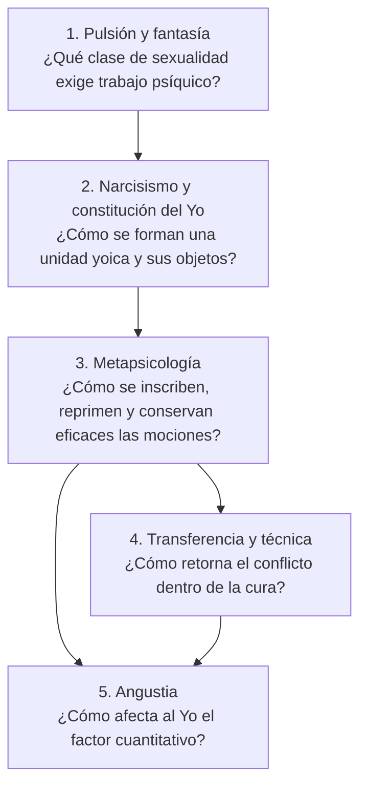
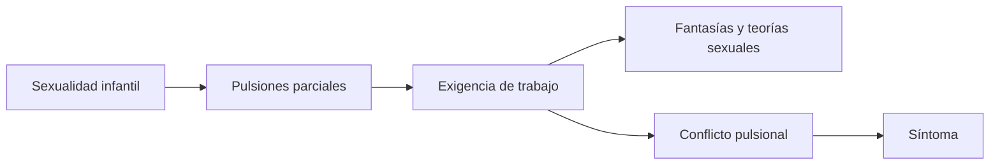
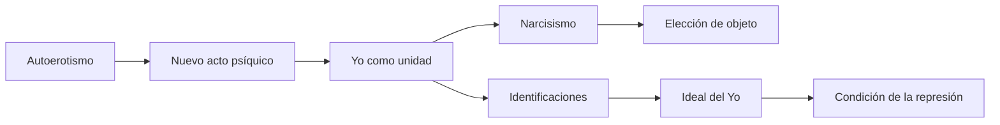
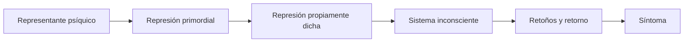
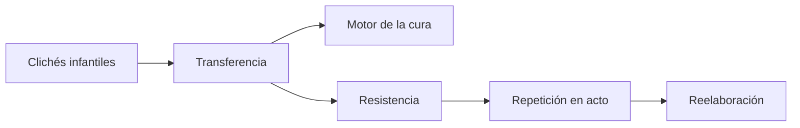
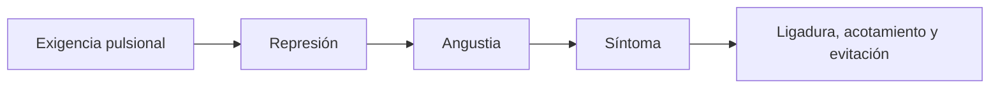

# Mapa de los cinco arcos de lectura

## Para qué sirve esta organización

La tabla maestra permite localizar cada texto, pero no muestra de inmediato **por qué Freud necesita pasar de uno a otro**. Los cinco arcos ofrecen una lectura top-down: cada uno reúne escritos que responden a un mismo problema y prepara el siguiente.

No son compartimentos cerrados. Algunos textos funcionan como bisagras y reaparecen en más de un arco.

## Arco 1 — Pulsión y fantasía

### Pregunta organizadora

¿Cómo pensar una sexualidad infantil, parcial y no naturalmente orientada, y qué respuestas psíquicas se construyen frente a ella?

### Textos centrales

1. [*Tres ensayos de teoría sexual*](02-tres-ensayos-de-teoria-sexual.md).
2. [*Mis tesis sobre el papel de la sexualidad en la etiología de las neurosis*](03-mis-tesis-sobre-el-papel-de-la-sexualidad.md).
3. [*Pulsiones y destinos de pulsión*](05-pulsiones-y-destinos-de-pulsion.md).
4. [*El creador literario y el fantaseo*](06-el-creador-literario-y-el-fantaseo.md).
5. [*Sobre las teorías sexuales infantiles*](07-sobre-las-teorias-sexuales-infantiles.md).
6. [*La perturbación psicógena de la visión*](08-la-perturbacion-psicogena-de-la-vision.md).

### Movimiento

## Arco 2 — Narcisismo y constitución del Yo

### Pregunta organizadora

Si las pulsiones son inicialmente parciales y autoeróticas, ¿cómo se constituye un yo capaz de tomarse como objeto, elegir objetos y medir sus satisfacciones?

### Textos centrales

1. *Introducción del narcisismo*.
2. *Psicología de las masas y análisis del yo*, capítulo VII.
3. *Tótem y tabú*, capítulo IV, §§5–6.

### Movimiento

## Arco 3 — Metapsicología

### Pregunta organizadora

¿Cómo puede una representación ser rechazada de la conciencia y, sin embargo, conservar eficacia psíquica?

### Textos centrales

1. *La represión*.
2. *Nota sobre el concepto de lo inconsciente en psicoanálisis*.
3. *Lo inconsciente*.

### Movimiento

## Arco 4 — Transferencia y técnica

### Pregunta organizadora

¿Qué ocurre cuando el conflicto reprimido no se recuerda como relato, sino que se actualiza con el analista?

### Textos centrales

1. *Sobre la dinámica de la transferencia*.
2. *Puntualizaciones sobre el amor de transferencia*.
3. *Recordar, repetir y reelaborar*.

### Movimiento

## Arco 5 — Angustia

### Pregunta organizadora

¿Cómo pasa la angustia de ser una cantidad somática exterior al análisis a ocupar el centro de las neurosis de transferencia?

### Textos centrales

1. *Sobre el psicoanálisis silvestre*.
2. Conferencia 25, *La angustia*.
3. *La represión*, como texto bisagra.

### Movimiento

## El recorrido completo en una frase

La pulsión introduce una sexualidad parcial que exige respuestas psíquicas; identificaciones e ideales constituyen al yo y sus objetos; la represión funda y mantiene una eficacia inconsciente; ese conflicto retorna como síntoma, transferencia y repetición, mientras la angustia afecta al yo y promueve nuevas defensas.

## Cómo estudiar con los arcos

Para cada arco conviene poder realizar tres operaciones:

1. **Localizar:** qué problema resuelve cada texto.
2. **Articular:** qué concepto recibe del texto anterior y cuál entrega al siguiente.
3. **Responder:** reconstruir el movimiento sin limitarse a enumerar definiciones.

Las fichas particulares desarrollan esas tres operaciones y terminan con una respuesta concentrada posible.
