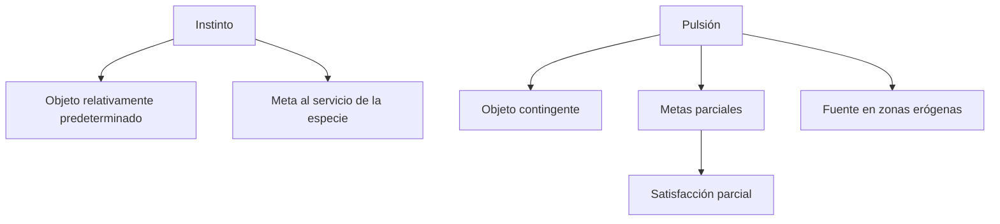
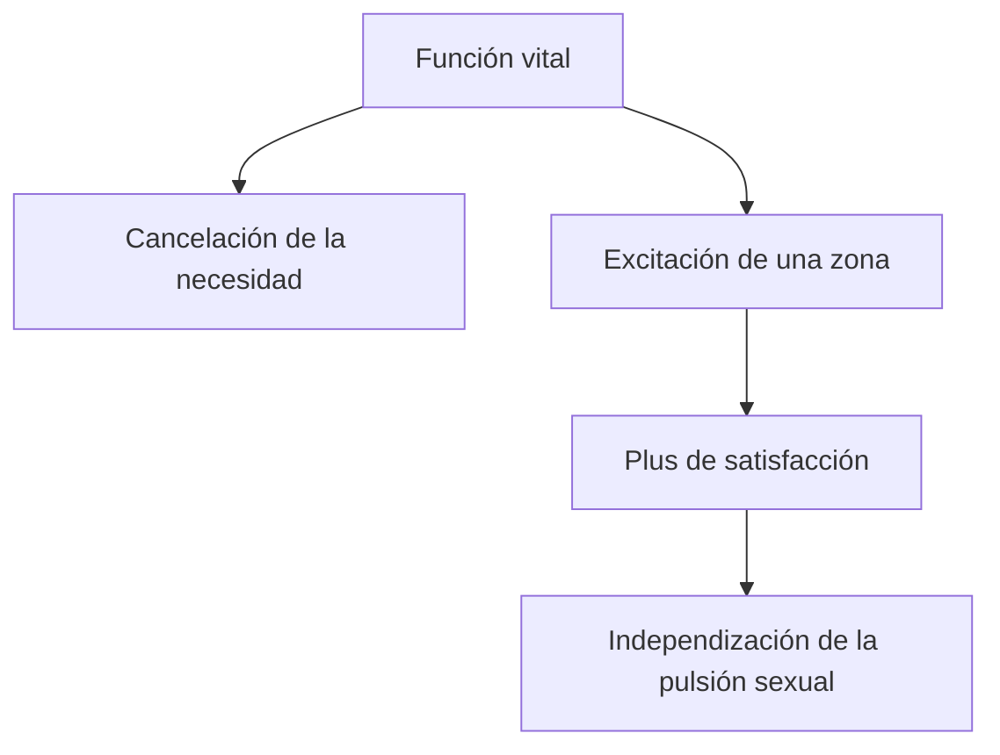
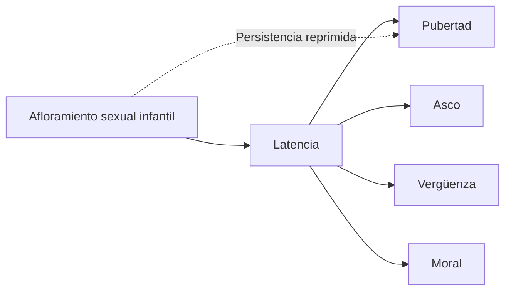
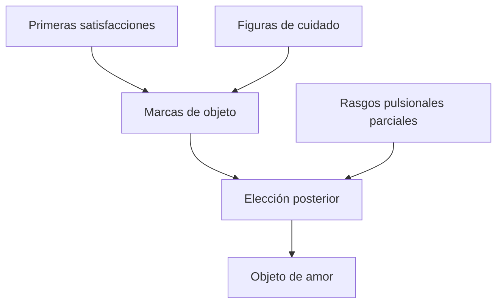
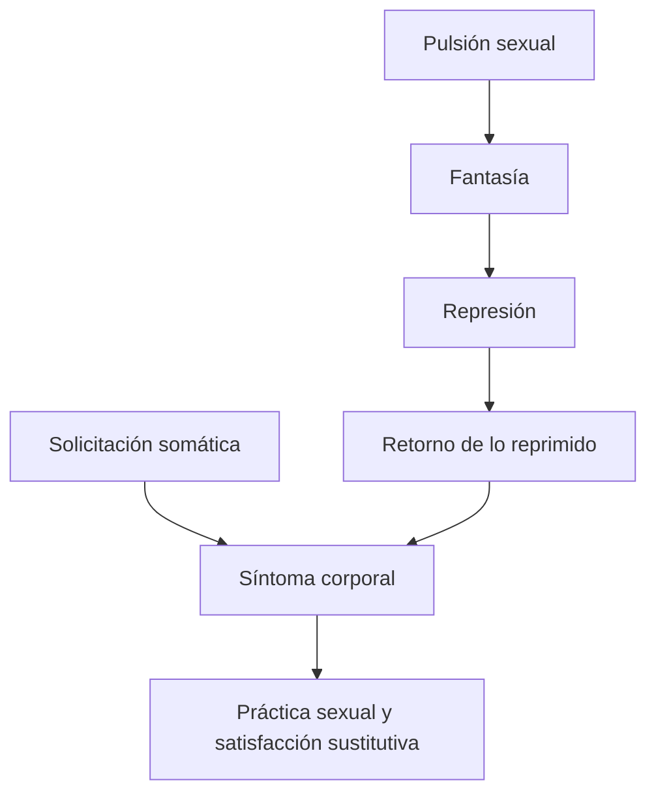

# Tres ensayos de teoría sexual

## Ficha de ubicación

| Dato | Referencia |
|---|---|
| Año | 1905, con agregados posteriores |
| Edición | Amorrortu, volumen VII |
| Prácticos | Cap. I, puntos 4 y 5; cap. II: pp. 148–154 y 157–188 |
| Seminarios | Cap. III, punto 5: pp. 202–210 |
| Problema | Construir una teoría de la sexualidad humana no reducida a instinto, genitalidad ni reproducción. |

## La intervención del texto

Freud desarma la oposición simple entre una sexualidad normal, naturalmente orientada, y perversiones entendidas como anomalías completamente ajenas a ella.

La variabilidad de objetos y metas muestra que la sexualidad humana no funciona según un instinto con objeto predeterminado. Los componentes llamados perversos aparecen también en la vida sexual ordinaria, en la infancia y en los síntomas neuróticos.

> **Tesis del texto.** La sexualidad humana está compuesta por \concept{pulsiones parciales} cuyo objeto es variable y cuyas satisfacciones no se encuentran originariamente subordinadas a la reproducción.

## Pulsión frente a instinto

La \concept{pulsión} no dispone de un saber natural que garantice el encuentro con un objeto complementario. Puede cambiar de objeto, fijarse a uno particular o satisfacerse por caminos alejados de la genitalidad.

## Objeto y meta sexuales

Freud examina desviaciones respecto del objeto y de la meta para mostrar que ambos términos pueden variar de manera relativamente independiente.

- El \concept{objeto sexual} es aquello hacia lo cual se dirige la pulsión.
- La \concept{meta sexual} es la acción hacia la cual esfuerza la pulsión.

La elección de una persona del mismo sexo, el fetichismo, mirar, mostrarse o producir dolor dejan de ser curiosidades externas a la teoría. Revelan componentes presentes en la estructura de la sexualidad.

> **Distinción decisiva.** *Pulsión sexual perversa* no equivale a *persona perversa*. Un componente parcial puede participar en una neurosis sin organizar toda la posición clínica del sujeto.

## El síntoma neurótico

Freud articula neurosis y sexualidad mediante una fórmula fuerte:

> **Fórmula de Freud trabajada por la cátedra.** Los \concept{síntomas} son la práctica sexual de los enfermos.

El síntoma no representa simplemente la ausencia de sexualidad. Una moción sexual reprimida encuentra allí una vía deformada de expresión y satisfacción.

El padecimiento consciente no impide que la pulsión obtenga satisfacción. Esto explica la persistencia del síntoma y la insuficiencia de una decisión voluntaria para abandonarlo.

## Sexualidad infantil

La sexualidad infantil no es un antecedente excepcional de la neurosis. Es universal y posee formas propias antes de la pubertad.

### Tres características de sus exteriorizaciones

1. \concept{Apuntalamiento} en una función corporal importante para la vida.
2. \concept{Autoerotismo}: satisfacción en el cuerpo propio, sin un objeto total unificado.
3. \concept{Imperio de una zona erógena}: predominio de una zona corporal recortada como fuente de excitación.

> **Enumeración prioritaria.** Apuntalamiento, autoerotismo e imperio de la zona erógena constituyen los tres caracteres que la profesora volvió a jerarquizar en el repaso.

## Apuntalamiento

La pulsión sexual emerge apoyada en una función de autoconservación. La boca satisface primero el hambre, pero el chupeteo puede repetirse cuando la necesidad ya cesó.

El apuntalamiento explica continuidad e independencia: la sexualidad nace en una función vital, pero no permanece subordinada a ella.

## Autoerotismo

La pulsión se satisface en el cuerpo propio y todavía no reconoce un objeto total comparable al yo o a otra persona unificada.

Autoerotismo no significa aislamiento del otro. El cuidado del otro constituye la zona y aporta el segundo estímulo mediante el cual se produce satisfacción.

## Zona erógena y paradoja de la satisfacción

La \concept{zona erógena} es una parte del cuerpo capaz de funcionar como fuente de excitación sexual. Para cancelar el estímulo interno se aplica sobre la zona un segundo estímulo exterior.

> **Fórmula de la cátedra.** La satisfacción pulsional cancela una excitación interna mediante un segundo estímulo aplicado sobre la fuente.

La zona puede producir placer consciente, dolor o una combinación. Lo decisivo es que queda incluida en un circuito repetible.

## Amnesia infantil, latencia y diques

La sexualidad se despliega en dos tiempos:

Asco, vergüenza y moral funcionan como \concept{diques} que inhiben manifestaciones sexuales. La amnesia infantil no prueba ausencia de sexualidad: indica su represión y reorganización posterior.

## Desarrollo en dos tiempos

La pubertad reactiva organizaciones infantiles y plantea una nueva coordinación bajo primacía genital. Pero las pulsiones parciales no desaparecen. Pueden integrarse como placer previo, quedar fijadas, sublimarse o participar en síntomas.

La sexualidad adulta no reemplaza limpiamente a la infantil. Se construye sobre sus marcas.

## Hallazgo de objeto

El hallazgo de objeto es, en realidad, un \concept{reencuentro}. Las primeras experiencias de satisfacción y cuidado dejan modelos que orientan elecciones posteriores.

El nuevo objeto no es idéntico al primero. Reactualiza rasgos, funciones y modos de satisfacción.

## Solicitación somática, fantasía y síntoma

La clase de repaso agregó una articulación que conviene conservar provisionalmente hasta contar con la transcripción completa.

Para que se forme un síntoma histérico no alcanza una fantasía aislada ni una predisposición corporal por sí sola. La \concept{solicitación somática} ofrece una vía corporal y la \concept{fantasía} organiza la satisfacción y el sentido psíquico.

> **Hipótesis de reconstrucción de la clase.** La fantasía media entre la exigencia pulsional y su expresión sintomática; la solicitación somática determina la vía corporal disponible para esa expresión.

Esta formulación deberá cotejarse con tus notas completas del repaso y con el pasaje de Dora utilizado por la profesora.

## Dora como articulación

El caso Dora permite reunir:

- solicitación somática;
- fantasía inconsciente;
- represión;
- retorno en un síntoma corporal;
- satisfacción sexual sustitutiva.

No conviene reducir el síntoma a una causa orgánica ni a una traducción simbólica única. Su formación requiere una convergencia de determinaciones corporales y psíquicas.

## Relación con *Mis tesis*

*Tres ensayos* construye positivamente la teoría de la sexualidad infantil. *Mis tesis* revisa retrospectivamente el cambio etiológico que hizo necesaria esa teoría.

| *Tres ensayos* | *Mis tesis* |
|---|---|
| ¿Cómo funciona la sexualidad humana? | ¿Cómo cambió la explicación de las neurosis? |
| Pulsión, parcialidad y zonas | Revisión de la seducción y factor constitutivo |
| Sexualidad infantil universal | Fantasías y recuerdos de neuróticos |
| Síntoma como práctica sexual | Nueva etiología sexual |

## Preguntas posibles

1. ¿Por qué la pulsión no equivale al instinto?
2. Desarrolle las tres características de las exteriorizaciones sexuales infantiles.
3. Explique la fórmula “los síntomas son la práctica sexual de los enfermos”.
4. Articule solicitación somática, fantasía, represión y síntoma en Dora.
5. ¿Por qué el hallazgo de objeto es un reencuentro?

## Errores frecuentes

- Reducir sexualidad a genitalidad.
- Confundir pulsión parcial con diagnóstico de perversión.
- Definir autoerotismo como ausencia de otros.
- Presentar latencia como desaparición de la sexualidad.
- Afirmar que el objeto pulsional es completamente indiferente: es contingente en la estructura, pero puede quedar fijado singularmente.
- Explicar el síntoma sólo por el cuerpo o sólo por una fantasía.

