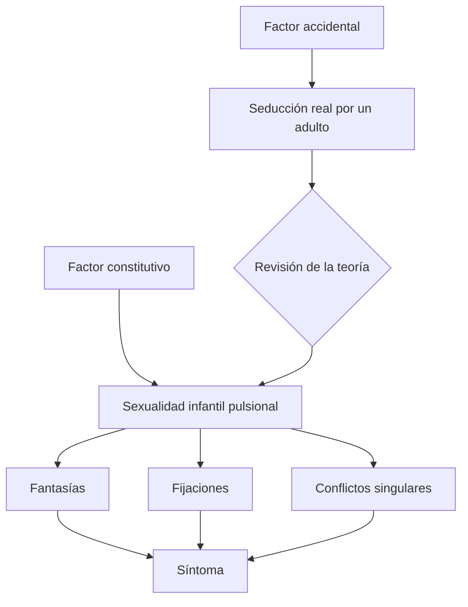
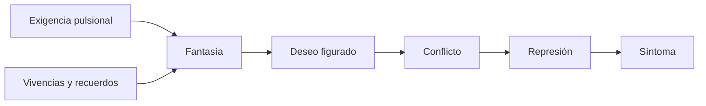
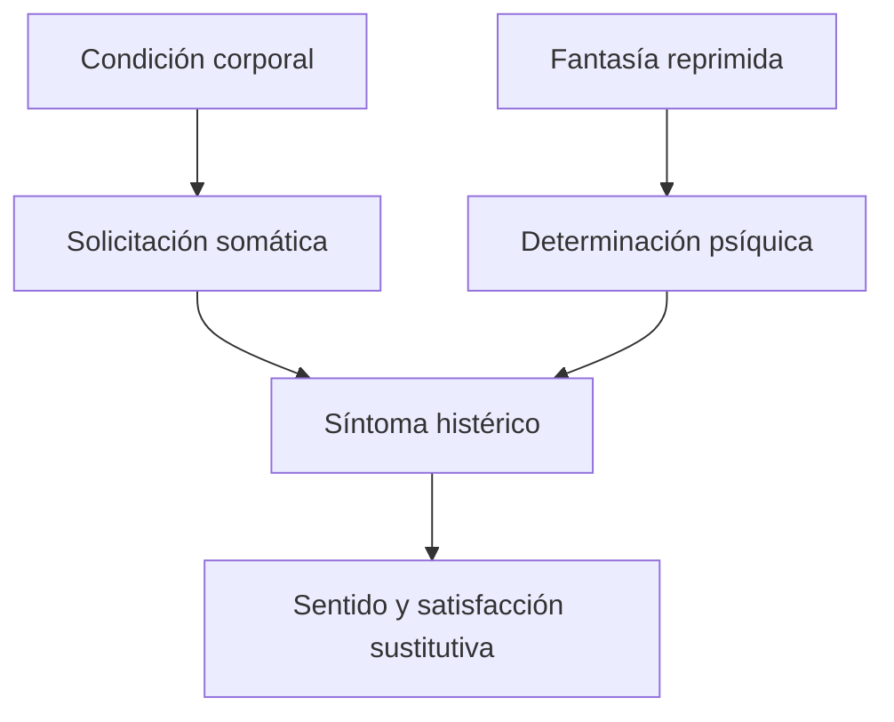

# Mis tesis sobre el papel de la sexualidad en la etiología de las neurosis

## Ficha de ubicación

| Dato | Referencia |
|---|---|
| Año | 1906, escrito en 1905 |
| Edición | Amorrortu, volumen VII |
| Páginas de guía | 263–271 |
| Espacio | Prácticos |
| Problema | Revisar la evolución de la teoría freudiana sobre la etiología sexual de las neurosis. |

## Un texto retrospectivo

Freud reconstruye cómo cambió su explicación de las neurosis. No presenta simplemente una nueva tesis: compara momentos, reconoce errores y conserva elementos de la teoría anterior bajo otra forma.

> **Tesis del texto.** Freud no abandona la etiología sexual cuando revisa la teoría de la seducción. Sustituye una causalidad basada en el acontecimiento accidental por una teoría de la sexualidad infantil pulsional, la fantasía y la constitución singular.

## Primer momento: escenas sexuales infantiles

En la teoría traumática, Freud atribuía las psiconeurosis a vivencias sexuales prematuras producidas por adultos.

La pasividad sexual infantil explicaría la histeria y una actividad posterior, precedida por pasividad, la neurosis obsesiva.

El modelo conservaba dos hallazgos fundamentales:

- importancia de la infancia;
- eficacia diferida de la sexualidad.

Su problema era convertir una escena exterior específica en condición universal.

## La dificultad clínica

Freud encuentra que los relatos no permiten distinguir de manera segura escenas acontecidas y fantasías. Si todos los padres hubieran sido seductores, la frecuencia exigida por la teoría resultaba inverosímil.

La revisión no equivale a concluir que los pacientes mentían. Una fantasía puede ser inconsciente, producir convicción y tener eficacia sin constituir un recuerdo fiel.

> **Distinción decisiva.** Fantasía no significa engaño consciente. Es una realidad psíquica capaz de organizar deseo, afecto y síntoma.

## Del accidente a la constitución

El factor constitutivo es universal, pero sus inscripciones son singulares. Todos atraviesan una sexualidad infantil; no todos construyen las mismas fantasías ni producen los mismos síntomas.

## Qué significa “sexual”

La revisión sólo es posible después de ampliar la sexualidad en *Tres ensayos*. “Sexual” ya no significa exclusivamente coito genital o excitación puberal.

Incluye:

- pulsiones parciales;
- zonas erógenas;
- autoerotismo;
- fantasías;
- placer de órgano;
- elecciones y fijaciones de objeto.

Así, la etiología permanece sexual sin depender de una relación genital real entre niño y adulto.

## Infancia universal, neurosis singular

Si la sexualidad infantil es universal, por sí sola no explica por qué alguien enferma. La causalidad debe incorporar series complementarias de factores.

El texto prepara una explicación donde participan:

- constitución sexual;
- experiencias infantiles;
- fantasías;
- fijaciones;
- conflictos posteriores;
- represión.

> **Fórmula de trabajo.** Lo universal es la sexualidad infantil; lo singular es su organización, sus fijaciones y los destinos que recibe bajo conflicto.

## El papel de la fantasía

La fantasía permite conservar algo de la escena de seducción sin exigir que haya ocurrido de manera literal. Puede construir una escena que organice una satisfacción pulsional y una defensa.

En este sentido, la fantasía no es un elemento que se agrega después de la pulsión. Constituye uno de los modos mediante los cuales el aparato responde y ofrece una escena a la satisfacción.

## La fantasía entre *Mis tesis* y *Tres ensayos*

La profesora jerarquizó la fantasía al repasar juntos ambos textos. La articulación puede reconstruirse así:

1. *Tres ensayos* muestra que la sexualidad infantil es pulsional y parcial.
2. *Mis tesis* revisa la causalidad basada en la seducción real.
3. La fantasía enlaza la exigencia pulsional con escenas, deseos y defensas.
4. Al caer bajo represión, puede participar en la formación del síntoma.

> **Hipótesis para cotejar con el repaso.** \concept{Práctica sexual} → \concept{fantasía} → \concept{represión} → \concept{síntoma} nombra el recorrido por el cual una satisfacción pulsional es organizada psíquicamente, rechazada y realizada de manera sustitutiva.

La flecha no debe leerse como una cronología rígida. La fantasía puede reorganizarse retroactivamente y el síntoma posee múltiples determinaciones.

## Solicitación somática

La nueva etiología no elimina el cuerpo. En la histeria, una \concept{solicitación somática} ofrece la vía corporal para la expresión de una fantasía reprimida.

No hay que elegir entre explicación corporal y psíquica. El síntoma histérico se forma allí donde una vía corporal puede ser tomada por una determinación psíquica.

## Dora

Los fragmentos de Dora seleccionados por la guía permiten estudiar esa convergencia. Un síntoma corporal puede:

- apoyarse en una condición somática;
- representar una fantasía;
- expresar identificaciones y relaciones de objeto;
- realizar una satisfacción pulsional reprimida.

La profesora parece haber utilizado Dora para dar un orden rápido entre práctica sexual, fantasía, represión y síntoma. La formulación exacta debe esperar la transcripción completa de la clase.

## Lo que se conserva de la teoría traumática

La revisión no borra todo lo anterior:

- la infancia continúa siendo decisiva;
- las vivencias poseen eficacia;
- la temporalidad no es lineal;
- el síntoma está determinado psíquicamente;
- la sexualidad permanece en el centro.

Lo que cambia es la necesidad de una escena real uniforme como origen último.

## Relación con textos posteriores

### *El creador literario y el fantaseo*

Desarrolla la fantasía como cumplimiento de deseo y articulación entre pasado, presente y futuro.

### *Sobre las teorías sexuales infantiles*

Muestra construcciones universales producidas por el niño frente a una falta de saber.

### *Pulsiones y destinos de pulsión*

Formaliza el factor constitutivo que reemplazó al accidente universalizado.

### *La represión*

Explica el mecanismo mediante el cual fantasías y representaciones quedan excluidas y retornan.

## Preguntas posibles

1. ¿Qué revisa Freud en *Mis tesis* y qué conserva de su teoría anterior?
2. Diferencie factor accidental y factor constitutivo.
3. ¿Por qué abandonar la teoría de la seducción no significa abandonar la etiología sexual?
4. ¿Qué estatuto adquiere la fantasía?
5. Articule *Mis tesis*, *Tres ensayos* y Dora.

## Errores frecuentes

- Afirmar que Freud descubre que sus pacientes mentían.
- Suponer que deja de considerar importantes las vivencias reales.
- Reducir fantasía a imaginación consciente.
- Confundir sexualidad infantil con genitalidad precoz.
- Convertir el factor constitutivo en determinismo biológico.
- Explicar el síntoma por una sola causa.

