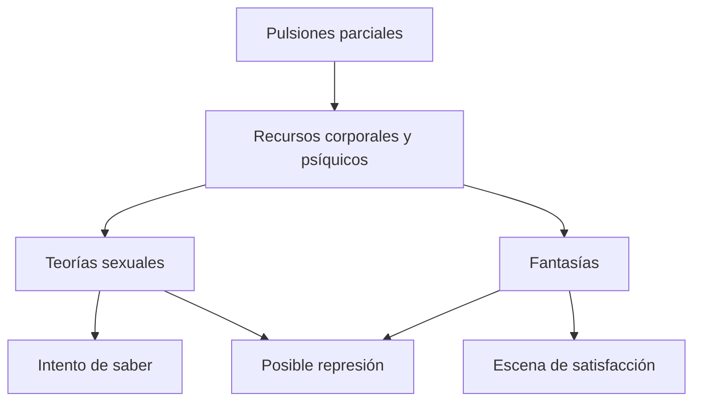

# *Sobre las teorías sexuales infantiles*

## Ubicación

- **Año:** 1908.
- **Edición:** Amorrortu, tomo IX.
- **Recorte de la guía:** pp. 187–201.
- **Espacios:** teóricos y seminarios.
- **Arco:** pulsión y fantasía.

## El problema del texto

El niño no recibe pasivamente un saber adulto sobre la sexualidad. Frente a preguntas urgentes y a una falta de saber, investiga y produce teorías con los recursos de su propia organización pulsional.

> **Tesis central.** Las teorías sexuales infantiles son erróneas respecto de la anatomía y el saber adulto, pero contienen un fragmento de verdad porque expresan la organización pulsional infantil.

## La ocasión de investigar

La investigación suele ser impulsada por problemas prácticos: la llegada real o temida de un hermano, el origen de los niños y la amenaza de perder el amor o los cuidados parentales.

La pregunta no nace de una curiosidad intelectual neutral. Está movida por intereses pulsionales y por la posición del niño en el vínculo con los adultos.

## El fracaso de la información

Los adultos pueden callar, engañar o proporcionar una explicación correcta que el niño todavía no puede integrar. La información no borra automáticamente las teorías construidas porque estas no son simples errores cognitivos: están sostenidas por la pulsión, la fantasía y los límites de la organización infantil.

Este punto enlaza el texto con *El esclarecimiento sexual del niño* y, más adelante, con la crítica al psicoanálisis silvestre: **informar no equivale a elaborar**.

## Tres teorías típicas

### Premisa universal del pene

El niño atribuye a todos los seres humanos un genital masculino. La diferencia anatómica no se reconoce de inmediato como diferencia sexual y puede ser desmentida o reinterpretada.

Esta teoría toma como medida el propio cuerpo y muestra el límite del saber infantil.

### Teoría de la cloaca

Si el niño desconoce la vagina, imagina el nacimiento según el modelo de la evacuación: el bebé sería expulsado por el intestino.

La teoría contiene un fragmento de verdad pulsional porque se apoya en el erotismo anal y en experiencias corporales conocidas.

### Concepción sádica del coito

El coito es interpretado como sometimiento, lucha o agresión. La escena sexual puede ser percibida sin comprenderse y organizada mediante componentes sádicos de la sexualidad infantil.

## Teoría, fantasía y pulsión

Las teorías sexuales no son equivalentes a las fantasías, pero se articulan con ellas. La teoría intenta responder a un enigma; la fantasía construye una escena de deseo y satisfacción. Ambas utilizan materiales disponibles en la organización pulsional.

## Investigación, inhibición y síntoma

La investigación puede ser reprimida junto con sus teorías. Sus destinos reaparecen luego como inhibición intelectual, compulsión de pensamiento, fantasía, síntoma o transferencia.

El caso de los “pies o zapatos abochornados” trabajado en seminarios muestra que un saber infantil reprimido puede retornar en una dificultad actual y desplegarse en la relación analítica.

## Fragmento de verdad

La verdad de estas teorías no reside en que describan correctamente la reproducción adulta. Se encuentra en aquello que revelan sobre:

- la primacía de determinadas zonas erógenas;
- las pulsiones parciales;
- la posición del niño frente al deseo de los adultos;
- los límites de su saber;
- las soluciones singulares construidas frente al enigma.

## Errores frecuentes

- Tratar las teorías como ocurrencias ingenuas sin eficacia posterior.
- Suponer que una explicación biológica correcta las elimina.
- Decir que son simplemente verdaderas o simplemente falsas.
- Confundir teoría sexual infantil y fantasía.
- Olvidar que la investigación está movida por intereses pulsionales.

## Preguntas posibles

- ¿Por qué investiga el niño?
- ¿En qué sentido las teorías sexuales son falsas y verdaderas?
- Desarrolle las tres teorías típicas.
- ¿Por qué fracasa la información adulta?
- Articule investigación sexual, represión e inhibición.

## Respuesta concentrada posible

> Freud sostiene que el niño investiga la sexualidad porque enfrenta enigmas que afectan su posición, como el nacimiento de un hermano. Ante una falta de saber produce teorías con los recursos de su organización pulsional. Las tres teorías típicas son la premisa universal del pene, la teoría de la cloaca y la concepción sádica del coito. Son falsas respecto del saber anatómico adulto, pero contienen un fragmento de verdad porque expresan zonas erógenas y pulsiones parciales. Por eso la información correcta no basta para suprimirlas. Pueden caer bajo represión y retornar como fantasías, síntomas, inhibiciones o fenómenos transferenciales.
