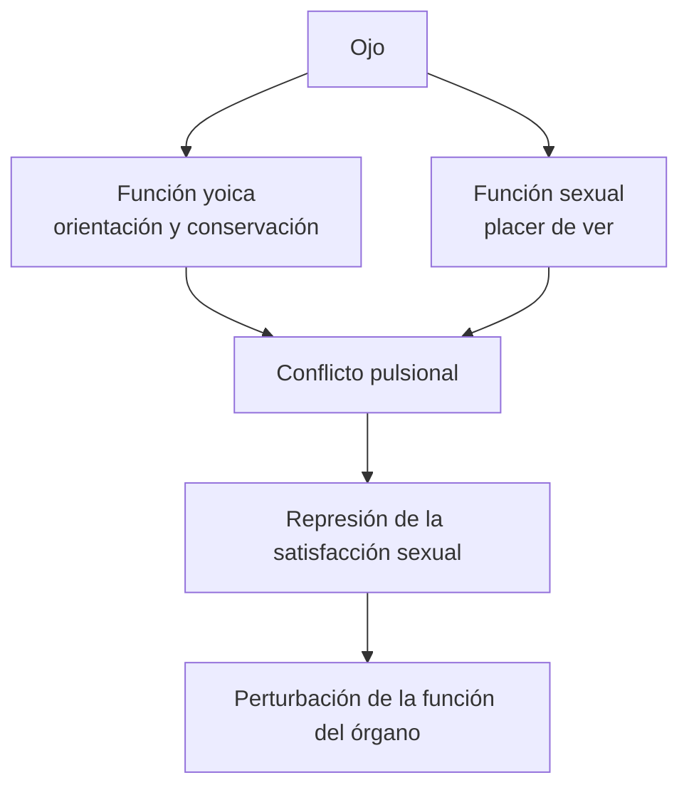
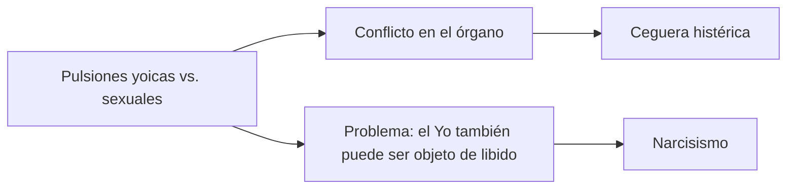

# *La perturbación psicógena de la visión según el psicoanálisis*

## Ubicación

- **Año:** 1910.
- **Edición:** Amorrortu, tomo XI.
- **Recorte de la guía:** pp. 209–216.
- **Espacios:** teóricos y seminarios.
- **Arco:** pulsión y fantasía; bisagra hacia narcisismo y represión.

## El problema del texto

Freud utiliza la ceguera histérica para mostrar cómo un órgano corporal puede quedar perturbado sin lesión orgánica suficiente para explicarla. La respuesta exige pensar que el mismo órgano participa en funciones yoicas y sexuales.

## El órgano de doble función

El ojo sirve simultáneamente:

1. a la orientación y conservación del individuo;
2. al placer de ver y dejarse ver.

> **Fórmula de la cátedra.** El órgano es un *territorio compartido* por las pulsiones yoicas y las pulsiones sexuales.

## El primer dualismo pulsional

El texto se organiza mediante la oposición entre:

- \concept{pulsiones yoicas} o de autoconservación;
- \concept{pulsiones sexuales}.

El conflicto no enfrenta mente y cuerpo. Ocurre entre dos usos pulsionales de un mismo órgano corporal. Esto vuelve insuficiente una concepción del cuerpo como organismo puramente biológico.

## La ceguera histérica

En la explicación de Freud, el placer sexual de ver cae bajo represión. El yo parece imponer al órgano una prohibición: puesto que quiso excederse en su función sexual, pierde también disponibilidad para su función de orientación.

No debe entenderse como una decisión consciente ni como un castigo moral deliberado. Es una manera figurada de describir el compromiso producido por el conflicto.

> **Definición de trabajo.** La perturbación psicógena muestra que la represión de una satisfacción pulsional puede alterar la disponibilidad yoica del mismo órgano que servía como zona de satisfacción.

## Complacencia y protesta del órgano

El síntoma admite una lectura doble:

- **complacencia:** el órgano participa en una satisfacción sexual sustitutiva;
- **protesta:** la función yoica queda perturbada como efecto defensivo frente a ese uso sexual.

No son dos síntomas distintos. Son dos dimensiones de una misma formación de compromiso.

## Qué demuestra el caso

La ceguera histérica permite articular:

1. fuente corporal y exigencia pulsional;
2. sexualidad ampliada y placer de órgano;
3. dualismo entre pulsiones yoicas y sexuales;
4. represión;
5. síntoma como defensa y satisfacción.

El cuerpo histérico no es un cuerpo sin biología, sino un cuerpo cuya función está también organizada por investiduras, fantasías y conflicto.

## Puente hacia el narcisismo

El primer dualismo permite formular el conflicto, pero *Introducción del narcisismo* lo vuelve problemático: si la libido puede investir al yo, la oposición simple entre pulsiones yoicas y libido sexual necesita ser revisada.

Por eso este texto cumple una función de bisagra:

## Errores frecuentes

- Explicar el síntoma como simulación.
- Oponer un cuerpo “psicológico” a un cuerpo “real”.
- Afirmar que el ojo cumple primero una función biológica y después deja de ser corporal.
- Confundir el primer dualismo con pulsiones de vida y de muerte.
- Leer la pérdida de visión como castigo consciente.
- Olvidar la satisfacción sustitutiva alojada en el síntoma.

## Preguntas posibles

- ¿Qué significa que un órgano tenga doble función?
- ¿Cómo explica Freud la ceguera histérica?
- ¿Qué dualismo pulsional organiza el texto?
- Articule órgano, represión y síntoma.
- ¿Por qué este escrito prepara el problema del narcisismo?

## Respuesta concentrada posible

> Freud explica la perturbación psicógena de la visión mediante el conflicto entre dos funciones pulsionales de un mismo órgano. El ojo sirve a la autoconservación y también al placer sexual de ver. Cuando esta satisfacción sexual se vuelve inconciliable y cae bajo represión, queda perturbada también la disponibilidad yoica del órgano. La ceguera histérica es así una formación de compromiso: expresa defensa y satisfacción sustitutiva. El texto utiliza el primer dualismo entre pulsiones yoicas y sexuales y prepara el narcisismo, que mostrará que el propio yo también puede recibir investidura libidinal.
