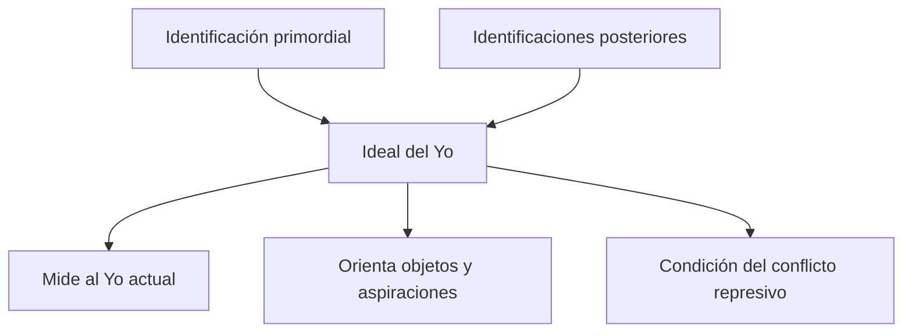
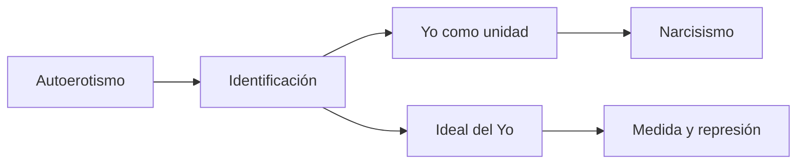

# *Psicología de las masas y análisis del yo* — La identificación

## Ubicación

- **Año:** 1921.
- **Edición:** Amorrortu, tomo XVIII.
- **Recorte de la guía:** capítulo VII, pp. 99–104.
- **Espacio:** seminarios.
- **Arco:** narcisismo y constitución del yo.

## El problema del capítulo

Freud necesita distinguir dos operaciones que pueden estar estrechamente relacionadas:

- tomar a otra persona como objeto de amor;
- modificar el propio yo según el modelo de otra persona.

La segunda operación es la \concept{identificación}.

> **Definición de trabajo.** La identificación es una forma originaria de ligazón afectiva con otra persona y una operación mediante la cual el yo se constituye o modifica según un rasgo del otro.

## Identidad e identificación

La cátedra insiste en que el yo no posee primero una identidad autosuficiente para vincularse después con otros. Se constituye mediante identificaciones.

> **Fórmula de la cátedra.** No hay identidad sin identificación: el yo incorpora algo del otro para llegar a organizarse como unidad.

Esto no implica una copia total. Una identificación puede tomar un solo rasgo y producir con él una modificación propia.

## Primera forma: identificación primordial

Freud presenta una identificación temprana con el padre de la prehistoria personal. Es anterior a una elección de objeto claramente diferenciada y funciona como supuesto lógico, no como episodio directamente observable.

La cátedra articula esta identificación con el \concept{nuevo acto psíquico} requerido para pasar del autoerotismo al narcisismo. Es una construcción entre *Introducción del narcisismo* y este capítulo, no una equivalencia textual automática.

## Segunda forma: sustitución de un lazo de objeto

Una identificación puede aparecer cuando un vínculo libidinal con un objeto se modifica, se pierde o debe ser abandonado. En lugar de conservar al objeto como destino exterior de la libido, el yo incorpora uno de sus rasgos.

> **Distinción decisiva.** En la elección de objeto se quiere *tener* al objeto; en la identificación se quiere *ser como* él o se incorpora uno de sus rasgos.

La oposición es orientadora, no absoluta: elección e identificación pueden coexistir y transformarse una en otra.

## Tercera forma: identificación por un rasgo común

También puede surgir una identificación sin vínculo sexual directo con la persona imitada. Basta la percepción inconsciente de un rasgo o una situación común.

Freud utiliza el ejemplo de varias jóvenes que reproducen el síntoma de una compañera. No se trata de simple imitación consciente: el síntoma expresa una identificación basada en el deseo de ocupar una posición semejante.

> **Clave clínica.** El contagio sintomático no requiere copiar toda una persona; puede fundarse en un único rasgo y en una situación afectiva compartida.

## Tres modalidades concentradas

| Modalidad | Operación principal |
|---|---|
| Identificación primordial | Ligazón originaria y constitutiva. |
| Sustitución regresiva del lazo de objeto | Un rasgo del objeto pasa al yo. |
| Identificación por un rasgo común | Se reconoce una comunidad inconsciente con otro. |

Las tres no deben entenderse como fases cronológicas universales.

## Identificación e Ideal del Yo

Las identificaciones proporcionan materiales para la formación del \concept{Ideal del Yo}. Rasgos parentales, familiares y sociales dejan de operar solamente como exigencias externas y constituyen una instancia interior que mide al yo actual.

El Ideal del Yo no es una colección consciente de valores ni una moral universal. Se arma singularmente con restos e identificaciones y funciona como una vara en buena medida inconsciente.

## Puente hacia la masa

Aunque la guía recorta el capítulo sobre identificación, su lugar en el libro prepara la explicación de los vínculos colectivos. Los miembros de una masa pueden identificarse entre sí por compartir una relación con el mismo objeto o ideal.

Esto muestra que la psicología individual ya contiene al otro: el yo, los ideales y los lazos colectivos se construyen mediante operaciones libidinales e identificatorias.

## Articulación con narcisismo

*Introducción del narcisismo* afirma que el yo debe constituirse y describe su investidura libidinal. Este capítulo aporta una operación para pensar esa constitución y las modificaciones posteriores del yo.

## Errores frecuentes

- Confundir identificación con imitación voluntaria.
- Suponer que incorpora a la persona completa.
- Tratar identificación y elección de objeto como sinónimos.
- Presentar las tres modalidades como etapas cronológicas rígidas.
- Afirmar que el capítulo identifica literalmente nuevo acto psíquico e identificación.
- Reducir el Ideal del Yo a valores morales conscientes.

## Preguntas posibles

- ¿Qué es una identificación?
- Distinga identificación y elección de objeto.
- Desarrolle las tres modalidades del capítulo VII.
- ¿Cómo puede un lazo de objeto ser sustituido por una identificación?
- Articule identificación, constitución del yo e Ideal del Yo.

## Respuesta concentrada posible

> Freud define la identificación como una forma originaria de ligazón afectiva y una operación que modifica al yo según un rasgo del otro. Distingue una identificación primordial, una identificación que sustituye regresivamente un lazo de objeto y otra fundada en un rasgo común. Elegir un objeto significa dirigir libido hacia él; identificarse implica incorporar un rasgo y transformar el yo, aunque ambas operaciones pueden combinarse. La cátedra articula la identificación primordial con el nuevo acto psíquico necesario para constituir una unidad yoica. Las identificaciones también sostienen el Ideal del Yo, instancia que mide al yo actual y participa en las condiciones de la represión.
