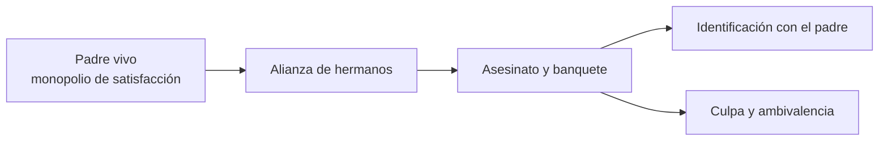
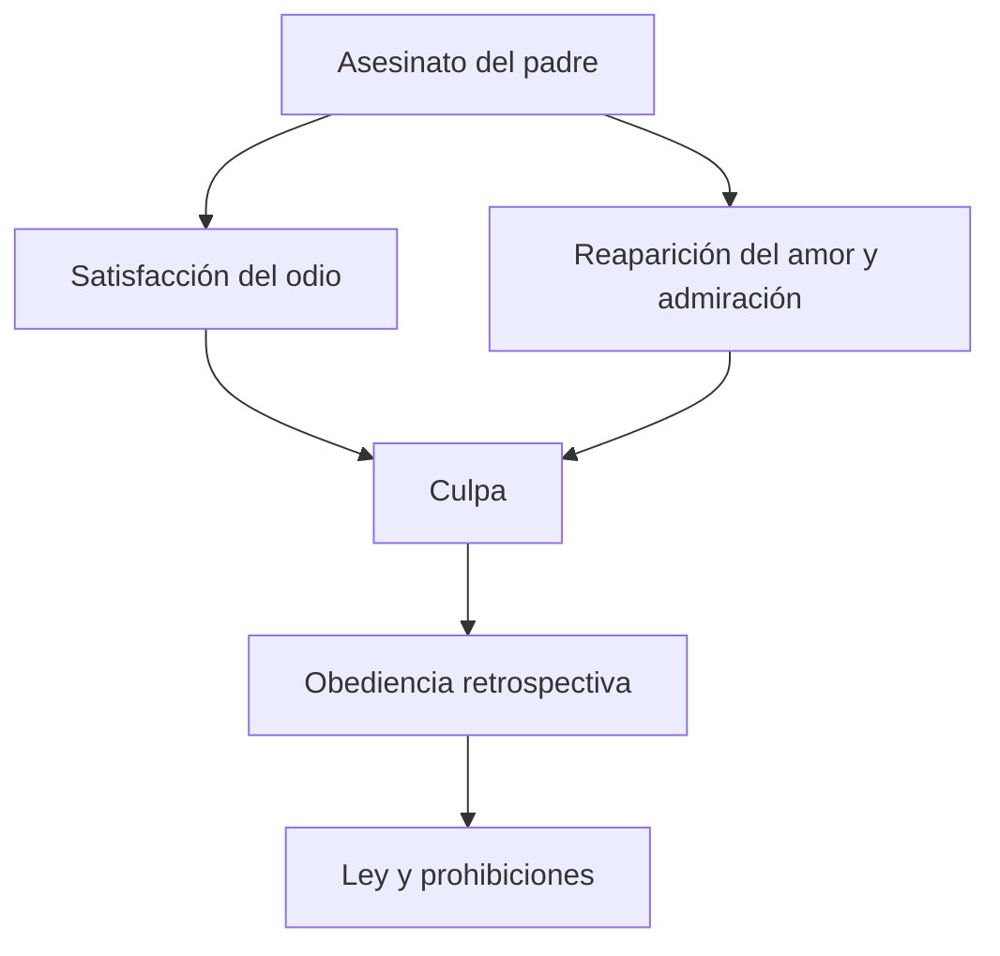
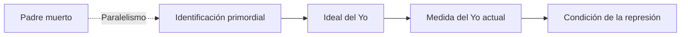

# *Tótem y tabú* — Padre muerto, ley y fundación

## Ubicación

- **Año:** 1913.
- **Edición:** Amorrortu, tomo XIII.
- **Recorte de la guía:** capítulo IV, §§5–6, pp. 142–152.
- **Espacios:** teóricos y prácticos.
- **Arco:** narcisismo y constitución del yo; bisagra hacia la metapsicología.

## La función del mito

Freud construye el mito de la horda primordial para pensar el origen de la organización social, la ley, la culpa y la religión. No se lo trabaja como una reconstrucción histórica verificable, sino como una escena teórica que hace visible una lógica de fundación.

> **Cautela conceptual.** El valor del relato para la cursada es lógico y metapsicológico: permite pensar cómo una pérdida y un acto imposible de deshacer fundan un orden.

## El padre de la horda

El padre primordial monopoliza a las mujeres y expulsa o somete a los hijos. Concentra para sí una satisfacción que los demás no pueden alcanzar.

Los hermanos se unen, lo matan y lo devoran. El banquete totémico expresa a la vez odio, deseo de ocupar su lugar, admiración e identificación.

## La paradoja del resultado

La eliminación del padre no inaugura el acceso libre a todas las satisfacciones. Ningún hermano puede ocupar establemente su lugar sin reactivar la lucha. La alianza sólo se conserva mediante renuncias compartidas.

Surgen dos prohibiciones totémicas:

1. no matar al animal totémico, sustituto del padre;
2. no mantener relaciones sexuales con las mujeres del propio clan totémico.

El asesinato conduce así a la prohibición del parricidio y al tabú del incesto.

## Obediencia retrospectiva

Después de muerto, el padre se vuelve más poderoso que cuando estaba vivo. Los hijos obedecen retrospectivamente aquello que antes impedía por la fuerza.

> **Tesis central.** El padre muerto funda una ley interiorizada: su ausencia no elimina la prohibición, sino que la vuelve eficaz desde un lugar simbólico.

## Ambivalencia e identificación

El vínculo con el padre es ambivalente: reúne odio y amor. El banquete no sólo destruye al padre; también procura incorporar su fuerza mediante una identificación.

Esto permite articular el texto con la \concept{identificación primordial} de *Psicología de las masas*. Sin embargo, la cátedra exige cautela: el padre muerto, el padre de la prehistoria personal y el Ideal del Yo no son nombres intercambiables.

## La fundación exige una pérdida

La vida colectiva requiere \concept{renuncia pulsional}. La organización social se funda cuando el acceso a una satisfacción total queda perdido para todos.

> **Fórmula de trabajo.** La ley no reserva la satisfacción completa para una persona privilegiada: establece una imposibilidad compartida que hace posible el lazo social.

La fantasía neurótica puede sostener que otro sí posee esa satisfacción y que sólo el sujeto está excluido. El mito muestra, en cambio, que el lugar del padre debe permanecer vacío: quien intentara ocuparlo destruiría el pacto entre hermanos.

## Ley y deseo

La ley no aparece simplemente después de un deseo natural ya constituido. El acto, la pérdida, la culpa y la prohibición organizan retroactivamente aquello que será deseado y prohibido.

## El banquete y el retorno

En la fiesta totémica se permite excepcionalmente matar y comer al animal prohibido. La repetición ritual conserva el crimen fundador y produce una satisfacción reglada.

La clase lo utiliza para señalar que la renuncia nunca clausura totalmente la exigencia pulsional. Algo retorna dentro del mismo orden que procuraba prohibirlo.

## Paralelismo con la represión primordial

La cátedra propone un paralelismo entre dos escenas fundantes:

| *Tótem y tabú* | Metapsicología |
|---|---|
| Padre muerto. | Representante psíquico de la pulsión. |
| Pérdida que funda la ley. | Represión primordial que funda el sistema inconsciente. |
| Prohibiciones y orden social. | Ordenamiento del mundo de representaciones. |
| Retorno ritual en el banquete. | Atracción de retoños y retorno de lo reprimido. |

> **Cautela de la cátedra.** Es un paralelismo funcional, no una identidad conceptual. El padre muerto no “es” el representante pulsional.

## Articulación con el Ideal del Yo

El padre muerto permite pensar el pasaje de una prohibición exterior a una ley interiorizada. Las identificaciones con figuras parentales participan luego en la construcción del \concept{Ideal del Yo}, que mide al yo actual y ofrece condiciones para el conflicto represivo.

## Errores frecuentes

- Presentar el mito como historia empírica demostrada.
- Suponer que matar al padre libera la satisfacción total.
- Reducir la ley a una prohibición externa sostenida por miedo.
- Olvidar la ambivalencia afectiva hacia el padre.
- Convertir padre muerto, representante pulsional e Ideal del Yo en sinónimos.
- Explicar la renuncia pulsional como obediencia moral voluntaria.

## Preguntas posibles

- ¿Qué funda el asesinato del padre?
- Explique la obediencia retrospectiva.
- ¿Por qué el padre muerto resulta más poderoso que el vivo?
- Articule ambivalencia, culpa e identificación.
- ¿En qué sentido la fundación social exige una pérdida?
- Desarrolle el paralelismo con la represión primordial y sus límites.

## Respuesta concentrada posible

> En el mito de *Tótem y tabú*, los hermanos matan al padre que monopolizaba la satisfacción, pero su muerte no produce libertad ilimitada. La ambivalencia hace retornar el amor junto con el odio satisfecho, genera culpa y conduce a una obediencia retrospectiva. Las prohibiciones de matar al tótem y del incesto sustituyen la fuerza del padre por una ley interiorizada y una renuncia compartida. El banquete conserva ritualmente el acto fundador y muestra que lo prohibido retorna dentro del orden. La cátedra articula esta escena con la identificación primordial, el Ideal del Yo y la represión primordial, pero como paralelismo funcional: padre muerto, Ideal y representante pulsional no son conceptos idénticos.
