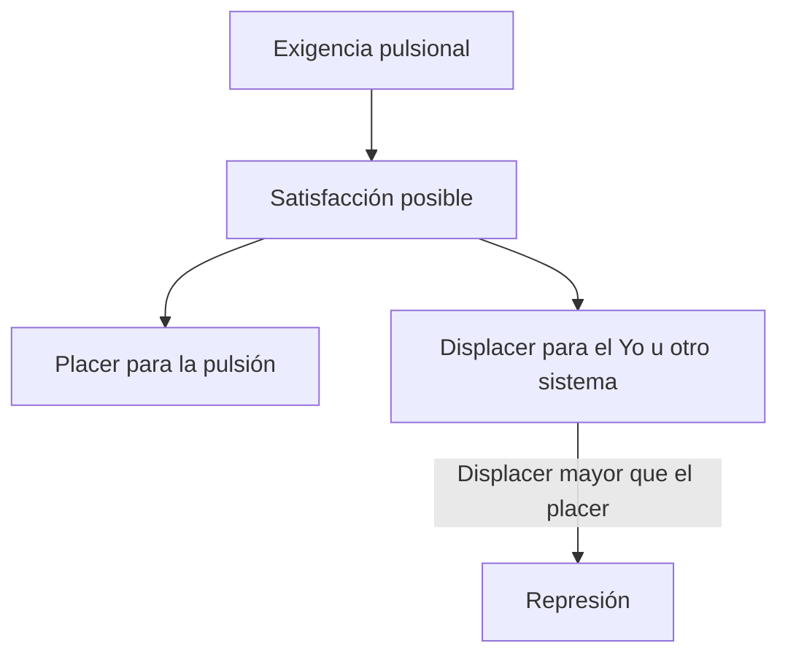
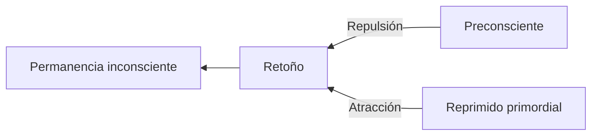
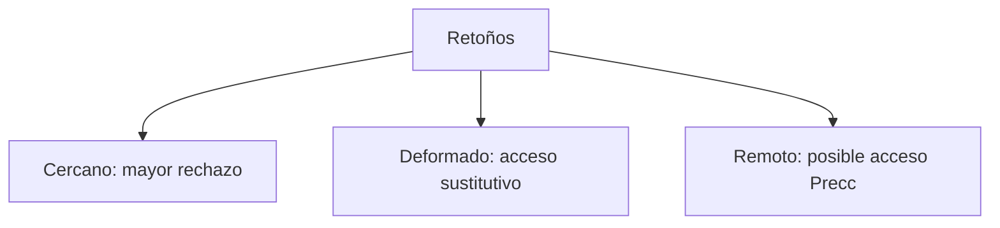
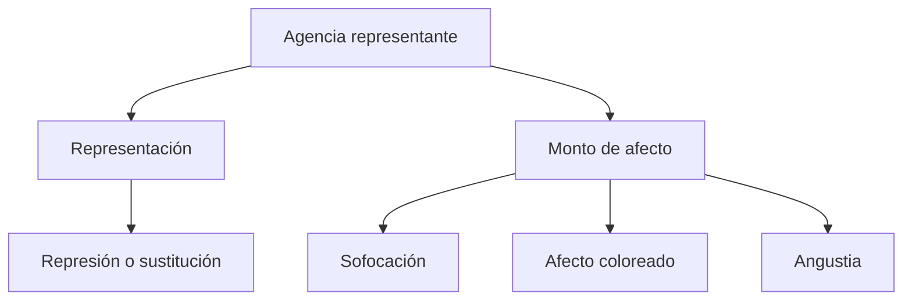
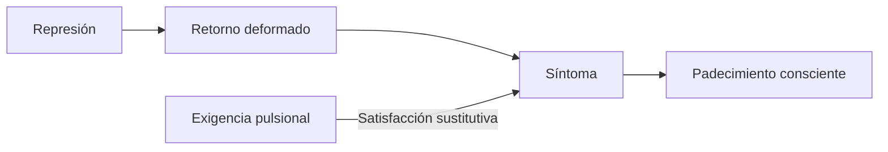

# *La represión*

## Ubicación

- **Año:** 1915.
- **Edición:** Amorrortu, tomo XIV.
- **Recorte de la guía:** pp. 141–152.
- **Espacios:** teóricos, prácticos y seminarios.
- **Arco:** metapsicología; bisagra hacia síntoma y angustia.

## El problema del texto

La pulsión busca satisfacción, pero una satisfacción puede producir placer en un lugar y un displacer mayor en otro. Freud debe explicar cómo el aparato rechaza una representación sin destruir la exigencia pulsional que la sostiene.

> **Fórmula de Freud.** La esencia de la \concept{Represión} consiste en rechazar algo de la conciencia y mantenerlo alejado de ella.

La represión no equivale a olvido, decisión consciente, condena moral ni eliminación. Es un destino pulsional y una operación permanente.

## Condición de la represión

Una moción sólo puede ser reprimida si su satisfacción produciría displacer en otro sistema y ese displacer sería mayor que el placer pulsional.

> **Paradoja central.** La satisfacción no deja de ser placentera para la pulsión; se vuelve inconciliable y displacentera desde otra organización psíquica.

El arco anterior aporta una condición de ese conflicto: el \concept{Ideal del Yo} ofrece una medida desde la cual determinadas satisfacciones contradicen el respeto del yo por sí mismo.

## Qué se reprime

La pulsión no comparece directamente como objeto de conciencia. Freud distingue:

| Término | Función |
|---|---|
| \concept{Pulsión} | Exigencia constante entre cuerpo y psiquismo. |
| \concept{Representante psíquico de la pulsión} | Agencia mediante la cual lo pulsional alcanza el aparato. |
| \concept{Representación} | Elemento enlazable que puede funcionar como retoño. |
| \concept{Monto de afecto} | Factor cuantitativo que puede recibir un destino distinto. |

> **Distinción decisiva.** No se reprime directamente la pulsión: se investigan los destinos de su representante, sus representaciones y el monto de afecto.

## Primer momento: represión primordial

Freud postula una primera operación: al representante psíquico de la pulsión se le deniega admisión a la conciencia. Este queda fijado y la pulsión permanece ligada a él.

La \concept{represión primordial} es una anterioridad lógica, no un episodio biográfico observable. Funda un polo inconsciente capaz de atraer materiales posteriores.

## Segundo momento: represión propiamente dicha

La \concept{represión propiamente dicha} recae sobre retoños, pensamientos y representaciones que han establecido enlaces con lo primordialmente reprimido.

Cooperan dos fuerzas:

1. \concept{repulsión} desde el sistema preconsciente-consciente;
2. \concept{atracción} ejercida por lo reprimido primordial.

## Tercer momento de la cursada: retorno

Las clases completan el recorrido con el \concept{retorno de lo reprimido}. Lo reprimido conserva investidura, produce retoños y puede alcanzar expresión si obtiene suficiente deformación o distancia.

> **Lectura de la cátedra.** Represión primordial, represión propiamente dicha y retorno forman los tres momentos que conviene reconstruir en el parcial.

El retorno no es una reproducción transparente. Aparece como formación sustitutiva, síntoma, sueño, lapsus, repetición o transferencia.

## Dos características

### Individual

La represión es \concept{individual}: cada retoño recibe un destino según su distancia respecto de lo reprimido. No todos los enlaces de una misma representación quedan igualmente excluidos.

### Móvil

La represión es \concept{móvil}: exige gasto continuo. Cambios de investidura, nuevos enlaces o mayor deformación pueden alterar el equilibrio y permitir retornos.

## Representación y monto de afecto

La agencia representante debe separarse en dos componentes con destinos diferentes:

- la representación puede desaparecer de la conciencia o ser sustituida;
- el monto de afecto puede ser sofocado, aparecer con otra cualidad o mudarse en angustia.

El éxito de la represión se mide por el destino del afecto. Si evita una representación pero genera intenso displacer, ha fracasado respecto de su finalidad defensiva.

## Tres formaciones clínicas

Freud compara mecanismos y resultados en:

1. histeria de angustia o fobia;
2. histeria de conversión;
3. neurosis obsesiva.

No basta con decir que todas “reprimen”. Cada una organiza de modo diferente representación, afecto, sustitución y contrainvestidura.

En la fobia, la representación puede sustituirse por un objeto exterior y el monto mudarse en angustia. En la conversión, el monto encuentra una inervación corporal. En la obsesión, el afecto puede desligarse y aparecer como culpa o angustia unido a otra representación.

## Represión y síntoma

La represión no elimina la satisfacción. El \concept{síntoma} constituye una formación de compromiso: sirve a la defensa y ofrece una \concept{satisfacción sustitutiva} a la exigencia pulsional.

## Errores frecuentes

- Confundir represión con supresión voluntaria.
- Decir que destruye la pulsión o su representante.
- Afirmar que reprime directamente el afecto y la representación del mismo modo.
- Describir la represión primordial como primer trauma cronológico.
- Explicar la secundaria sólo por rechazo desde la conciencia y olvidar la atracción.
- Olvidar los caracteres individual y móvil.
- Suponer que retorno significa recuperación literal de un recuerdo intacto.

## Preguntas posibles

- ¿Cuál es la condición de la represión?
- ¿Sobre qué recae?
- Distinga sus fases o momentos.
- ¿Qué fuerzas cooperan en la represión propiamente dicha?
- ¿Por qué es individual y móvil?
- Desarrolle los destinos de representación y monto de afecto.

## Respuesta concentrada posible

> La represión se vuelve posible cuando una satisfacción placentera para la pulsión produciría en otro sistema un displacer mayor. Su esencia consiste en rechazar una representación de la conciencia y mantenerla alejada, sin eliminar la exigencia pulsional. La represión primordial fija un representante inconsciente y funda un polo de atracción; la represión propiamente dicha recae sobre sus retoños mediante repulsión preconsciente y atracción desde lo reprimido; el retorno muestra que aquello rechazado conserva eficacia. La represión es individual y móvil. Además deben distinguirse el destino de la representación y el del monto de afecto, que puede sofocarse, cualificarse o mudarse en angustia.
