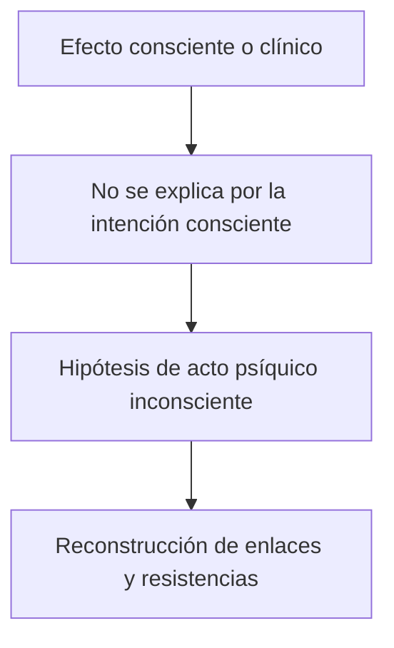

# *Nota sobre el concepto de lo inconsciente en psicoanálisis*

## Ubicación

- **Año:** 1912.
- **Edición:** Amorrortu, tomo XII.
- **Recorte de la guía:** pp. 271–277.
- **Espacio:** prácticos.
- **Arco:** metapsicología.

## El problema del texto

La palabra “inconsciente” puede indicar cosas diferentes. Si se utiliza solamente para lo que no está presente ahora en la conciencia, no permite distinguir un recuerdo disponible de una representación mantenida fuera por la represión.

Freud separa tres usos que la cursada denomina:

1. descriptivo;
2. dinámico;
3. sistemático.

> **Distinción decisiva.** Estos son tres sentidos de “inconsciente”. No deben confundirse con los puntos de vista tópico, dinámico y económico de la metapsicología.

## Sentido descriptivo

Es inconsciente todo contenido que no está actualmente presente en la conciencia.

Una representación puede ser latente: no está siendo pensada ahora, pero puede recuperarse sin vencer una resistencia intensa. En este sentido, tanto lo preconsciente como lo reprimido son descriptivamente inconscientes.

> **Límite.** La ausencia actual de conciencia describe un estado, pero todavía no explica por qué algo permanece ausente.

## Sentido dinámico

Es inconsciente dinámicamente aquello que no alcanza conciencia porque fuerzas defensivas se oponen a su acceso.

La resistencia observada en el tratamiento permite inferir esa fuerza. El contenido no es simplemente débil u olvidado: continúa activo, produce efectos y exige un trabajo para mantenerse alejado.

## Sentido sistemático

Freud da un paso adicional: “inconsciente” nombra un sistema psíquico, abreviado \concept{Icc}, con operaciones y propiedades específicas.

No todo lo que carece actualmente de conciencia pertenece al sistema Icc. Un recuerdo disponible puede estar en el preconsciente aunque sea descriptivamente inconsciente.

| Caso | Descriptivamente Icc | Dinámicamente Icc | Sistema Icc |
|---|---:|---:|---:|
| Recuerdo latente y accesible | Sí | No | No |
| Representación reprimida eficaz | Sí | Sí | Sí |
| Contenido consciente actual | No | No | No |

La tabla es orientadora: el texto busca mostrar que una misma palabra no debe borrar diferencias entre cualidad, conflicto y sistema.

## La experiencia hipnótica

Freud recupera experiencias en las que una orden impartida durante la hipnosis es ejecutada más tarde sin que el sujeto recuerde conscientemente su origen.

El ejemplo prueba que una representación puede:

- permanecer inconsciente;
- conservar eficacia;
- organizar una acción;
- producir una explicación consciente secundaria.

> **Tesis central.** Lo inconsciente no se define por inactividad. Una representación inconsciente puede ser eficaz y orientar la conducta.

## De la hipnosis a la clínica analítica

En el análisis, síntomas, ocurrencias, sueños y resistencias permiten inferir actos psíquicos que no son conscientes. La hipótesis de lo inconsciente no es una especulación añadida desde afuera: intenta volver inteligibles efectos observables.

## Lo preconsciente no es lo reprimido

La distinción más útil para el examen es:

- lo \concept{preconsciente} está ausente de la conciencia, pero puede acceder a ella;
- lo \concept{reprimido} permanece inconsciente por acción de fuerzas y sólo retorna venciendo o rodeando resistencias.

Llamar a ambos simplemente “inconscientes” es descriptivamente correcto, pero metapsicológicamente insuficiente.

## Por qué prepara el artículo de 1915

La *Nota* establece la multivocidad del término. *Lo inconsciente* desarrollará luego:

- la relación entre sistemas Icc, Precc y Cc;
- investiduras y censura;
- propiedades del sistema Icc;
- representación-cosa y representación-palabra.

La *Nota* responde **qué sentidos tiene el término**; el artículo posterior explica **cómo funciona el sistema**.

## Errores frecuentes

- Definir inconsciente como todo aquello que no se piensa en este instante.
- Confundir latente con reprimido.
- Suponer que inconsciente significa inactivo.
- Mezclar descriptivo–dinámico–sistemático con tópico–dinámico–económico.
- Tratar Icc como un lugar anatómico del cerebro.

## Preguntas posibles

- ¿Por qué Freud distingue varios sentidos de inconsciente?
- Desarrolle los sentidos descriptivo, dinámico y sistemático.
- Distinga representación latente y reprimida.
- ¿Qué demuestra la experiencia hipnótica?
- ¿Cómo se justifica la hipótesis de actos psíquicos inconscientes?

## Respuesta concentrada posible

> Freud distingue tres sentidos porque la ausencia de conciencia no explica por sí misma el funcionamiento psíquico. En sentido descriptivo, es inconsciente todo contenido actualmente ausente de la conciencia. En sentido dinámico, una representación permanece inconsciente por efecto de fuerzas represivas, aunque conserva eficacia. En sentido sistemático, Icc designa un sistema con legalidad propia. Por eso un recuerdo preconsciente y una representación reprimida son ambos descriptivamente inconscientes, pero sólo la segunda es inconsciente dinámicamente y pertenece al sistema Icc. La experiencia hipnótica muestra que una representación inconsciente puede producir acciones y efectos.
