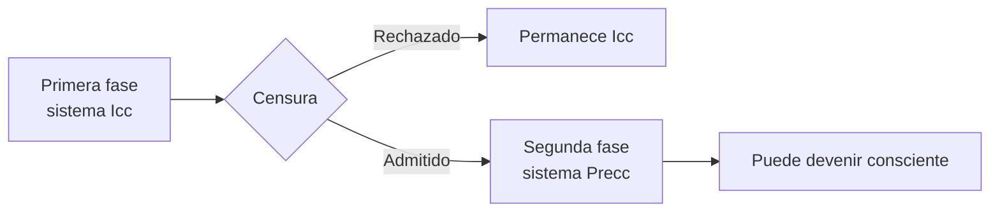
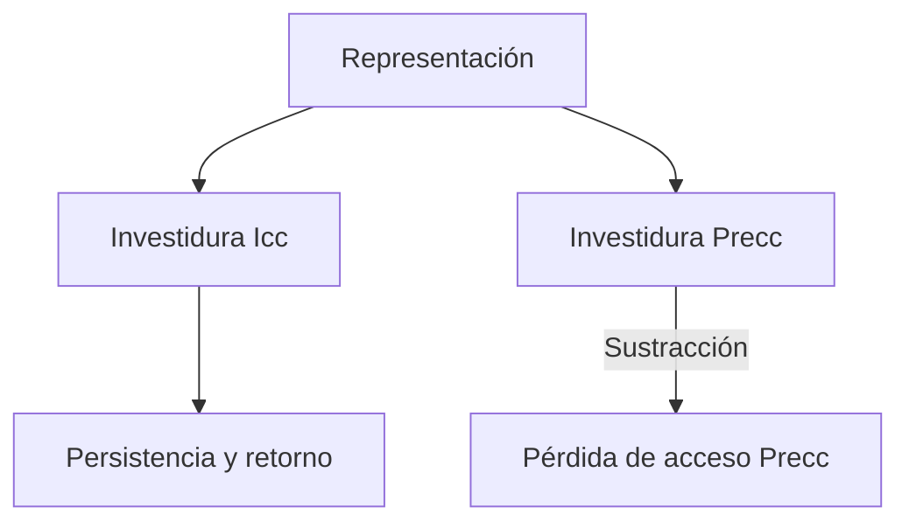
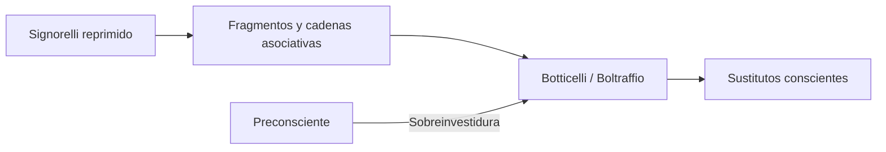
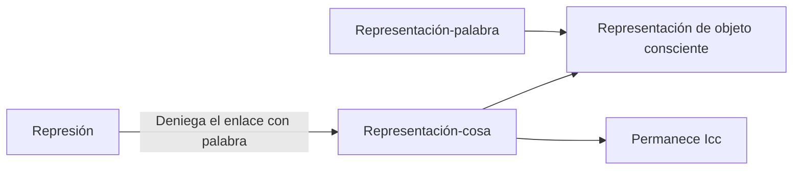

# *Lo inconsciente*

## Ubicación

- **Año:** 1915.
- **Edición:** Amorrortu, tomo XIV.
- **Recortes de la guía:** capítulos II, III, IV, V, VI y VII; pp. 168–184, 187 y 197–199 según cada espacio.
- **Espacios:** teóricos y prácticos.
- **Arco:** metapsicología.

## La intervención del texto

La *Nota* de 1912 distinguía los sentidos de la palabra “inconsciente”. Este artículo construye una teoría del \concept{sistema inconsciente}: explica el pasaje entre sistemas, la represión en términos de investiduras, las propiedades del proceso inconsciente y la composición de la representación consciente.

> **Tesis central.** Lo inconsciente no es un depósito de contenidos escondidos, sino un sistema de procesos con una legalidad específica.

## Capítulo II: dos fases del acto psíquico

Freud imagina que un acto psíquico atraviesa un examen:

La censura no juzga si una representación es verdadera. Expresa su compatibilidad con las exigencias y ligaduras del preconsciente.

## Doble inscripción o cambio de estado

Freud considera dos hipótesis sobre el pasaje de Icc a Precc:

### Hipótesis tópica

La representación produciría una nueva copia en otra localidad. Habría una inscripción inconsciente y otra preconsciente.

### Hipótesis funcional

La representación sufriría un cambio de estado al recibir otra investidura y nuevos enlaces.

| Doble inscripción | Cambio funcional |
|---|---|
| Nueva copia en otro sistema. | Transformación del funcionamiento. |
| La inscripción Icc queda intacta. | Se agregan investiduras y enlaces Precc. |
| Facilita una imagen espacial. | Explica mejor por qué informar no cura. |

> **Consecuencia clínica.** Comunicar al paciente el contenido supuesto no cancela la representación inconsciente eficaz. Oír una interpretación no equivale a producir el cambio psíquico requerido.

## Capítulo III: sentimientos inconscientes

Freud sostiene que la esencia de un sentimiento es ser percibido. En sentido estricto, no habría afectos inconscientes del mismo modo que hay representaciones inconscientes.

Cuando se habla de amor, odio o culpa inconscientes, se designa:

- una moción cuyo representante fue reprimido;
- un monto de afecto que no alcanzó desarrollo consciente;
- o un afecto que apareció unido a otra representación.

> **Distinción decisiva.** La representación puede permanecer inconsciente; el afecto debe ser sofocado, cualificado o enlazado de otro modo para ser sentido.

## Capítulo IV: tópica y dinámica de la represión

Una representación eficaz depende de su \concept{investidura}. En la represión secundaria, el sistema preconsciente sustrae su propia investidura, mientras la representación conserva investidura inconsciente.

La sustracción no basta para mantenerla alejada. El preconsciente utiliza una \concept{contrainvestidura}: gasto defensivo que protege frente al retorno.

| Represión primordial | Represión secundaria |
|---|---|
| No existe investidura Precc previa para sustraer. | Puede sustraerse una investidura Precc. |
| Contrainvestidura como mecanismo específico. | Sustracción más contrainvestidura. |
| Mantiene la fijación primordial. | Mantiene alejados sus retoños. |

## Formación sustitutiva y sobreinvestidura

Una representación sustitutiva puede recibir una carga adicional o \concept{sobreinvestidura}. Así llega a conciencia de manera deformada y contribuye a impedir el retorno directo de otra representación.

El olvido de Signorelli muestra que Botticelli y Boltraffio no son sustitutos arbitrarios: conservan fragmentos y enlaces de las cadenas reprimidas.

## Capítulo V: propiedades del sistema Icc

### Ausencia de contradicción y negación

Mociones opuestas pueden coexistir sin cancelarse mediante un juicio lógico. Esto no significa armonía, sino ausencia de una síntesis consciente que afirme o niegue.

### Proceso primario

La energía se encuentra móvil y opera mediante:

1. \concept{condensación}: varias cadenas confluyen en una formación;
2. \concept{desplazamiento}: la intensidad pasa a una representación diferente.

### Atemporalidad

Los procesos inconscientes no se ordenan por el tiempo ni pierden eficacia simplemente porque hayan ocurrido hace años. Lo infantil puede actualizarse como presente.

### Realidad psíquica

La realidad exterior puede ser sustituida por la \concept{realidad psíquica}. Una fantasía produce efectos aunque no reproduzca fielmente un acontecimiento histórico.

### Principio de placer

El sistema busca descarga y satisfacción sin considerar inmediatamente las condiciones del mundo exterior.

## Icc y Precc-Cc

| Sistema Icc | Sistema Precc-Cc |
|---|---|
| Proceso primario | Proceso secundario |
| Energía móvil | Energía ligada |
| Atemporalidad | Orden temporal |
| Realidad psíquica | Examen de realidad |
| Principio de placer | Principio de realidad |
| Ausencia de contradicción | Juicio y negación |

El proceso secundario liga investiduras, posterga descargas y hace posibles pensamiento, examen de realidad y acción diferida.

## Capítulo VII: representación-cosa y palabra

La comparación con la esquizofrenia conduce a una nueva formulación:

- la \concept{representación-cosa} reúne investiduras de huellas derivadas de la cosa;
- la \concept{representación-palabra} aporta enlaces verbales;
- la representación de objeto consciente resulta de su enlace.

> **Fórmula central.** En las neurosis de transferencia, la represión deniega a la representación-cosa su traducción o enlace con la representación-palabra.

Esto no significa que las palabras vuelvan consciente mecánicamente cualquier contenido. Deben integrarse en asociaciones e investiduras producidas por el trabajo del analizante.

## Neurosis y esquizofrenia

En las neurosis, la representación-cosa permanece investida mientras se rechaza su enlace preconsciente con palabras. En la esquizofrenia, Freud observa una retirada de investiduras de objeto y una sobreinvestidura de palabras, que pueden ser tratadas como cosas.

La comparación esclarece la metapsicología; no debe convertirse en una regla diagnóstica basada en tomar literalmente una frase aislada.

## Las tres perspectivas metapsicológicas

El artículo permite combinar:

1. \concept{tópica}: relaciones entre sistemas Icc, Precc y Cc;
2. \concept{dinámica}: conflicto entre atracción, repulsión y resistencia;
3. \concept{económica}: distribución y movilidad de investiduras.

Estas perspectivas no son los tres sentidos de “inconsciente”. Responden a preguntas distintas: dónde ocurre un proceso, qué fuerzas actúan y cómo se distribuye la energía.

## Interpretar no es informar

Si el pasaje requiere nuevos enlaces, el analista no entrega desde afuera un significado correcto capaz de borrar lo inconsciente. La interpretación adquiere eficacia cuando abre asociaciones y permite otro trabajo sobre la representación.

> **Tesis clínica.** El análisis no completa un contenido faltante: modifica las condiciones bajo las cuales algo puede enlazarse con palabras y adquirir otro sentido.

## Errores frecuentes

- Tratar Icc, Precc y Cc como regiones anatómicas.
- Confundir los tres sentidos de inconsciente con las perspectivas metapsicológicas.
- Afirmar que los afectos permanecen inconscientes igual que las representaciones.
- Suponer que sustracción de investidura elimina la investidura Icc.
- Confundir contrainvestidura con ausencia de energía.
- Decir que representación-cosa es el objeto real.
- Suponer que agregar palabras produce conciencia automáticamente.

## Preguntas posibles

- Compare doble inscripción y cambio funcional.
- ¿Cómo opera la represión en términos de investiduras?
- Desarrolle las propiedades del sistema Icc.
- Distinga proceso primario y secundario.
- ¿Qué significa hablar de sentimientos inconscientes?
- Distinga representación-cosa y representación-palabra.
- ¿Por qué informar una interpretación no basta para curar?

## Respuesta concentrada posible

> *Lo inconsciente* desarrolla una teoría sistemática y no sólo descriptiva. Un acto psíquico puede permanecer en Icc o recibir investiduras y enlaces Precc. En la represión secundaria se sustrae investidura preconsciente y opera una contrainvestidura, mientras la investidura inconsciente conserva la eficacia y posibilita el retorno. El sistema Icc se caracteriza por ausencia de contradicción, proceso primario, atemporalidad, realidad psíquica y principio de placer. La representación consciente exige el enlace entre representación-cosa y representación-palabra; en las neurosis, la represión deniega ese enlace. Por eso comunicar palabras desde afuera no produce por sí solo el cambio funcional que requiere el trabajo analítico.
