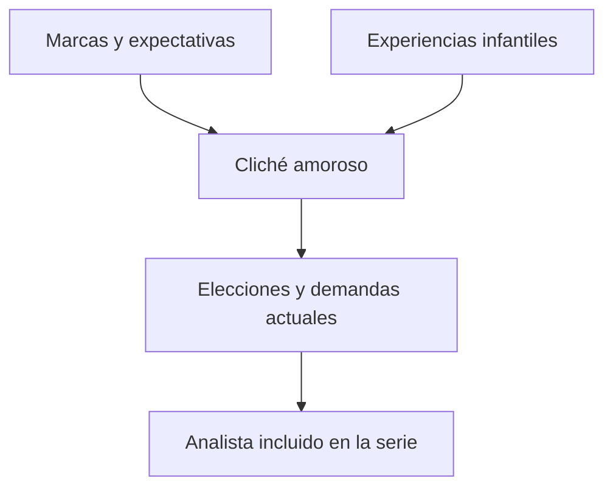
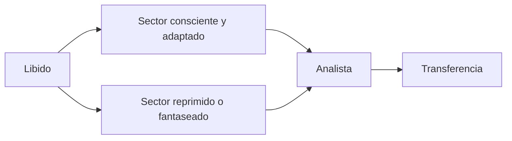
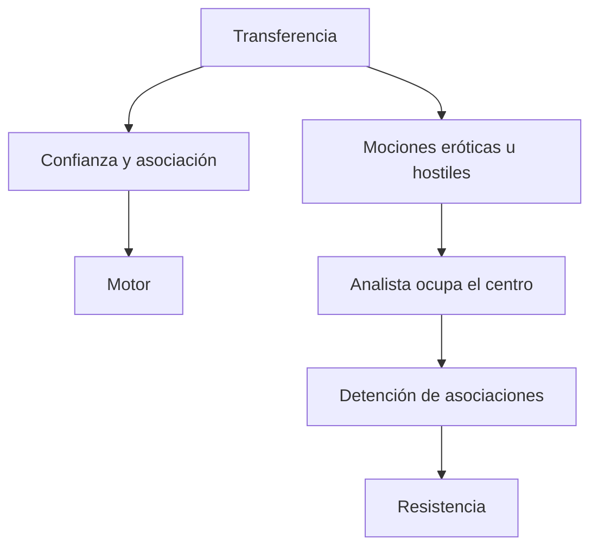

# *Sobre la dinámica de la transferencia*

## Ubicación

- **Año:** 1912.
- **Edición:** Amorrortu, tomo XII.
- **Recorte de la guía:** pp. 97–105.
- **Espacios:** teóricos y prácticos.
- **Arco:** transferencia y técnica.

## El problema del texto

Freud debe explicar por qué los sentimientos dirigidos al analista aparecen necesariamente en la cura y por qué el mismo fenómeno que permite trabajar puede convertirse en la resistencia más poderosa.

> **Tesis central.** La \concept{transferencia} inserta al analista en una serie psíquica previa y vuelve actual el conflicto que sostenía la neurosis.

La transferencia no es creada artificialmente por el análisis. El dispositivo la vuelve visible, concentrada y utilizable.

## El cliché amoroso

Cada sujeto adquiere una especificidad para ejercer su vida amorosa: condiciones para amar, metas pulsionales, expectativas y modos de satisfacción que se repiten como un \concept{cliché}.

Freud articula:

1. disposiciones constitucionales;
2. experiencias e influencias infantiles.

La cátedra amplía la idea de disposición: incluye marcas anteriores al sujeto —nombre, expectativas, duelos y lugares familiares— sin convertirlas en un programa biológico determinante.

El analista no recibe esas mociones sólo por sus rasgos personales. La situación analítica ofrece un lugar en el que puede ser investido según modelos anteriores.

## Dos sectores de la libido

Una parte de las mociones amorosas atravesó el desarrollo, se volvió consciente y se orientó hacia la realidad. Otra quedó detenida, reprimida o desplegada en fantasías inconscientes.

Ambos sectores participan en la transferencia. El analista puede recibir tanto expectativas conscientes como mociones reprimidas que buscan satisfacción.

## Por qué la transferencia se intensifica

La frustración de satisfacciones en la realidad favorece una retirada de libido hacia fantasías. Al comenzar el análisis, esa libido disponible inviste al analista y lo incorpora a las series infantiles.

El fenómeno enlaza el arco técnico con el narcisismo:

- las neurosis de transferencia conservan investiduras de objeto capaces de dirigirse al analista;
- en las neurosis narcisistas, la retirada hacia el yo dificulta ese movimiento dentro del modelo de esta época.

## Tres vertientes

La cátedra distingue:

| Vertiente | Estado frecuente | Efecto posible |
|---|---|---|
| \concept{Transferencia positiva tierna} | Consciente | Confianza y cooperación. |
| \concept{Transferencia positiva erótica} | Reprimida o actuada | Demanda de amor y detención asociativa. |
| \concept{Transferencia negativa} | Hostilidad | Oposición y resistencia. |

“Positiva” describe una tonalidad amorosa, no un efecto necesariamente favorable. La transferencia erótica puede obstaculizar intensamente el trabajo.

## Motor y obstáculo

La confianza transferencial permite aceptar la regla fundamental, hablar y escuchar intervenciones. Pero las mociones eróticas u hostiles pueden colocar a la persona del analista en primer plano y detener la asociación.

> **Fórmula de la cátedra.** La transferencia es *motor y obstáculo* de la cura.

No son dos fenómenos independientes: la misma actualización que sostiene el análisis puede defender contra la emergencia de material reprimido.

## Cuándo se vuelve resistencia

La transferencia no es resistencia en todo momento. Adquiere esa función cuando reemplaza la asociación por una actuación dirigida al analista.

La secuencia clínica trabajada en clase es:

1. las asociaciones avanzan;
2. se aproximan a un punto conflictivo;
3. aparece una detención;
4. el analista se vuelve el contenido dominante;
5. interpretar esa función puede restablecer la asociación.

> **Articulación metapsicológica.** La resistencia observada en sesión permite inferir la fuerza actual que mantiene la represión.

## Transferencia fuera y dentro del análisis

Los seres humanos transfieren también sobre médicos, docentes, parejas y autoridades. Lo específico del análisis es la respuesta técnica:

- asociación libre del paciente;
- atención flotante del analista;
- abstinencia;
- interpretación de la transferencia cuando funciona como resistencia.

El análisis no busca impedir la repetición transferencial, sino transformarla en material de trabajo.

## Actualización, no copia

La transferencia repite una estructura o posición, no una escena grabada de manera idéntica. El presente y la respuesta del analista introducen condiciones nuevas.

## Errores frecuentes

- Explicar la transferencia sólo por la personalidad del analista.
- Decir que sólo existe dentro del psicoanálisis.
- Confundir transferencia positiva con transferencia siempre favorable.
- Afirmar que toda transferencia es resistencia desde el inicio.
- Suponer que actualizar significa reproducir literalmente una escena.
- Tratar la resistencia como falta de voluntad del paciente.

## Preguntas posibles

- ¿Qué es el cliché y cómo se relaciona con la transferencia?
- ¿Por qué el analista es incluido en una serie previa?
- Desarrolle las tres vertientes transferenciales.
- Explique la fórmula “motor y obstáculo”.
- ¿Cuándo la transferencia se vuelve resistencia?
- Articule transferencia, represión y retorno.

## Respuesta concentrada posible

> Freud sostiene que cada sujeto posee un cliché amoroso constituido por disposiciones y experiencias infantiles. Al iniciar un análisis, el analista es incluido en esa serie y recibe mociones tiernas, eróticas y hostiles. La transferencia positiva tierna sostiene la confianza, mientras la erótica y la negativa pueden colocar al analista en primer plano y detener las asociaciones. Por eso la transferencia es motor y obstáculo: hace actual el conflicto y permite trabajarlo, pero también puede funcionar como resistencia. No es exclusiva del análisis; lo específico es que el dispositivo la aísla y la interpreta cuando sustituye el decir por la actuación.
