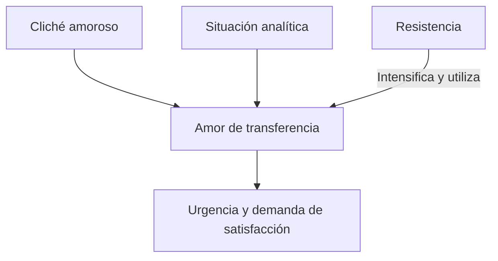
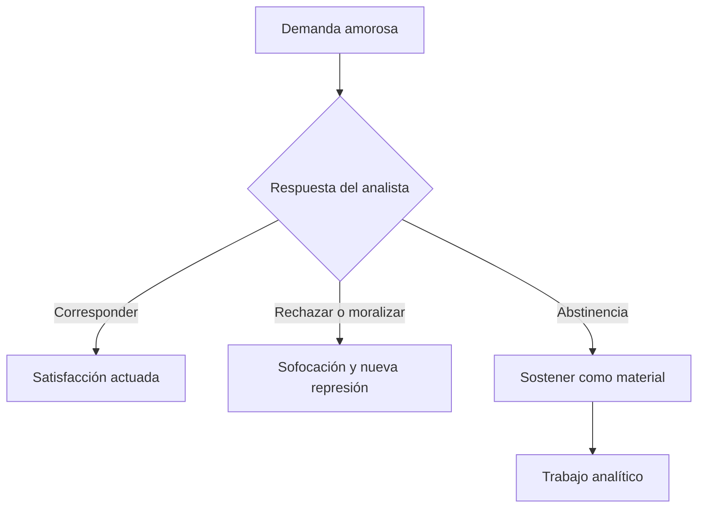
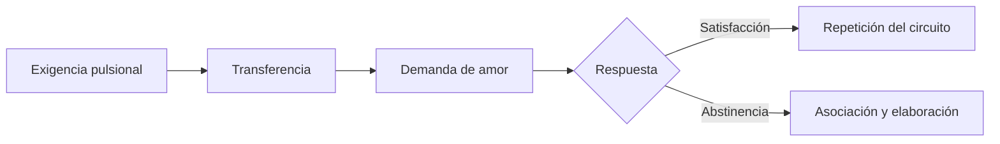

# *Puntualizaciones sobre el amor de transferencia*

## Ubicación

- **Año:** 1915.
- **Edición:** Amorrortu, tomo XII.
- **Recorte de la guía:** pp. 170–171.
- **Espacios:** teóricos y prácticos.
- **Arco:** transferencia y técnica.

## El problema técnico

Una paciente declara amar al analista y exige ser correspondida. Freud pregunta si ese amor es falso, si el tratamiento debe interrumpirse y cómo puede responder el analista sin satisfacer ni sofocar la moción.

> **Tesis central.** El \concept{amor de transferencia} es genuino como cualquier enamoramiento y, al mismo tiempo, posee condiciones singulares de aparición y uso dentro del análisis.

El problema no se resuelve mediante un juicio moral sobre el sentimiento, sino precisando su función en la cura.

## Por qué es genuino

### La resistencia no lo crea

La resistencia intensifica, explota y empuja hacia arriba una moción amorosa disponible, pero no la fabrica desde la nada. El amor proviene del cliché y de condiciones infantiles de elección de objeto.

### Todo enamoramiento repite

Los amores fuera del análisis también reeditarían prototipos infantiles. Que un sentimiento sea transferencial no lo vuelve irreal.

> **Distinción decisiva.** *Transferencial* no significa falso; significa actualizado en un vínculo presente según condiciones amorosas anteriores.

## Tres singularidades

La cátedra destaca que este amor:

1. está provocado por la situación analítica;
2. es empujado hacia arriba y utilizado por la resistencia;
3. carece en alto grado de miramiento por la realidad objetiva.

La falta de miramiento por la realidad se reconoce en la intensidad y urgencia de la demanda. La persona concreta del analista importa menos que el lugar que ocupa en la serie.

## Cómo se vuelve resistencia

El amor pasa a primer plano precisamente cuando el trabajo se aproxima a material conflictivo. La paciente deja de asociar y exige una respuesta amorosa.

La intervención no consiste en anunciar que el amor “no es real”. Debe mostrar cuándo aparece, qué repetición actualiza y cómo sustituye el trabajo asociativo.

## Dos respuestas que hacen fracasar la cura

### Corresponder

Satisfacer la demanda convierte la repetición en una relación ordinaria y abandona la posición analítica. El analista utiliza al paciente para su propia satisfacción y pierde el campo de elaboración.

### Rechazar o moralizar

Tratar el amor como impropio humilla, refuerza la represión y desperdicia un material central. Tampoco se trata de exigir una renuncia virtuosa.

## Abstinencia

La \concept{abstinencia} consiste en no ofrecer a la pulsión la satisfacción sustitutiva que busca en la relación analítica.

> **Definición de trabajo.** La abstinencia sostiene la tensión para que la demanda pueda desplegarse, asociarse e interpretarse sin ser satisfecha ni sofocada por el analista.

No equivale a frialdad, neutralidad afectiva absoluta ni maltrato. Es una regla sobre el uso de la posición analítica.

## La dimensión ética

La relación es asimétrica: el paciente consulta desde un padecimiento y el analista ocupa una función, no el lugar de una pareja posible.

La abstinencia exige al analista:

- no explotar la dependencia;
- no buscar gratificación narcisista;
- no imponer sus ideales;
- reconocer sus propias respuestas sin actuarlas con el paciente;
- conservar como orientación el trabajo analítico.

## Amor y pulsión

El amor de transferencia vuelve visible que la pulsión busca satisfacción dentro del dispositivo. La abstinencia impide que el análisis se convierta en una nueva satisfacción sustitutiva estable.

## Errores frecuentes

- Decir que el amor transferencial es mentira o simulación.
- Afirmar que la resistencia lo crea por completo.
- Usar su genuinidad como justificación para corresponderlo.
- Definir abstinencia como indiferencia o rechazo.
- Reducir el problema a una prohibición moral.
- Olvidar su relación con la detención de asociaciones.

## Preguntas posibles

- ¿Es genuino el amor de transferencia?
- ¿Qué papel desempeña la resistencia?
- Desarrolle sus tres singularidades.
- ¿Por qué corresponder y rechazar son respuestas inadecuadas?
- Defina abstinencia y explique su función.
- Articule amor de transferencia y satisfacción pulsional.

## Respuesta concentrada posible

> Freud sostiene que el amor de transferencia es genuino porque la resistencia no lo crea desde cero y porque todo enamoramiento repite condiciones infantiles. Sin embargo, posee tres singularidades: está provocado por la situación analítica, es intensificado y utilizado por la resistencia y tiene escaso miramiento por la realidad. Corresponderlo satisface la repetición y destruye la posición analítica; moralizarlo refuerza la represión. La abstinencia mantiene la demanda como material de asociación e interpretación sin satisfacerla ni sofocarla. Es, por eso, una posición técnica y ética.
