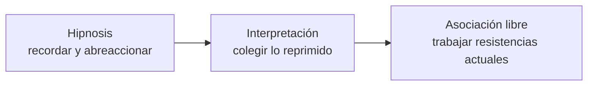
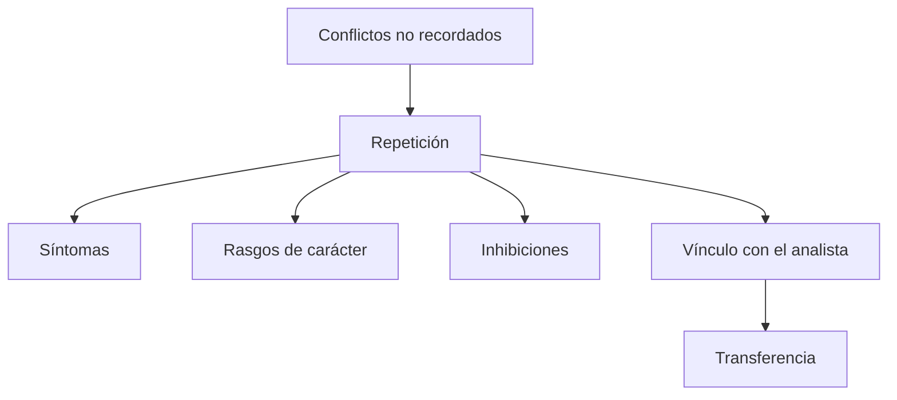
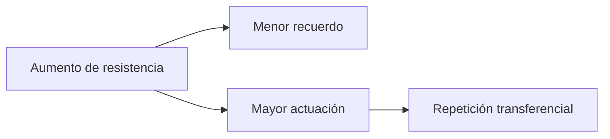

# *Recordar, repetir y reelaborar*

## Ubicación

- **Año:** 1914.
- **Edición:** Amorrortu, tomo XII.
- **Recorte de la guía:** pp. 145–157.
- **Espacios:** teóricos y prácticos.
- **Arco:** transferencia y técnica.

## La intervención del texto

Freud muestra que el paciente no recupera todo lo reprimido como recuerdo narrable. Aquello que no recuerda lo repite en actos, síntomas, rasgos y relaciones; el análisis debe convertir esa actualización en un campo de trabajo.

> **Fórmula de Freud trabajada por la cátedra.** El analizante repite sin saber que repite: la \concept{repetición} es una manera de recordar en acto.

## Tres momentos de la técnica

### Hipnosis y método catártico

Se buscaba recuperar la escena de formación del síntoma y abreaccionar el afecto estrangulado.

### Interpretación de ocurrencias

Al abandonar la hipnosis, Freud procura colegir lo reprimido a partir de sueños, síntomas y asociaciones.

### Trabajo sobre la superficie

La técnica posterior se concentra en las resistencias que aparecen actualmente en silencios, interrupciones, actuaciones y transferencia.

La “superficie” no significa superficialidad. Es el lugar presente donde las fuerzas de la represión se vuelven observables.

## Qué no puede recordarse como texto

Freud encuentra distintas formas de olvido:

- recuerdos bloqueados por resistencia;
- conexiones y secuencias olvidadas;
- impresiones infantiles que nunca se organizaron como relato consciente;
- recuerdos encubridores que representan y ocultan otros materiales.

> **Distinción de trabajo.** No todo lo eficaz fue alguna vez un recuerdo autobiográfico completo. El cuerpo y la relación pueden conservar marcas sin un texto original recuperable.

## Repetición en acto

El paciente reproduce:

- inhibiciones;
- actitudes inviables;
- rasgos patológicos de carácter;
- síntomas;
- modalidades de vínculo y demanda.

El sujeto vive lo repetido como plenamente actual, no como una cita consciente de su pasado.

## Relación inversa con la resistencia

Cuanto mayor es la resistencia, más ampliamente el recordar es sustituido por actuar.

La repetición es simultáneamente un límite al recuerdo y la vía por la que lo no recordado ingresa en el análisis.

## Neurosis de transferencia

La cura transforma la neurosis ordinaria en una \concept{neurosis de transferencia}: una nueva versión del conflicto organizada alrededor del analista.

No es una enfermedad nueva agregada por el analista. Concentra las fuerzas de la neurosis en un vínculo actual donde pueden ser reconocidas y modificadas.

## Una palestra para repetir

Freud concede a la compulsión de repetición un ámbito delimitado dentro de la transferencia. El paciente puede desplegar allí sus modalidades, pero la respuesta abstinente del analista introduce una diferencia respecto de las relaciones habituales.

La meta no es impedir toda actuación antes de comprenderla. Es evitar que se expanda sin límite y reconducirla hacia el recuerdo y la elaboración.

## Recordar

Recordar no consiste en recuperar una película fiel. Implica producir palabras, enlaces y temporalidad para algo que se actualizaba sin reconocimiento.

El análisis llena lagunas en sentido dinámico: trabaja las resistencias que impiden reconocer conexiones.

## Reelaborar

Nombrar una resistencia no la elimina. El analizante debe encontrarla repetidas veces, reconocer sus variaciones y atravesar su fuerza.

> **Definición de trabajo.** La \concept{reelaboración} es el trabajo sostenido mediante el cual se atraviesan resistencias que persisten aun después de haber sido discernidas.

La reelaboración diferencia el análisis de una sugestión rápida apoyada en la autoridad del terapeuta.

## *In absentia* e *in effigie*

Freud afirma que nadie puede ser ajusticiado *in absentia* o *in effigie*. El conflicto no se resuelve con sus fuerzas ausentes o mediante una representación inerte: debe volverse actual en transferencia.

> **Fórmula de Freud.** Nadie puede ser ajusticiado *in absentia* o *in effigie*.

Amor, hostilidad, defensa y satisfacción deben presentarse en el vínculo para que exista la posibilidad de una respuesta diferente.

## El arco técnico completo

La secuencia no sucede una sola vez: se reabre con cada nueva forma de resistencia.

## Errores frecuentes

- Suponer que analizar es recuperar recuerdos fotográficos.
- Tratar toda repetición como conducta deliberada.
- Considerar la repetición únicamente un obstáculo.
- Confundir neurosis de transferencia con neurosis narcisistas.
- Creer que señalar una resistencia equivale a eliminarla.
- Reducir reelaboración a comprensión intelectual.
- Pensar que trabajar la superficie evita lo inconsciente.

## Preguntas posibles

- Reconstruya los tres momentos de la técnica.
- ¿En qué sentido repetir es recordar en acto?
- ¿Qué relación existe entre repetición y resistencia?
- Defina neurosis de transferencia.
- ¿Por qué Freud permite desplegar la repetición?
- Distinga discernimiento y reelaboración.

## Respuesta concentrada posible

> Freud reconstruye el pasaje desde la hipnosis y abreacción hacia la interpretación y, finalmente, al trabajo sobre las resistencias actuales mediante asociación libre. El analizante no recuerda todo lo reprimido: repite sin saberlo en síntomas, rasgos y vínculos. Cuanto mayor es la resistencia, más el recuerdo es reemplazado por actuación. En el análisis, esa repetición se concentra en una neurosis de transferencia que funciona como palestra delimitada. Interpretar una resistencia no basta: la reelaboración requiere encontrarla y atravesarla reiteradamente hasta producir una modificación duradera.
