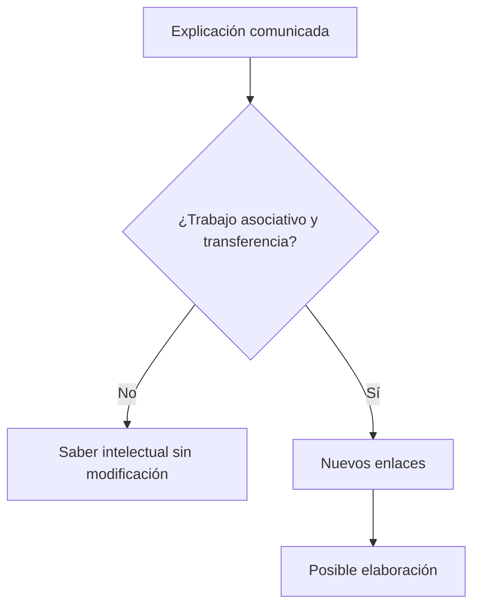

# *Sobre el psicoanálisis silvestre*

## Ubicación

- **Año:** 1910.
- **Edición:** Amorrortu, tomo XI.
- **Recorte de la guía:** pp. 221–223.
- **Espacio:** seminarios.
- **Arco:** angustia.

## La escena clínica

Una mujer separada consulta por estados de angustia. Otro médico le había explicado que su padecimiento provenía de una insatisfacción sexual y le había presentado tres alternativas:

1. volver con su marido;
2. tomar un amante;
3. satisfacerse por sí misma.

El consejo parece apoyarse en una tesis freudiana —la importancia etiológica de la sexualidad—, pero Freud lo considera una forma de \concept{psicoanálisis silvestre}.

> **Problema central.** Repetir aisladamente que un síntoma tiene una causa “sexual” no equivale a pensar ni practicar psicoanálisis.

## El error sobre la sexualidad

El médico reduce la sexualidad a actividad genital y la satisfacción a descarga directa. Desconoce la ampliación producida por *Tres ensayos* y por la teoría de la pulsión.

| Lectura reductiva | Lectura psicoanalítica |
|---|---|
| Sexualidad = genitalidad. | Sexualidad infantil, pulsional y no limitada a lo genital. |
| Necesidad consciente. | Exigencia pulsional representada y conflictiva. |
| Descarga directa. | Destinos, fantasías, fijaciones y satisfacciones sustitutivas. |
| Consejo sobre la conducta. | Investigación de conflicto, represión y retorno. |

> **Lectura de la cátedra.** La sexualidad sólo adquiere sentido psicoanalítico si se la piensa como pulsional, infantil, ampliada y sometida a conflicto y represión.

## El error sobre la angustia

El consejo mezcla sin mediaciones dos problemas:

- la primera teoría de la \concept{neurosis de angustia}, vinculada con alteraciones de la sexualidad actual;
- la angustia que interviene en síntomas y neurosis de transferencia.

En la primera formulación, la excitación permanece somática, carece de representación psíquica y no opera la represión. Recomendar descarga genital no convierte por eso el cuadro en uno abordable mediante interpretación.

Con la teoría de la pulsión, Freud podrá pensar otra articulación:

Esta segunda serie no puede reducirse a falta de actividad sexual actual.

## Informar no es producir saber

El médico comunica una explicación desde una posición de autoridad. Incluso si una formulación fuera conceptualmente correcta, decirle al paciente qué “tiene” no elimina la eficacia de lo inconsciente.

El problema ya aparecía en las teorías sexuales infantiles: una información adulta correcta no desarma automáticamente una construcción sostenida por la pulsión y la fantasía. *Lo inconsciente* ofrece después la explicación metapsicológica: una representación consciente comunicada desde afuera no modifica por sí sola la inscripción inconsciente.

> **Distinción decisiva.** Información transmitida no equivale a saber elaborado por el analizante.

## Saber y resistencia

El paciente puede aceptar intelectualmente una explicación y conservar intactos el síntoma y la resistencia. También puede rechazarla, sentirse acusado o usarla para reforzar una defensa.

El analista no oculta información como estrategia de poder. Espera las condiciones en las que una intervención pueda enlazarse con las asociaciones y resistencias presentes.

## El momento de la intervención

El texto prepara una regla técnica desarrollada en otros escritos: no conviene comunicar una interpretación antes de que exista transferencia suficiente y el material se encuentre próximo al trabajo del paciente.

Una interpretación prematura puede:

- aumentar la resistencia;
- provocar rechazo intelectual;
- imponer una explicación ajena;
- confundir persuasión con análisis.

## Qué vuelve “silvestre” a una intervención

No es solamente un error de vocabulario. Se vuelve silvestre cuando:

1. toma un concepto aislado del conjunto teórico;
2. reduce la sexualidad a genitalidad;
3. desconoce pulsión, fantasía, conflicto y represión;
4. comunica una causa sin trabajar resistencias;
5. reemplaza la asociación por consejo;
6. ignora la transferencia y el momento técnico.

## Puente hacia la Conferencia 25

*Sobre el psicoanálisis silvestre* delimita lo que la angustia **no** puede explicarse como una receta simple de descarga. La Conferencia 25 pregunta luego qué relación existe entre angustia realista y neurótica y permite situar la exigencia pulsional como peligro interno.

## Errores frecuentes

- Pensar que Freud niega toda relación entre sexualidad y angustia.
- Creer que el único problema del médico es haber dado un consejo moralmente dudoso.
- Reducir la crítica a una discusión sobre abstinencia genital.
- Suponer que una interpretación correcta cura por ser verdadera.
- Confundir informar, interpretar y elaborar.
- Mezclar neurosis de angustia con angustia en las neurosis de transferencia.

## Preguntas posibles

- ¿Por qué el médico practica psicoanálisis silvestre?
- ¿Qué concepción de sexualidad critica Freud?
- ¿Por qué informar no equivale a analizar?
- Articule saber comunicado, resistencia y elaboración.
- ¿Cómo prepara este texto el problema de la angustia?

## Respuesta concentrada posible

> Freud llama silvestre a la intervención del médico porque toma aisladamente la etiología sexual y la reduce a genitalidad y descarga. Al aconsejar a la paciente volver con su marido, tomar un amante o satisfacerse por sí misma, desconoce la sexualidad infantil y pulsional, el conflicto, la represión y la transferencia. Además confunde información con elaboración: comunicar una causa no modifica por sí mismo la representación inconsciente ni vence las resistencias. El texto prepara así el pasaje desde una concepción somática de la neurosis de angustia hacia la articulación metapsicológica entre pulsión, represión, angustia y síntoma.
