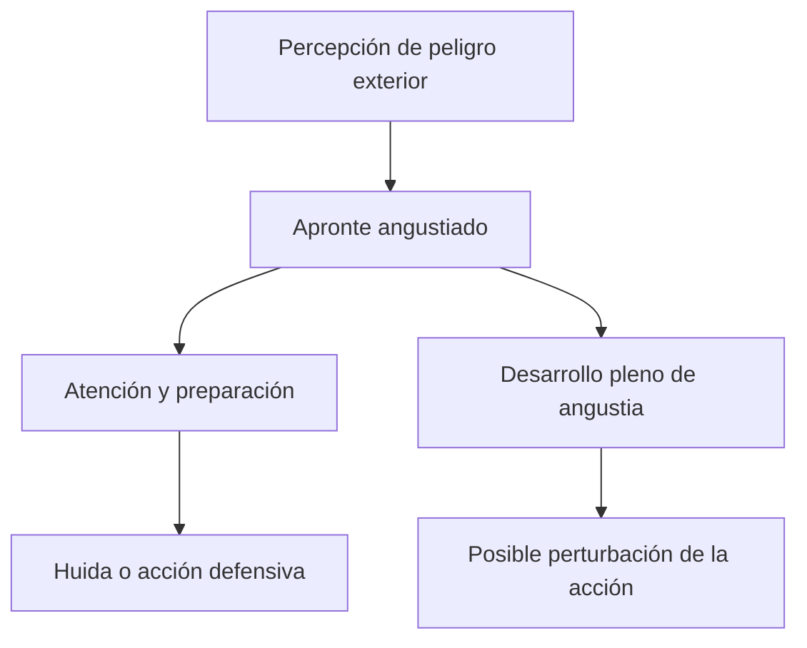
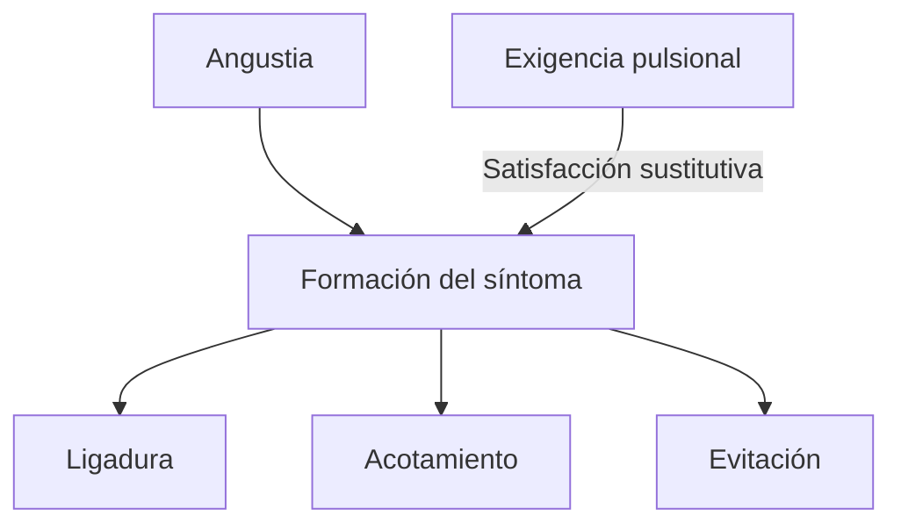
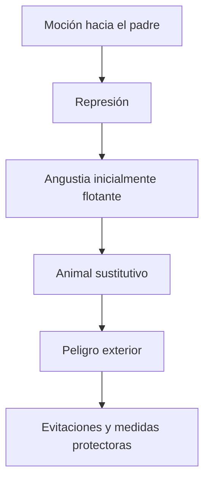
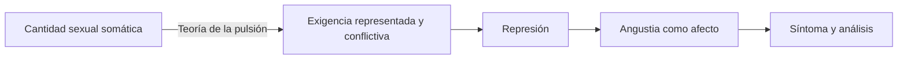

# Conferencia 25 — *La angustia*

## Ubicación

- **Año:** 1917.
- **Edición:** Amorrortu, tomo XVI.
- **Recorte de la guía:** pp. 365–368 y 372–374.
- **Espacio:** seminarios.
- **Arco:** angustia.

## La pregunta de la conferencia

Freud distingue angustia realista y neurótica, pero busca un factor común. La clase del 20/08 organiza la respuesta: ambas son reacciones **ante un peligro** y ponen en juego un intento de huida.

La diferencia reside en la procedencia del peligro:

| Angustia realista | Angustia neurótica |
|---|---|
| Peligro exterior reconocible. | Exigencia pulsional interna. |
| La huida motriz puede ser adecuada. | No existe huida motriz de la propia pulsión. |
| Puede preparar una acción defensiva. | Exige defensa psíquica, represión y síntoma. |

> **Factor común trabajado por la cátedra.** La angustia es angustia *ante algo*: frente a un peligro exterior en la realista y frente a una exigencia pulsional en la neurótica.

## Angustia realista

Freud la define como una reacción frente a la percepción de un peligro exterior. Incluye un componente de preparación y otro de desarrollo afectivo.

Cuando su intensidad permanece limitada, puede funcionar como:

- señal;
- apronte;
- anticipación;
- preparación para huir o actuar.

Cuando se desarrolla plenamente, puede desorganizar o inhibir la acción más adecuada.

> **Distinción decisiva.** La preparación frente al peligro puede ser útil; el desarrollo desbordado de angustia no lo es necesariamente.

## Angustia neurótica

La angustia neurótica parece al comienzo carecer de objeto o presentarse como “flotante”. Sin embargo, la cátedra destaca que también responde a un peligro: una \concept{exigencia pulsional} que el yo no puede tramitar.

La dificultad consiste en que el estímulo pulsional:

- proviene del interior;
- actúa como fuerza constante;
- no puede evitarse alejándose físicamente;
- exige trabajo psíquico.

Por eso el aparato intenta producir una defensa equivalente a una huida.

## El puente con *La represión*

La conferencia se articula con la distinción entre representación y \concept{monto de afecto}. La representación puede ser rechazada mientras el factor cuantitativo se muda en angustia.

La clase formula la serie de esta etapa de Freud:

> **Serie central de examen.** Exigencia pulsional → represión → angustia → síntoma.

Esta fórmula corresponde a la teoría utilizada en los textos del programa: **la represión produce angustia**. Freud invertirá posteriormente la relación en *Inhibición, síntoma y angustia*, texto que no debe introducirse sin marcar el cambio teórico.

## Qué hace el síntoma

El síntoma intenta:

1. ligar la angustia;
2. acotarla;
3. evitar su desarrollo.

No es solamente una consecuencia posterior. Es una respuesta defensiva que localiza o administra el peligro, al tiempo que aloja una satisfacción pulsional sustitutiva.

## La serie común de las neurosis de transferencia

Histeria de conversión, histeria de angustia y neurosis obsesiva producen formaciones diferentes, pero la clase propone una serie común:

- exigencia pulsional;
- conflicto con el yo;
- represión;
- angustia;
- formación sintomática.

La serie no elimina las diferencias de mecanismo. Ofrece un esqueleto para comparar cómo cada neurosis trata representación y monto de afecto.

## La fobia vuelve visible el mecanismo

La fobia transforma un peligro pulsional interno en uno exterior y localizable. En los ejemplos trabajados, una moción hacia el padre es reprimida, la angustia aparece y se liga a un animal.

> **Función de la fobia.** El objeto fóbico permite tratar como exterior y evitable un peligro pulsional interno del que no existe huida directa.

La fobia no elimina la angustia. La liga a condiciones precisas: lugares, distancias, acompañantes y movimientos permitidos o prohibidos.

## Primera y segunda formulación

### Primera teoría

- alteración de la sexualidad actual;
- sexualidad entendida principalmente como genitalidad;
- cantidad somática no representada;
- ausencia de conflicto y represión;
- fuera del campo interpretativo del psicoanálisis.

### Segunda formulación trabajada

- sexualidad psicosexual pensada mediante la pulsión;
- conflicto entre yo y exigencia pulsional;
- represión;
- monto de afecto que se muda en angustia;
- lugar central en las neurosis de transferencia.

## La angustia como afecto

La angustia continúa manifestándose corporalmente mediante palpitaciones, sudoración, agitación o dificultad para respirar. Puede carecer de un texto consciente capaz de explicar esa intensidad.

Lo nuevo no es que deje de sentirse en el cuerpo. Cambia su articulación teórica: el factor cuantitativo puede afectar al yo como resultado del conflicto y la represión.

> **Fórmula de la cátedra.** La angustia es el afecto por excelencia: el modo en que el factor cuantitativo de la función pulsional afecta al yo.

## Errores frecuentes

- Confundir angustia con miedo sin precisar la operación fóbica.
- Decir que la angustia realista es siempre útil.
- Sostener que la angustia neurótica no es ante nada.
- Confundir neurosis de angustia y angustia en neurosis de transferencia.
- Olvidar que el peligro neurótico es una exigencia interna.
- Presentar el síntoma sólo como efecto y omitir su función de ligadura.
- Introducir la teoría posterior sin aclarar que invierte la relación entre angustia y represión.

## Preguntas posibles

- Distinga angustia realista y neurótica.
- ¿Cuál es su factor común?
- ¿Qué diferencia hay entre apronte y desarrollo pleno de angustia?
- Desarrolle la serie común de las neurosis de transferencia.
- ¿Qué función cumple el síntoma respecto de la angustia?
- Utilice la fobia para explicar la transformación del peligro interno.
- Compare las dos formulaciones de la angustia.

## Respuesta concentrada posible

> En la Conferencia 25, Freud distingue angustia realista y neurótica y busca su factor común. Ambas son reacciones ante un peligro y promueven una huida. En la angustia realista el peligro es exterior y un apronte limitado prepara la acción; en la neurótica el peligro es una exigencia pulsional interna de la que no puede huirse motrizmente. Articulada con *La represión*, la serie de esta etapa es exigencia pulsional, represión, angustia y síntoma. El síntoma intenta ligar, acotar o evitar la angustia. La fobia muestra el mecanismo al transformar el peligro interno en un objeto exterior localizable y organizar medidas de evitación.
