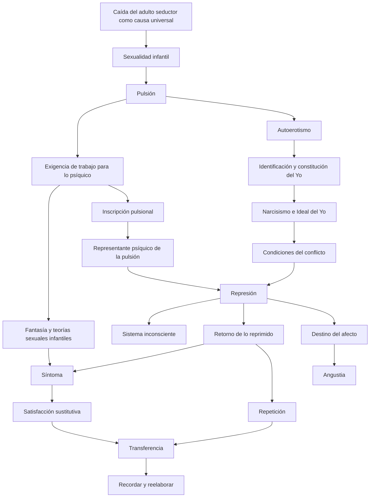

# El recorrido cohesivo

## Una transformación, no una lista de conceptos

El segundo parcial puede parecer una acumulación difícil de ordenar: pulsión, fantasía, narcisismo, represión, inconsciente, síntoma, transferencia y angustia. Sin embargo, la cátedra no los presenta como temas independientes. Todos responden a una transformación inicial.

> **Tesis del recorrido.** La introducción de la \concept{pulsión} transforma la etiología, el cuerpo, el aparato psíquico, el yo, el síntoma y la técnica. El segundo parcial estudia las consecuencias de esa transformación.

La pregunta ya no es solamente qué acontecimiento produjo una neurosis. Freud debe explicar qué es la sexualidad humana cuando no existe un instinto que determine objeto y meta, cómo responde el psiquismo a esa exigencia y por qué una satisfacción puede convertirse en fuente de conflicto.

## El mapa general

Este mapa no es una cronología estricta. Expresa condiciones y articulaciones. Por ejemplo, el \concept{Ideal del Yo} no causa por sí solo toda represión, pero permite pensar desde qué instancia una satisfacción pulsional puede resultar inconciliable y producir displacer.

## Primer movimiento: desnaturalizar la sexualidad

Freud abandona la idea de que la sexualidad humana funciona como un instinto dirigido naturalmente hacia un objeto maduro y una meta reproductiva. La variabilidad de objetos, metas y zonas muestra que la sexualidad se organiza de otro modo.

La \concept{pulsión} permite nombrar esa diferencia. Es una fuerza constante que parte del cuerpo, exige trabajo a lo psíquico y obtiene satisfacciones parciales. Su objeto no está predeterminado: funciona como *medio contingente* para alcanzar la meta.

La sexualidad infantil deja entonces de ser una excepción patológica. Es universal y se construye en los intercambios de cuidado con otros. El cuerpo biológico deviene cuerpo erógeno mediante zonas, recorridos y marcas de satisfacción.

## Segundo movimiento: construir respuestas psíquicas

La pulsión no trae consigo un saber acerca de cómo satisfacerse. La falta de instinto abre una falta de saber. Frente a ella, el niño investiga, pregunta, fantasea y construye teorías sexuales.

La \concept{fantasía} no es una invención sin consecuencias. Es una forma de tramitar la exigencia pulsional y de organizar deseos. Puede permanecer consciente como sueño diurno o devenir inconsciente y participar en el síntoma.

Las \concept{teorías sexuales infantiles} son falsas respecto del conocimiento adulto, pero contienen fragmentos de verdad sobre el cuerpo pulsional del niño. Su represión no las vuelve ineficaces: pueden retornar en síntomas, inhibiciones, sueños y elecciones posteriores.

## Tercer movimiento: constituir el yo

El cuerpo pulsional comienza como un campo de satisfacciones parciales. No existe desde el inicio un yo unificado que sea propietario de esas experiencias.

El pasaje del \concept{autoerotismo} al \concept{narcisismo} requiere un nuevo acto psíquico: una \concept{identificación} que constituya al yo como unidad y primer objeto unificado de la libido.

Pero la unidad no es total. Queda un *resto autoerótico* que no ingresa completamente en el yo ni en los objetos. Por eso el yo puede funcionar como síntesis sin eliminar la parcialidad pulsional que lo precede.

El narcisismo permite distinguir \concept{libido yoica} y \concept{libido de objeto}, así como comprender las elecciones de objeto y la formación de ideales. El \concept{Ideal del Yo} mide al yo actual y contribuye a determinar qué satisfacciones resultan aceptables o inconciliables.

## Cuarto movimiento: formalizar el conflicto

La pulsión no entra al aparato como una cantidad puramente somática ni como una representación cualquiera. Freud necesita el concepto de \concept{representante psíquico de la pulsión} para pensar su inscripción.

La \concept{represión primordial} fija ese representante y constituye una anterioridad lógica. La \concept{represión propiamente dicha} recae sobre sus retoños representativos. Aquello que se reprime no desaparece: conserva investidura, atrae nuevas representaciones y busca retornar.

El \concept{sistema inconsciente} posee una legalidad específica: proceso primario, atemporalidad, ausencia de negación y predominio de la realidad psíquica. El síntoma se vuelve inteligible como resultado de esa eficacia.

## Quinto movimiento: del síntoma a la cura

El síntoma no es solamente un signo exterior de enfermedad. Es una \concept{formación sustitutiva} y una \concept{satisfacción sustitutiva}. Expresa deformadamente algo reprimido y, al mismo tiempo, aloja una satisfacción pulsional.

Por eso la cura no puede consistir en informar al paciente qué significa su síntoma. El saber comunicado desde afuera no modifica automáticamente la representación inconsciente eficaz.

En la \concept{transferencia}, las condiciones infantiles de amor, hostilidad y satisfacción se actualizan con el analista. El paciente no recuerda todo: repite y actúa. Esa repetición constituye una resistencia, pero también vuelve presente el conflicto y permite trabajarlo.

> **Fórmula de la cátedra.** La \concept{transferencia} es *motor y obstáculo* de la cura.

La tarea analítica busca transformar la repetición en recuerdo y producir \concept{reelaboración} de las resistencias.

## Sexto movimiento: el afecto y la angustia

La represión permite distinguir el destino de la representación y el del \concept{monto de afecto}. La representación puede quedar reprimida mientras el afecto es sofocado, aparece con otra cualidad o se muda en angustia.

Este paso incorpora la angustia al campo de la metapsicología. Ya no se trata únicamente de excitación sexual somática no ligada, como en la primera teoría de las neurosis actuales. La angustia puede pensarse ahora en relación con pulsión, conflicto y represión.

La articulación completa queda abierta hasta incorporar las clases finales y reconstruir con precisión la Conferencia 25.

## Cómo leer lo que sigue

Los capítulos siguientes desarrollan este mapa por problemas. Cada uno debe responder cuatro preguntas:

1. ¿qué dificultad encuentra Freud?;
2. ¿qué concepto construye para resolverla?;
3. ¿qué modifica ese concepto en la teoría anterior?;
4. ¿cómo lo utiliza la cátedra para articular textos y clínica?

El objetivo no es memorizar una secuencia de definiciones, sino poder reconstruir el movimiento que las vuelve necesarias.

