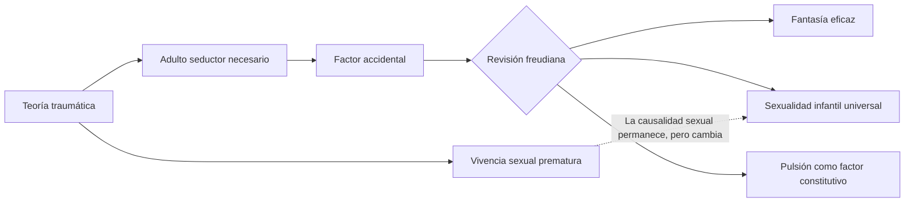
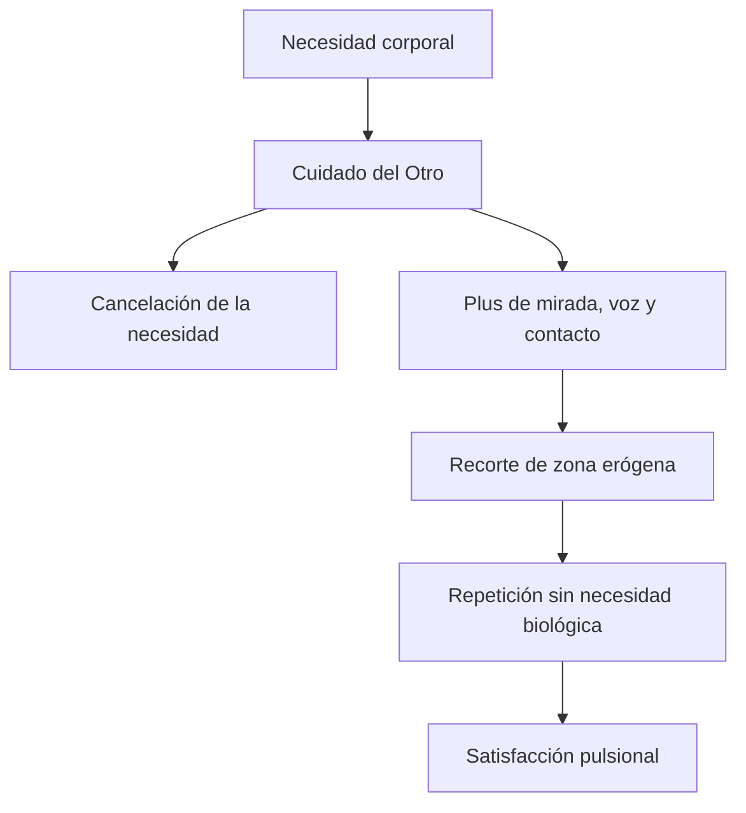

# De la teoría traumática a la pulsión

## El problema del viraje

Freud había atribuido un lugar etiológico decisivo a vivencias sexuales prematuras producidas por la intervención de un adulto. En esa teoría, el carácter accidental del encuentro traumático parecía explicar por qué ciertos sujetos enfermaban.

La revisión de esa hipótesis no elimina la sexualidad de la etiología. Modifica su estatuto.

> **Distinción decisiva.** Freud no pasa de una teoría sexual a una teoría no sexual. Pasa de la sexualidad como acontecimiento accidental exterior a la \concept{sexualidad infantil pulsional} como factor constitutivo y universal.

## Qué cae y qué permanece

Cae la necesidad de probar un adulto seductor real en todos los casos. Permanece la tesis de que la sexualidad infantil ocupa un lugar fundamental en la formación de las neurosis.

También permanece la eficacia del pasado, pero ya no depende exclusivamente de un hecho exterior verificable. La \concept{realidad psíquica} puede producir efectos aunque la escena haya sido fantaseada.

## Carta 69: el desengaño fecundo

En la Carta 69 a Fliess, Freud reconoce que su teoría de las neurosis lo había engañado. Las notas de seminarios traducen el viraje mediante una oposición clara:

- se había sobrevalorado la realidad efectiva;
- se había infravalorado la fantasía.

Este reconocimiento abre una dificultad nueva. Si el relato no permite decidir de manera inmediata entre acontecimiento y fantasía, ¿cómo sostener la causalidad psíquica?

La respuesta no consiste en declarar irrelevante la verdad. Consiste en distinguir registros. Para el trabajo de lo inconsciente, una fantasía puede tener valor y eficacia porque organiza deseo, afecto y satisfacción.

> **Fórmula de la cátedra.** En el inconsciente no hay un signo de realidad que permita distinguir por sí solo entre lo acontecido y lo fantaseado.

## Del factor accidental al constitutivo

El adulto seductor funcionaba como factor accidental: podía estar o no estar. La pulsión funciona como factor constitutivo: forma parte de la sexualidad humana.

| Factor accidental | Factor constitutivo |
|---|---|
| Acontecimiento exterior particular | Pulsión sexual universal |
| Adulto seductor necesario | Intercambios de cuidado y constitución erógena |
| Explica por qué ocurrió la escena | Explica por qué el cuerpo exige trabajo psíquico |
| Realidad efectiva como garantía | Realidad psíquica y fantasía eficaz |

Universal no significa idéntico. La pulsión vale para todos, pero se inscribe de manera singular: zonas privilegiadas, objetos fijados, fantasías y destinos varían en cada historia.

## La sexualidad excede la genitalidad

La nueva teoría requiere ampliar qué se entiende por sexual. Lo sexual incluye lo genital, pero no se reduce a reproducción, madurez ni complementariedad entre sexos.

Freud se sirve de las llamadas perversiones para mostrar la variabilidad de objetos y metas. Aquello que la clasificación de la época aislaba como desviación aparece, en componentes parciales, en la sexualidad de todos.

Esto permite separar:

- la disposición perversa polimorfa de la sexualidad infantil;
- una organización perversa estable en sentido clínico;
- la presencia de pulsiones parciales en el síntoma neurótico.

> **Fórmula fuerte.** Que un síntoma satisfaga una pulsión sexual parcial no convierte al neurótico en una “persona perversa”. Muestra que la sexualidad humana no está naturalmente subordinada a la reproducción.

## El cuerpo no viene erógeno de origen

La pulsión permite pensar que el cuerpo se constituye como sede de satisfacción en los intercambios con otros. El cuidado materno —como función, no necesariamente como persona biológica— aporta algo más que la cancelación de necesidades.

Mirada, voz, contacto, ritmos y palabras recortan zonas. El niño puede repetir una acción aun cuando la necesidad haya cesado, porque esa acción produce una satisfacción diferente.

La relación con el otro no puede reducirse a supervivencia. En el mismo acto que conserva la vida se introduce una satisfacción que se independiza de la función biológica.

## La pulsión como solución conceptual

Freud necesita un concepto que articule cuerpo y psiquismo sin reducir uno al otro.

> **Definición de trabajo.** La \concept{pulsión} es un \concept{concepto fronterizo} entre lo anímico y lo somático y una \concept{medida de la exigencia de trabajo} impuesta a lo psíquico por su trabazón con el cuerpo.

No es simplemente una representación mental ni un estímulo fisiológico. Parte de una excitación corporal, pero sólo puede producir efectos psíquicos mediante representantes, fantasías, afectos y recorridos.

## Consecuencias del viraje

La revisión de la teoría traumática abre los problemas que organizan todo el parcial:

1. Si no hay instinto, hay que explicar la variabilidad del objeto y la satisfacción parcial.
2. Si la pulsión exige trabajo, hay que estudiar las respuestas del aparato: fantasía y teorías sexuales.
3. Si el cuerpo comienza fragmentado en zonas, hay que explicar la constitución del yo.
4. Si una satisfacción produce conflicto, hay que construir el mecanismo de la represión.
5. Si lo reprimido conserva eficacia, hay que formalizar el sistema inconsciente y el retorno.
6. Si el conflicto retorna en la cura, hay que comprender la transferencia.

## Una respuesta posible de parcial

Ante una consigna sobre la enmienda de la teoría traumática conviene evitar dos errores:

- afirmar que Freud descubre que sus pacientes “mentían”;
- sostener que abandona la importancia de la sexualidad o de la historia infantil.

La tesis debería ser que la caída del adulto seductor como condición universal conduce a una concepción más radical de la sexualidad: infantil, pulsional, universal y organizada por la realidad psíquica. La fantasía no sustituye a la causalidad; se convierte en una de sus formas psíquicas.

