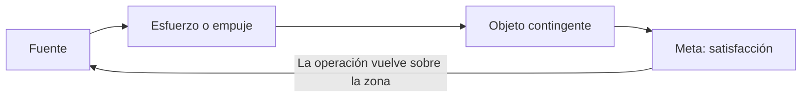
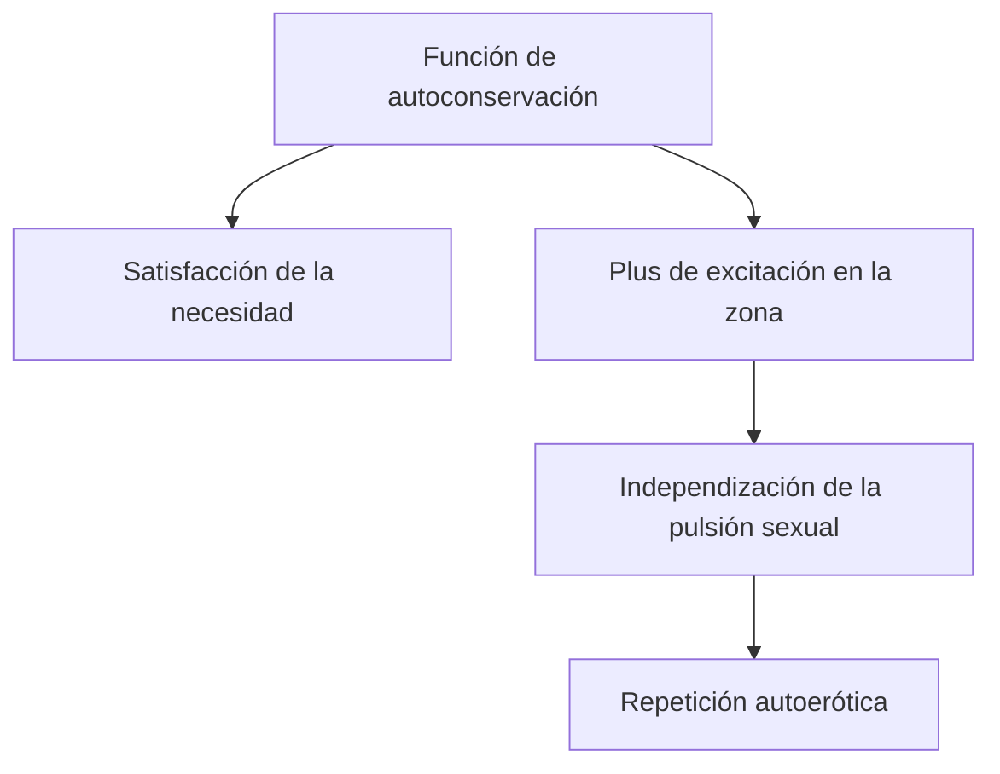
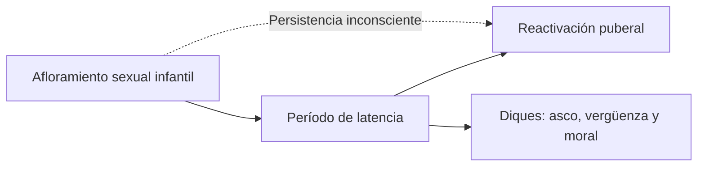
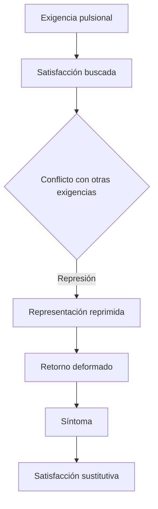

# Pulsión y sexualidad infantil

## Por qué la pulsión no es un instinto

El instinto supone un saber de la especie: objeto, conducta y meta se encuentran relativamente predeterminados. La sexualidad humana, en cambio, muestra variabilidad de objetos, metas y zonas.

> **Distinción decisiva.** La \concept{pulsión} no dispone de un objeto natural que la complete. El objeto es contingente y vale como medio para alcanzar una satisfacción parcial.

Esta contingencia no significa que cualquier objeto sea indiferente en una historia singular. Un objeto puede quedar privilegiado mediante \concept{fijación}. Lo que no existe es una correspondencia biológica universal que garantice satisfacción completa.

## Pulsión y estímulo

Freud compara la pulsión con el estímulo para mostrar sus diferencias.

| | Pulsión | Estímulo externo |
|---|---|---|
| Procedencia | Interior del organismo | Exterior |
| Fuerza | Constante | Momentánea o de choque |
| Huida | Imposible | Posible |
| Respuesta | Trabajo y modificación del mundo interno | Acción apropiada sobre la fuente exterior |

No puede huirse del propio cuerpo. Esta imposibilidad explica por qué la pulsión impone trabajo al aparato.

## Los cuatro términos

### Fuente

La \concept{fuente} es el proceso excitatorio que se produce en un órgano o zona corporal. En la lectura de la cátedra, funciona como punto de partida y llegada del circuito.

### Esfuerzo

El \concept{esfuerzo} o *Drang* es el factor motor, la medida de exigencia de trabajo. Su carácter constante impide resolver la pulsión mediante una huida única.

### Objeto

El \concept{objeto pulsional} es aquello por lo cual la pulsión alcanza su meta. Es el término más variable y puede modificarse, sustituirse o fijarse.

### Meta

La \concept{meta pulsional} es siempre la satisfacción. Metas parciales diferentes permiten operar sobre la fuente y producir satisfacción de órgano.

## El circuito de satisfacción

El objeto no cancela la pulsión como un alimento cancela momentáneamente el hambre. Permite realizar un recorrido que vuelve sobre el cuerpo y obtiene satisfacción parcial.

> **Fórmula de la cátedra.** Lo que se satisface es la pulsión, no la persona como totalidad.

Esta fórmula evita imaginar que el sujeto alcanza completitud. Una pulsión parcial puede satisfacerse mientras la experiencia consciente es de displacer o padecimiento, como ocurre en el síntoma.

## Apuntalamiento

La sexualidad infantil nace \concept{apuntalada} en funciones de autoconservación. La boca sirve para alimentarse; una vez cancelada el hambre, el chupeteo puede repetirse por la satisfacción producida en la zona.

Apuntalamiento no significa que la sexualidad sea biológica. Nombra el modo en que emerge apoyándose en una función vital para después independizarse de ella.

## Autoerotismo y zona erógena

La satisfacción infantil es inicialmente \concept{autoerótica}: se obtiene en el cuerpo propio sin un objeto total unificado. Esto no implica ausencia de otros. El circuito se constituye a partir del cuidado recibido, aunque la satisfacción recaiga sobre una zona del propio cuerpo.

Las exteriorizaciones sexuales infantiles presentan tres caracteres:

1. apuntalamiento en una función corporal;
2. autoerotismo;
3. predominio de una \concept{zona erógena}.

Una zona es erógena porque queda recortada en un circuito de satisfacción. No se define solamente por producir placer consciente: puede participar también en experiencias dolorosas o síntomas.

## Sexualidad en dos tiempos

La sexualidad humana posee un desarrollo en dos tiempos.

La latencia no elimina la sexualidad. Sofoca manifestaciones visibles, construye diques y deja organizaciones infantiles capaces de retornar en la pubertad y en la neurosis.

## Pulsiones parciales

Oralidad, analidad, crueldad y mirada muestran que la sexualidad infantil no se encuentra unificada bajo primacía genital. Cada pulsión parcial parte de una zona y persigue una satisfacción específica.

La expresión *perversa polimorfa* señala esta multiplicidad y no constituye por sí misma un diagnóstico. Los componentes parciales permanecen en la vida adulta y pueden integrarse, sublimarse, reprimirse o participar en síntomas.

## Deseo y pulsión

La cátedra insiste en no confundirlos.

| Deseo | Pulsión |
|---|---|
| Se articula con huellas de objeto | Parte de una fuente corporal |
| Es una moción psíquica | Articula lo somático y lo psíquico |
| Busca realizarse | Busca satisfacción |
| Insiste alrededor de una experiencia perdida | Insiste mediante un circuito corporal |

> **Distinción de la cátedra.** El \concept{deseo} se realiza; la \concept{pulsión} se satisface.

La distinción no implica que funcionen aisladamente. Fantasías y síntomas pueden enlazar deseo y satisfacción pulsional, pero cada concepto destaca una dimensión diferente.

## Conflicto y síntoma

La teoría pulsional redefine el conflicto psíquico. Una satisfacción sexual puede entrar en contradicción con exigencias yoicas, ideales o condiciones de realidad. Si cae bajo represión, la pulsión no desaparece.

> **Fórmula fuerte.** El \concept{síntoma} no es sólo una formación sustitutiva: es también una \concept{satisfacción sustitutiva} de la pulsión.

Esta doble definición explica por qué el sujeto padece un síntoma y, al mismo tiempo, no puede abandonarlo mediante una decisión consciente.

## Qué conviene poder responder

Una respuesta sobre pulsión debería incluir:

1. diferencia respecto del instinto y del estímulo;
2. cuatro términos;
3. contingencia del objeto;
4. circuito y satisfacción parcial;
5. apuntalamiento, autoerotismo y zona erógena;
6. relación con conflicto, represión y síntoma.

Nombrar los términos no alcanza: hay que mostrar cómo permiten pensar una sexualidad sin objeto natural y por qué el síntoma puede alojar satisfacción.

