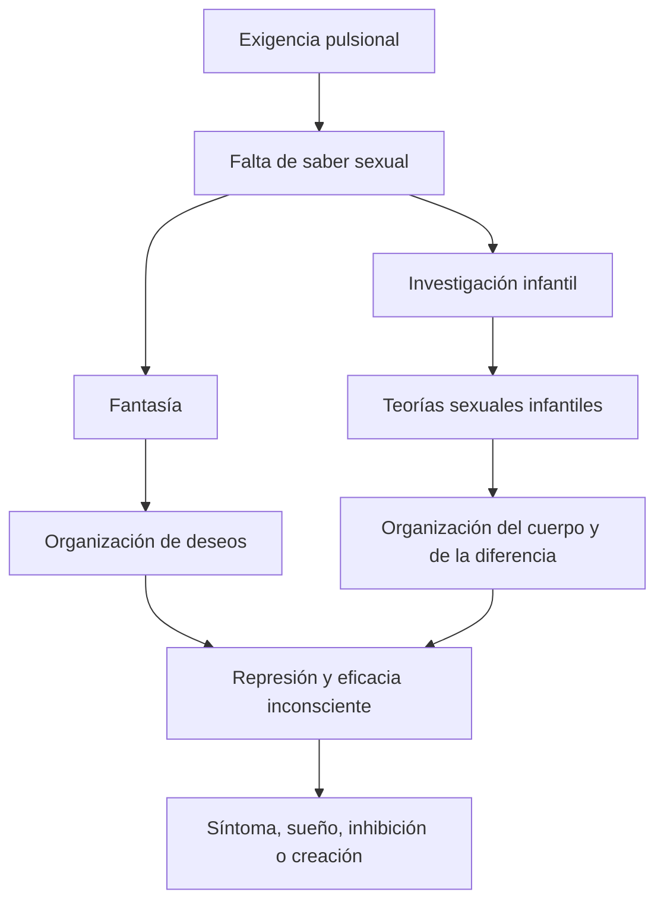
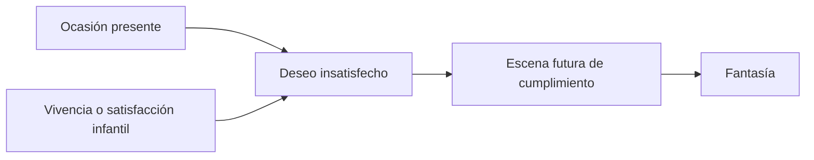
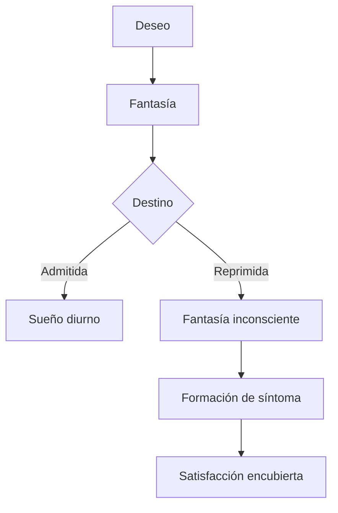
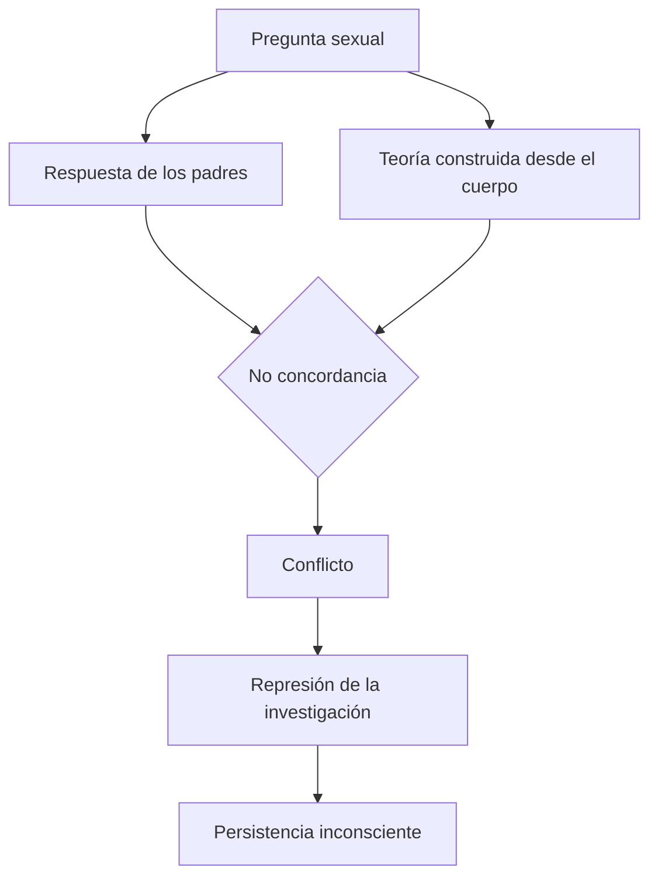

# Fantasía y teorías sexuales infantiles

## Respuestas frente a una falta de saber

Si la sexualidad humana no está guiada por un instinto, el niño no dispone de un saber natural acerca del origen, la diferencia sexual o el coito. El cuerpo excita y plantea preguntas antes de que exista un conocimiento capaz de responderlas.

La fantasía y las teorías sexuales infantiles son modos distintos de elaborar esa exigencia.

## La fantasía como elaboración

La \concept{fantasía} es una respuesta psíquica a la exigencia pulsional. No es puro error ni decoración imaginaria. Organiza escenas donde un deseo puede figurarse como satisfecho.

En *El creador literario y el fantaseo*, Freud parte del juego infantil. El niño crea un mundo propio y reordena elementos de la realidad de una manera que le produce placer.

> **Distinción de Freud.** Lo opuesto del juego no es la seriedad, sino la realidad efectiva.

El juego emplea grandes montos de afecto y se apoya en objetos reales. Cuando el niño crece, no renuncia sin más a esa satisfacción: la permuta por fantasías o sueños diurnos.

## La temporalidad del fantaseo

El motor del fantaseo son deseos insatisfechos. Una ocasión presente despierta un deseo enlazado con experiencias infantiles y produce una escena futura de satisfacción.

La fantasía enlaza presente, pasado y futuro. No reproduce simplemente un recuerdo: reorganiza tiempos alrededor del deseo.

## Del juego a la creación literaria

Las fantasías adultas suelen ser privadas porque revelan deseos ambiciosos o eróticos. El creador literario logra compartirlas mediante dos recursos:

1. atempera su carácter egoísta mediante variaciones y encubrimiento;
2. ofrece una \concept{prima de placer} formal o estética.

Ese placer previo permite acceder a fuentes de satisfacción que, presentadas directamente, despertarían vergüenza o rechazo. La obra no elimina la fantasía privada: la transforma para volverla compartible.

## Fantasía consciente e inconsciente

Los sueños diurnos pueden ser conscientes. En el síntoma, en cambio, la fantasía puede quedar reprimida y sostenerse en un deseo inconsciente.

> **Fórmula de la cátedra.** La fantasía inconsciente puede funcionar como un estadio previo al \concept{síntoma}.

Esto permite enlazar seminarios y prácticos: el síntoma encubre la práctica sexual del neurótico porque una fantasía reprimida organiza el modo de satisfacción pulsional.

## Pulsión de saber e investigación infantil

La pregunta “¿de dónde vienen los niños?” no es curiosidad neutra. Se encuentra impulsada por la propia existencia, el cuerpo y cambios en la familia.

La \concept{pulsión de saber} reúne componentes de apoderamiento y mirada. El niño pregunta a los padres, supuestos portadores del saber, pero sus respuestas pueden resultar evasivas o incompatibles con aquello que el cuerpo impone.

Las notas de seminarios llaman \concept{ignorancia que no se deja sustituir} al límite que no puede resolverse mediante información. No es simplemente que los padres expliquen mal: el saber sexual carece de la garantía instintiva que el niño busca.

## Primera fractura

Cuando la respuesta adulta contradice la construcción infantil, el niño debe elegir entre el saber atribuido a sus padres y sus propias teorías corporales. La cátedra sitúa allí una primera fractura o conflicto.

La teoría se reprime y deja de recordarse, pero puede conservar eficacia. Por eso una investigación sexual infantil puede reaparecer como inhibición intelectual, síntoma o curiosidad compulsiva.

## Las tres teorías típicas

### Premisa universal del pene

El niño atribuye el mismo genital a todas las personas. No integra la diferencia percibida y sostiene una \concept{premisa universal del pene}.

La teoría es falsa respecto de la anatomía adulta, pero expresa la organización genital infantil y el modo en que el niño interpreta la diferencia desde su propio cuerpo.

### Teoría de la cloaca

Los niños serían concebidos por la boca y nacidos por el ano. La \concept{teoría de la cloaca} parte de organizaciones oral y anal y del desconocimiento de la vagina.

### Concepción sádica del coito

La relación sexual observada o escuchada se interpreta como pelea, dominación o ejercicio de poder. La \concept{concepción sádica del coito} organiza actividad y pasividad en términos de apoderamiento.

## Falsas y verdaderas

Las teorías sexuales infantiles son contradictorias en dos sentidos:

- son falsas para el conocimiento adulto y contienen fragmentos de verdad pulsional;
- son reprimidas y continúan siendo eficaces.

| Teoría | Error manifiesto | Fragmento de verdad pulsional |
|---|---|---|
| Premisa universal del pene | Niega la diferencia anatómica | Primacía de la organización genital infantil |
| Cloaca | Desconoce concepción y nacimiento | Articula zonas oral y anal |
| Coito sádico | Reduce el coito a lucha | Expresa componentes de apoderamiento, actividad y pasividad |

No se ordenan por el conocimiento científico, sino por las zonas y pulsiones disponibles para el niño.

## Pies o zapatos abochornados

El ejemplo de la joven que se inhibe cada vez que debe aprender algo nuevo muestra la eficacia posterior de la investigación infantil.

Una mirada a los pies reactiva una escena en la que la niña observa al hermano orinar de pie, intenta imitarlo y fracasa. La escena se articula con comparación, premisa del pene, vergüenza e inhibición ante el saber.

El caso no debe reducirse a una explicación lineal del tipo “vio una escena y por eso se inhibe”. Muestra una red donde cuerpo, teoría sexual, represión, saber y transferencia se reactivan mutuamente.

## Fantasía, realidad psíquica y síntoma

La revisión de la teoría traumática adquiere aquí su alcance. Si fantasías y teorías infantiles organizan satisfacción y conflicto, la eficacia causal no depende sólo de verificar un acontecimiento exterior.

> **Tesis integrada.** La \concept{realidad psíquica} no niega que existan acontecimientos. Afirma que el síntoma depende de cómo vivencias, pulsiones y fantasías se inscriben y adquieren eficacia para el sujeto.

El síntoma puede ser leído porque condensa esas construcciones, aunque el sujeto no disponga conscientemente de ellas.

## Qué conviene poder responder

Una respuesta sólida debería articular:

1. falta de instinto y falta de saber;
2. fantasía como respuesta a la pulsión;
3. juego, sueño diurno y creación literaria;
4. temporalidad del fantaseo;
5. pulsión de saber y teorías sexuales infantiles;
6. falsedad manifiesta y verdad pulsional;
7. represión y eficacia en síntoma o inhibición.

La clave es no presentar fantasía y teorías como contenidos curiosos de la infancia. Son construcciones que median entre pulsión, cuerpo, saber y síntoma.

