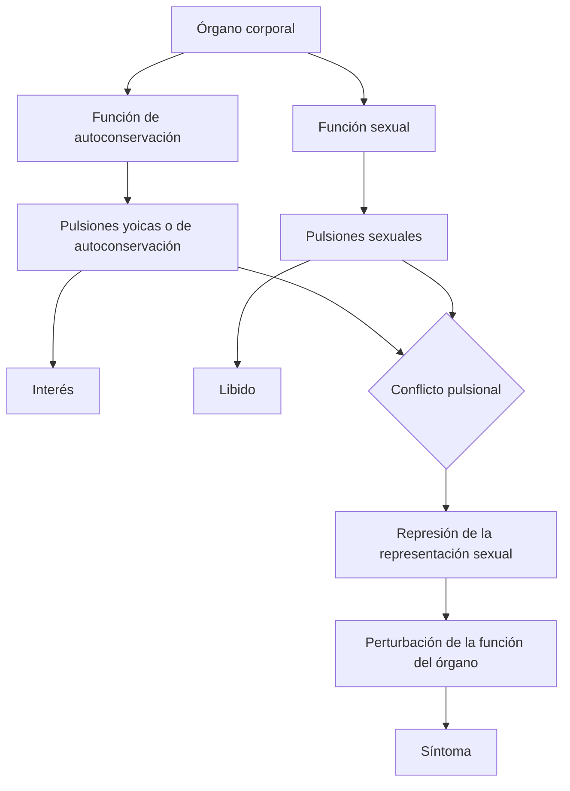
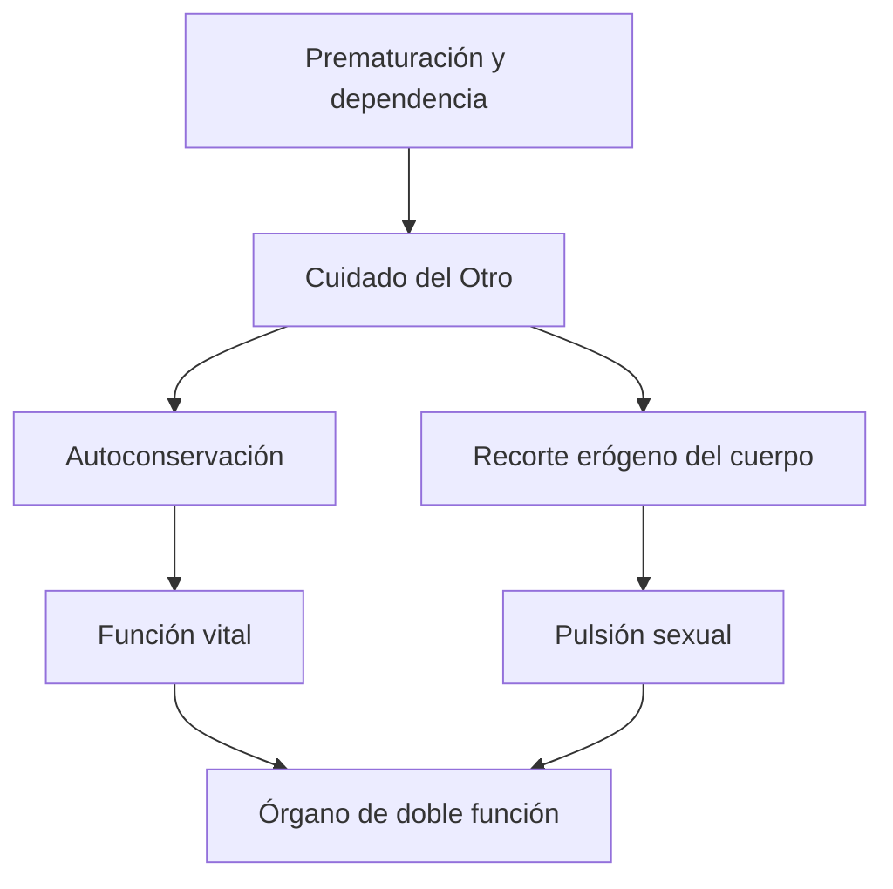

# Órgano de doble función y conflicto pulsional

## El problema del conflicto

La teoría de la pulsión explica la sexualidad infantil y la satisfacción parcial, pero abre una nueva pregunta: si la satisfacción pulsional es en sí misma placentera, ¿por qué puede producirse un conflicto que conduzca a la represión?

*La perturbación psicógena de la visión según el psicoanálisis* ofrece un modelo privilegiado. El ojo no pertenece exclusivamente a una función: sirve a la orientación y autoconservación, pero también puede convertirse en zona de placer sexual.

> **Fórmula de la cátedra.** Un mismo órgano puede servir a dos amos: las \concept{pulsiones de autoconservación} y las \concept{pulsiones sexuales}.

## El primer dualismo pulsional

El dualismo permite sostener un conflicto entre dos grupos de exigencias:

| Pulsiones de autoconservación | Pulsiones sexuales |
|---|---|
| Sirven a los intereses vitales del yo | Buscan placer de órgano |
| Energía denominada *interés* | Energía denominada \concept{libido} |
| Exigen que el órgano cumpla su función práctica | Pueden apropiarse del órgano como zona erógena |

Las notas no emplean siempre de manera uniforme “pulsiones yoicas” y “pulsiones de autoconservación”. Conviene conservar el problema: Freud vincula la autoconservación con los intereses del yo, pero el yo mismo todavía deberá ser explicado como una unidad constituida.

## La ceguera histérica

En la ceguera histérica no hay una lesión orgánica que explique la pérdida funcional. El ojo queda perturbado porque su función sexual entra en conflicto con las exigencias yoicas.

La defensa intenta disciplinar al órgano: si el ojo insiste en mirar sexualmente, se le impide ver. El resultado parece contrario a la autoconservación, pero expresa la eficacia del conflicto.

> **Tesis clínica.** El síntoma no es absurdo desde la perspectiva pulsional. La función práctica fracasa, pero la represión y la satisfacción sustitutiva encuentran una solución de compromiso.

## El cuerpo de la autoconservación ya fue tocado por el otro

El dualismo parece separar una función vital originaria de una sexualidad que se agregaría después. Sin embargo, la cursada introduce una paradoja: la autoconservación del bebé depende del cuidado de otro.

Ese cuidado nunca es puramente biológico. Al alimentar, limpiar, hablar y mirar, el otro participa en el recorte erógeno del cuerpo. Las pulsiones sexuales se apuntalan en funciones vitales y luego se independizan.

Por eso el dualismo es funcional, no una separación entre un cuerpo natural intacto y una sexualidad añadida desde afuera.

## Del primer dualismo al narcisismo

El conflicto entre autoconservación y sexualidad encuentra una dificultad cuando Freud estudia el narcisismo. Si la libido puede investir al yo, entonces “yo” y “sexualidad” no se oponen de manera simple.

La libido se diferencia por su localización:

- \concept{libido yoica}, cuando inviste al yo;
- \concept{libido de objeto}, cuando inviste objetos.

Ambas son libido sexual. Esta nueva oposición es presentada en las notas como un *pseudo-dualismo*: mantiene una diferencia necesaria para pensar el conflicto, pero ya no enfrenta dos energías completamente distintas.

## Por qué este texto es una bisagra

*La perturbación psicógena de la visión* conecta dos zonas del parcial:

1. retoma apuntalamiento, zona erógena y pulsión parcial;
2. introduce un conflicto entre funciones del órgano;
3. permite pensar represión y síntoma;
4. prepara la reformulación narcisista del yo y la libido.

Una respuesta de parcial debería mostrar ese movimiento. No alcanza con afirmar que el ojo “tiene dos funciones”: hay que explicar cómo esa duplicidad permite que una satisfacción sexual sea reprimida y retorne perturbando la función de autoconservación.

