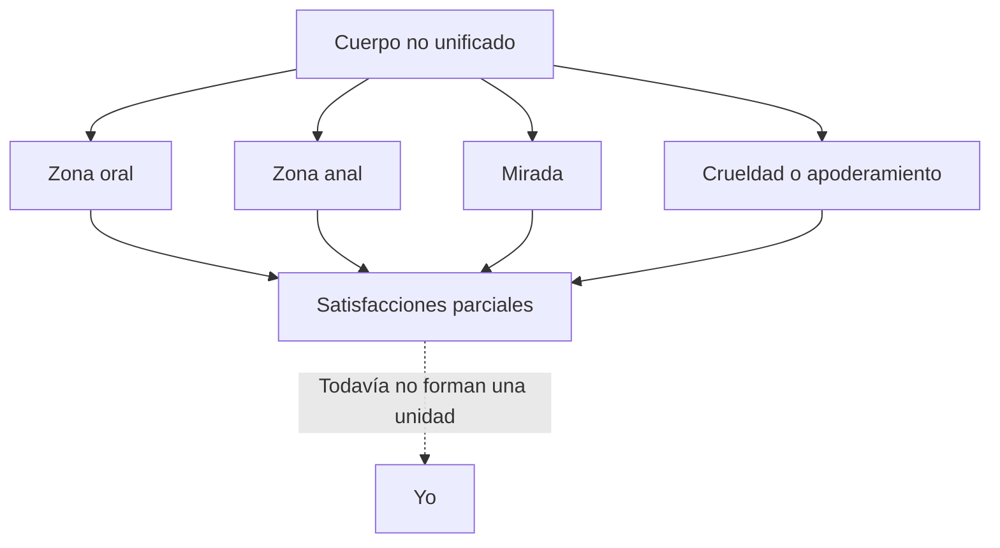
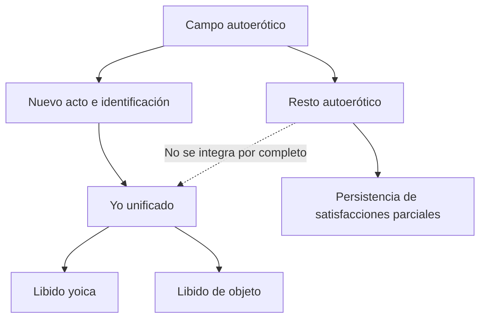

# Autoerotismo, identificación y constitución del yo

## El yo no está desde el comienzo

La expresión “satisfacción en el cuerpo propio” puede inducir un error: imaginar que el autoerotismo supone un yo ya constituido que toma su cuerpo como objeto. Para Freud, las pulsiones autoeróticas existen antes de que se forme una unidad comparable al yo.

> **Distinción decisiva.** En el \concept{autoerotismo} hay satisfacciones parciales en el cuerpo propio, pero todavía no existe un yo unificado que funcione como objeto total de la libido.

## El campo de la parcialidad

El autoerotismo está compuesto por zonas y circuitos relativamente independientes.

La parcialidad tiene dos sentidos vinculados:

- cada pulsión parte de una zona o función parcial;
- ninguna de esas satisfacciones completa al sujeto como totalidad.

## El nuevo acto psíquico

Entre autoerotismo y narcisismo debe agregarse un \concept{nuevo acto psíquico}. Las notas de seminarios lo articulan con la \concept{identificación}.

La identificación no copia una identidad ya dada. Incorpora un rasgo o una imagen proveniente del otro y produce una nueva organización.

> **Fórmula de la cátedra.** No hay primero una identidad completa que luego se relaciona con otros; hay \concept{identificaciones} a partir de las cuales se constituye el yo.

## Dependencia del otro

El yo no se origina por maduración espontánea. La prematuración humana vuelve decisivo el cuidado de otros. Antes de poder reconocerse como unidad, el niño es mirado, nombrado y esperado.

Las “disposiciones innatas” que aparecen en los textos sobre transferencia son leídas por la cátedra no como un programa biológico cerrado, sino como marcas anteriores al sujeto: nombre, expectativas familiares, duelos y lugares ofrecidos.

La identificación organiza algo de esas marcas. El otro participa así en dos procesos distintos pero enlazados:

- recorta el cuerpo pulsional mediante cuidados;
- ofrece rasgos e imágenes con los que se constituye una unidad yoica.

## El yo como primer objeto unificado

Una vez constituido, el yo puede ser investido libidinalmente. Seminarios lo formula como el primer objeto unificado de la libido.

| Antes del nuevo acto | Después del nuevo acto |
|---|---|
| Zonas erógenas parciales | Yo como unidad |
| Satisfacciones autoeróticas | Investidura narcisista |
| Sin objeto total | Primer objeto unificado |
| Dependencia de circuitos locales | Síntesis de una imagen corporal |

La unidad no debe confundirse con una esencia verdadera. Es una organización psíquica que permite reunir experiencias y reconocerse, pero conserva algo de construcción e ilusión.

## Autoerotismo y narcisismo primario

Las notas aproximan lógicamente ambos momentos y, al mismo tiempo, advierten que no son idénticos.

> **Cautela conceptual.** \concept{Autoerotismo} y \concept{narcisismo primario} pueden describir un estado originario sin clara diferenciación entre yo y objeto, pero sólo el narcisismo supone estrictamente una unidad yoica investida.

Conviene no convertir la serie en una cronología evolutiva rígida. Se trata también de posiciones lógicas que Freud construye para explicar cómo la libido llega a investir unidades.

## El resto autoerótico

La unificación no absorbe todas las pulsiones parciales. Las notas de la cátedra llaman *resto autoerótico* a aquello que no pasa al campo del yo y de los objetos unificados.

Este resto marca un límite de la síntesis yoica. El yo puede organizar y ligar, pero no elimina la parcialidad pulsional.

> **Elaboración de la cátedra.** El yo es una unidad necesaria, pero *ilusoria* si se la supone completa. Algo de la satisfacción parcial permanece fuera de su dominio.

## Consecuencias

El resto autoerótico permite comprender:

- por qué no existe satisfacción total en un objeto unificado;
- por qué componentes parciales persisten en la sexualidad adulta;
- por qué el yo no gobierna completamente la vida pulsional;
- por qué síntoma y repetición pueden alojar satisfacciones desconocidas para el yo.

## Identificación primordial y secundarias

Las notas distinguen una \concept{identificación primordial}, anterior a relaciones de objeto observables, y diversas identificaciones secundarias.

La identificación primordial con el padre de la prehistoria personal funciona como supuesto lógico. Las identificaciones secundarias pueden surgir como restos de relaciones de objeto: cuando el lazo se pierde o modifica, un rasgo del objeto se incorpora al yo.

No debe confundirse identificación con elección de objeto:

- elegir un objeto es dirigir libido hacia él;
- identificarse es modificar al yo según un rasgo del otro.

Ambas operaciones pueden sucederse y combinarse.

## Qué conviene poder responder

Una respuesta sobre constitución del yo debería incluir:

1. inexistencia de un yo primordial unificado;
2. campo autoerótico y pulsiones parciales;
3. necesidad de un nuevo acto psíquico;
4. identificación como operación constitutiva;
5. yo como primer objeto unificado de la libido;
6. persistencia de un resto autoerótico.

El punto central no es narrar etapas, sino explicar por qué el narcisismo requiere una unidad que el autoerotismo todavía no posee.

