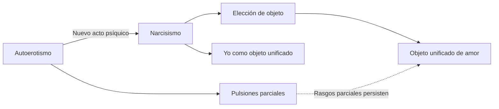
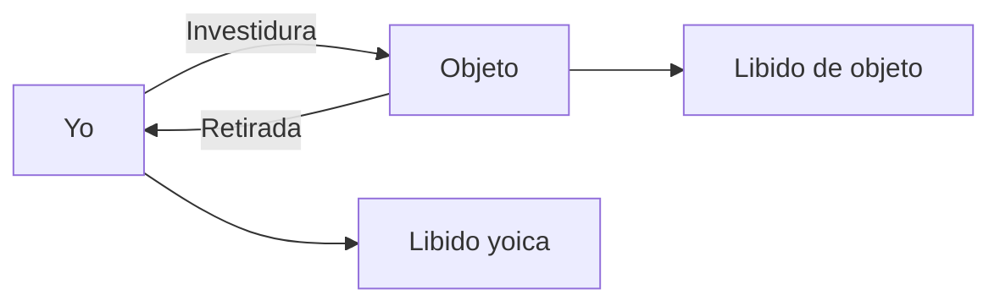
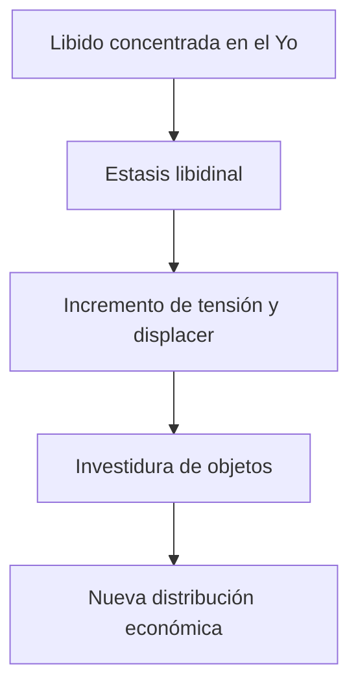
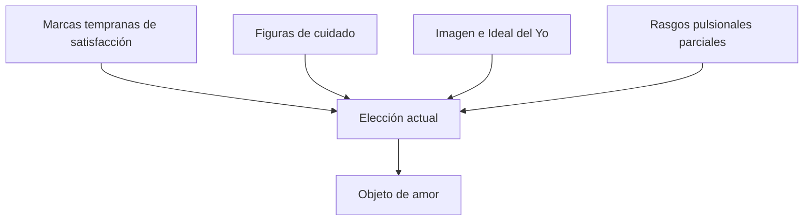

# Narcisismo y elección de objeto

## De patología a momento regular

El término narcisismo había sido utilizado para describir una conducta patológica en la que la persona trata su propio cuerpo como objeto sexual. Freud conserva esa posibilidad, pero amplía radicalmente el concepto.

> **Definición de trabajo.** El \concept{narcisismo} es una colocación regular de la libido sobre el yo constituido como objeto.

No es solamente enfermedad ni egoísmo cotidiano. Ocupa un lugar necesario en la organización sexual.

## La serie

La serie no implica que cada posición desaparezca al surgir la siguiente. El autoerotismo persiste; el narcisismo no se abandona por completo; la elección de objeto conserva marcas de ambos.

## El modelo de la ameba

Freud compara la distribución de libido con una ameba que extiende y retira seudópodos. Existe una investidura libidinal del yo desde la que pueden enviarse cargas hacia objetos y luego retirarse.

> **Distinción decisiva.** \concept{Libido yoica} y \concept{libido de objeto} no son dos clases naturales de energía. Son estados de una misma libido según su localización.

## Economía libidinal

La relación entre ambas localizaciones es económica. En el enamoramiento, el objeto puede engrandecerse a costa del yo. En estados de retirada narcisista, la libido vuelve al yo y el mundo pierde interés.

| Movimiento | Yo | Objeto |
|---|---|---|
| Enamoramiento intenso | Empobrecido | Sobreinvestido e idealizado |
| Enfermedad orgánica | Retira interés hacia sí | Mundo momentáneamente relegado |
| Sueño | Retirada hacia el yo | Disminución del interés exterior |
| Megalomanía | Engrandecimiento yoico | Retirada extrema de objetos |

Estos ejemplos no son equivalentes clínicamente. Sirven para demostrar que la libido puede desplazarse.

## ¿Por qué salir del narcisismo?

Si el yo puede conservar libido, ¿por qué investir objetos? Las notas responden mediante la \concept{estasis libidinal}: una acumulación excesiva en el yo produce displacer y obliga a traspasar sus límites.

Amar no se presenta entonces como un gesto puramente altruista. Constituye también una necesidad económica del aparato.

## Narcisismo primario y secundario

El \concept{narcisismo primario} nombra una investidura originaria anterior a la diferenciación estable entre libido yoica y de objeto. Su estatuto es reconstruido, no observado directamente.

El \concept{narcisismo secundario} supone retirada hacia el yo de libido que ya había investido objetos.

| Narcisismo primario | Narcisismo secundario |
|---|---|
| Anterioridad lógica | Retorno posterior |
| Diferenciación yo–objeto todavía problemática | Yo y objeto ya diferenciados |
| Investidura originaria reconstruida | Retirada observable por sus efectos |

No conviene ubicar el narcisismo primario como una etapa empírica fechable sin dificultades. Freud lo construye como hipótesis para explicar estados posteriores.

## Elección anaclítica

La \concept{elección anaclítica} o por apuntalamiento sigue el modelo de las primeras figuras de cuidado.

Los objetos se eligen según funciones:

- la persona que nutre;
- la persona que protege.

La sexualidad se había apuntalado en la autoconservación; la elección amorosa conserva esa marca y busca objetos relacionados con las primeras experiencias de satisfacción y cuidado.

## Elección narcisista

En la \concept{elección narcisista}, el objeto vale por su relación con el propio yo. Puede elegirse:

- **lo que uno es:** según la posición actual del yo;
- **lo que uno fue:** ligado a una imagen anterior y al narcisismo resignado;
- **lo que uno quisiera ser:** orientado por el Ideal del Yo;
- **aquello que alguna vez fue parte de uno:** como el hijo, investido desde el propio narcisismo.

En las notas, la fórmula “que me ame” condensa una modalidad donde el objeto interesa por la confirmación narcisista que devuelve.

> **Distinción de trabajo.** En la elección anaclítica predomina la marca del cuidado recibido; en la narcisista, la relación del objeto con la propia imagen e ideal.

No son casilleros excluyentes. Una elección concreta puede combinar ambas modalidades.

## *His Majesty the Baby*

La sobreestimación parental ofrece un caso privilegiado de elección narcisista. El hijo no es investido únicamente como un otro separado: recibe deseos, perfecciones y aspiraciones que los padres debieron abandonar.

> **Definición de trabajo.** En la sobreestimación parental, el hijo funciona como depositario del narcisismo perdido de los padres y como promesa de restitución de una perfección resignada.

El ejemplo evita una lectura individualista del narcisismo. La imagen del yo y sus ideales se constituyen en una trama de investiduras y expectativas de otros.

## El objeto como reencuentro

El hallazgo de objeto es un reencuentro. No se recupera un objeto idéntico perdido, sino que nuevas elecciones se organizan a partir de marcas de satisfacción, cuidado e identificación.

Rasgos aparentemente parciales —una voz, un olor, una forma de mirar— pueden orientar la elección de un objeto unificado. El campo parcial no desaparece: participa en aquello que atrae y fija.

## Narcisismo y clínica

La distribución libidinal permite distinguir:

- \concept{neurosis de transferencia}, donde la libido de objeto puede actualizarse con el analista;
- \concept{neurosis narcisistas}, donde la retirada de libido hacia el yo dificulta esa operación.

Esta clasificación prepara el problema técnico de la transferencia. Para que el analista sea insertado en una serie amorosa previa, debe existir libido disponible para investir objetos.

La clase del 06/08 marca esta diferencia como un **eje del parcial**. No se trata sólo de aprender una clasificación: la distribución de libido explica por qué ciertas neurosis pueden producir una transferencia analizable y otras presentan una dificultad estructural para hacerlo dentro de este modelo freudiano.

## Qué conviene poder responder

Una respuesta sobre narcisismo debería articular:

1. ampliación desde patología hacia colocación regular;
2. nuevo acto psíquico y constitución del yo;
3. libido yoica y libido de objeto;
4. modelo de la ameba y circulación económica;
5. estasis libidinal;
6. narcisismo primario y secundario;
7. elecciones anaclítica y narcisista;
8. consecuencias para la transferencia.
