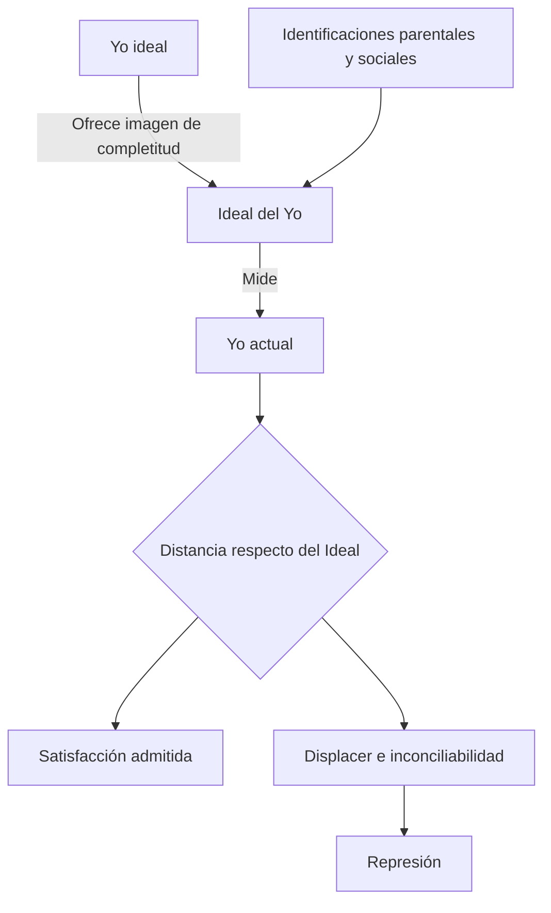
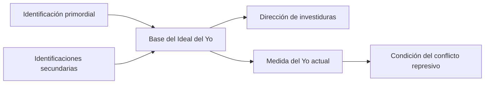
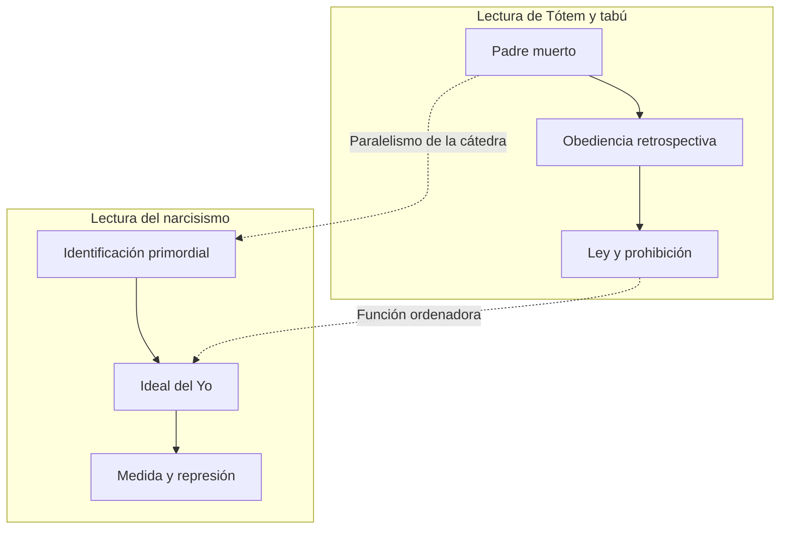

# Yo ideal, Ideal del Yo y represión

## Por qué aparecen los ideales

El narcisismo infantil supone una experiencia de perfección y completitud. La crítica, las exigencias parentales y la realidad impiden conservarla sin modificaciones, pero Freud sostiene una regla: una satisfacción no se abandona fácilmente.

Aquello que se pierde como estado actual puede preservarse bajo forma ideal.

> **Fórmula de la cátedra.** Nunca se resigna completamente una satisfacción; algo del narcisismo infantil queda refugiado en el \concept{Yo ideal}.

## Tres términos que no deben confundirse

| Término | Función |
|---|---|
| \concept{Yo actual} | Organización presente del yo, con sus rasgos y límites. |
| \concept{Yo ideal} | Imagen de completitud que recupera la perfección narcisista infantil. |
| \concept{Ideal del Yo} | Instancia que mide al yo actual según exigencias e identificaciones. |

El yo ideal pertenece principalmente al registro de una imagen completa. El Ideal del Yo funciona como vara, medida y orientación.

## La operación de medida

La medida no responde necesariamente a valores morales universales. Se construye con rasgos, mandatos y expectativas singulares incorporados mediante identificaciones.

## Ideal e identificación

El Ideal del Yo se sostiene en identificaciones. Las figuras parentales no permanecen sólo como objetos externos; rasgos de esas relaciones pasan a formar parte de la instancia que observa, mide y orienta al yo.

La \concept{identificación primordial} con el padre de la prehistoria personal es presentada como un supuesto anterior a elecciones de objeto observables. Las identificaciones secundarias pueden sustituir lazos de objeto y conservar rasgos de aquello perdido.

## Condición de la represión

La satisfacción pulsional es placentera respecto de la pulsión. Para que sea reprimida debe producir displacer desde otra organización o sistema.

El Ideal del Yo permite precisar esa otra exigencia: una satisfacción puede resultar incompatible con la imagen, los mandatos o las condiciones según las cuales el yo busca ser amado y reconocido.

> **Tesis de la cátedra.** La formación del \concept{Ideal del Yo} es condición de la \concept{represión}: ofrece la medida desde la cual una satisfacción pulsional puede volverse inconciliable.

Esto no significa que el Ideal ejecute mecánicamente cada represión ni que sea su única causa. Sitúa la estructura del conflicto: placer para una exigencia, displacer para otra.

## Articulación con *Tótem y tabú*

La cátedra propone relacionar la identificación primordial y el Ideal del Yo con el padre muerto de *Tótem y tabú*.

> **Cautela conceptual.** Padre muerto, identificación primordial e Ideal del Yo no son sinónimos. La articulación muestra funciones fundantes y ordenadoras comparables, no una identidad terminológica.

## La ley nace con el deseo

El mito de la horda no presenta una prohibición exterior que llega después de un deseo ya organizado. Asesinato, culpa y obediencia retrospectiva muestran que ley y deseo se constituyen conjuntamente.

El padre vivo monopolizaba la satisfacción; el padre muerto se vuelve más poderoso como ley. Su lugar debe permanecer vacío: nadie puede ocuparlo y garantizar una satisfacción total.

La neurosis puede sostener la fantasía de que la satisfacción completa sí existe, pero está reservada a otro. La lectura de la cátedra desplaza el problema:

> **Fórmula de trabajo.** No se trata de que “otro puede y yo no”, sino de una imposibilidad de satisfacción total que alcanza a todos.

## El ideal dirige las investiduras

El Ideal del Yo no sólo prohíbe. También orienta qué objetos resultan valiosos, admirables o dignos de amor. Participa en:

- elecciones de objeto;
- aspiraciones del yo;
- modos de buscar reconocimiento;
- pertenencias e identificaciones colectivas;
- condiciones bajo las cuales una satisfacción es aceptada o rechazada.

Por eso constituye una bisagra entre narcisismo, objeto y represión.

## Yo ideal e idealización del objeto

En el enamoramiento, el objeto puede ocupar el lugar de una perfección deseada. El yo se empobrece mientras el objeto es idealizado. Parte de aquello que el sujeto quisiera ser se proyecta sobre el objeto amado.

Esto enlaza economía libidinal e ideales: el movimiento de libido no es solamente cuantitativo, también está organizado por identificaciones y medidas.

## Preparación de la metapsicología

Con la constitución del yo y del Ideal del Yo queda planteada una condición del conflicto, pero todavía falta explicar el mecanismo.

El arco siguiente deberá responder:

1. ¿cómo se inscribe la pulsión en un aparato de representaciones?;
2. ¿sobre qué recae exactamente la represión?;
3. ¿cómo cooperan atracción y repulsión?;
4. ¿qué destinos reciben representación y monto de afecto?;
5. ¿por qué lo reprimido puede retornar?

Esas preguntas llevan al \concept{representante psíquico de la pulsión}, la \concept{represión primordial} y la teoría del \concept{sistema inconsciente}.

## Qué conviene poder responder

Una respuesta sobre ideales debería:

1. distinguir yo actual, yo ideal e Ideal del Yo;
2. articular Ideal e identificación;
3. explicar el Ideal como medida, no sólo como modelo moral;
4. mostrar por qué su formación es condición del conflicto represivo;
5. relacionarlo cuidadosamente con *Tótem y tabú*;
6. evitar convertir los paralelismos de la cátedra en equivalencias conceptuales.

