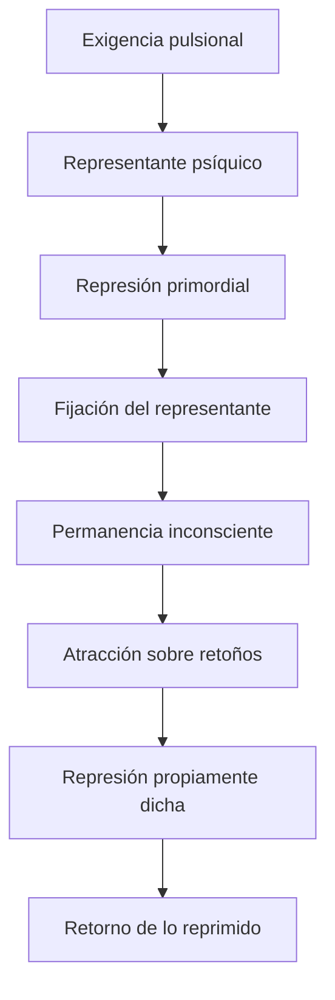
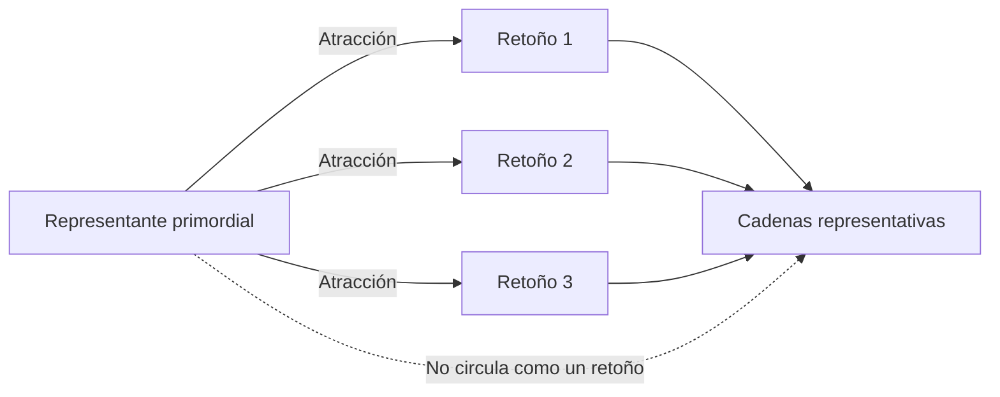
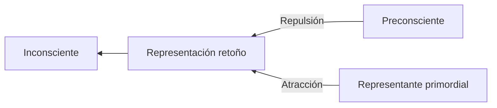
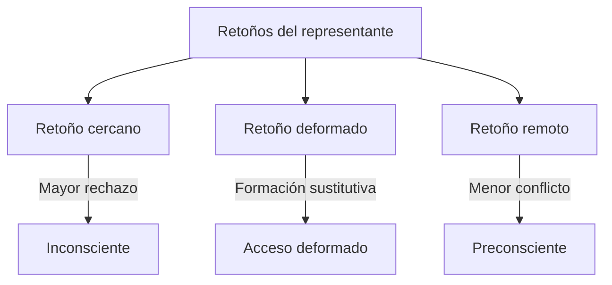
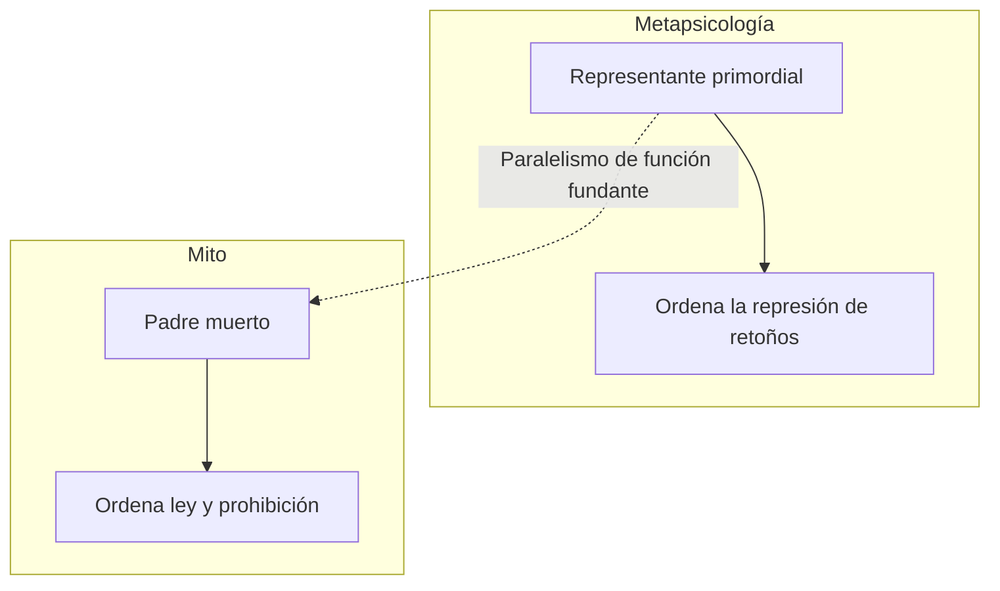

# Representante psíquico y fases de la represión

## La dificultad de inscribir la pulsión

La pulsión es un concepto fronterizo: parte de una fuente corporal e impone trabajo a lo psíquico. Pero el aparato que Freud construye es un aparato de representaciones. ¿Cómo puede comparecer allí una exigencia que no es, en sí misma, una representación?

El concepto de \concept{representante psíquico de la pulsión} responde a esa dificultad.

> **Distinción decisiva.** La \concept{pulsión} no ingresa directamente en la conciencia ni es reprimida como una cosa completa. Sólo puede ser conocida por sus representantes y por los destinos de su monto de afecto.

## Cuatro términos que no deben confundirse

| Término | Función |
|---|---|
| \concept{Pulsión} | Exigencia constante que articula cuerpo y psiquismo. |
| \concept{Representante psíquico de la pulsión} | Inscripción o agencia por la cual lo pulsional alcanza el aparato. |
| \concept{Representación} | Elemento psíquico que puede enlazarse, desplazarse y funcionar como retoño. |
| \concept{Monto de afecto} | Factor cuantitativo ligado a la moción pulsional que puede recibir un destino diferente de la representación. |

Las notas alternan “representante”, “agencia representante” y “representación”. El libro conserva la distinción conceptual aunque las traducciones y formulaciones de clase no siempre sean uniformes.

## El problema lógico de la primera represión

Si toda represión recayera sobre algo previamente reprimido, habría una regresión infinita. Freud necesita postular una operación primera que funde la posibilidad de represiones posteriores.

La primera operación no se observa directamente. Es una \concept{anterioridad lógica} reconstruida a partir de sus efectos.

## Represión primordial

En *La represión*, Freud presenta una primera fase en la que al representante psíquico de la pulsión se le deniega admisión a la conciencia. Como consecuencia, se produce una fijación: el representante permanece inmutable y la pulsión sigue ligada a él.

> **Definición de trabajo.** La \concept{represión primordial} es la operación lógica por la cual un representante pulsional queda fijado en el inconsciente y funda un polo de atracción para representaciones posteriores.

La lectura de la cátedra acentúa su dimensión fundante. No es simplemente la primera de una serie cronológica; establece una diferencia y una condición para que el aparato funcione como un sistema de representaciones sometidas a represión.

## Una marca que no entra en cadena como las demás

El representante primordial no funciona como una representación ordinaria que circula libremente entre asociaciones. Las notas lo describen como una marca fija, inaccesible e intangible.

Esto permite que las representaciones se muevan, se sustituyan y se deformen alrededor de un punto que permanece fuera de su circulación ordinaria.

## Represión propiamente dicha

La segunda fase recae sobre \concept{retoños} del representante: representaciones enlazadas con aquello primordialmente reprimido.

La represión secundaria no depende sólo de una fuerza que expulsa desde la conciencia. Cooperan dos direcciones:

- \concept{repulsión} desde el sistema preconsciente-consciente;
- \concept{atracción} ejercida por lo reprimido desde antes.

> **Fórmula central.** La represión propiamente dicha combina una fuerza que rechaza desde el preconsciente y otra que atrae desde lo reprimido primordial.

## Individual y móvil

La represión no afecta a una representación de una vez y para siempre según una clasificación fija.

Es \concept{individual}: cada retoño puede encontrarse a distinta distancia de lo reprimido y recibir un destino diferente. Una deformación suficiente puede permitir que algo alcance la conciencia.

Es \concept{móvil}: mantener alejada una representación exige gasto continuo. Nuevos enlaces, situaciones y aumentos de investidura pueden modificar el equilibrio.

## Retorno de lo reprimido

El retorno no constituye el fracaso accidental de una represión que normalmente eliminaría su objeto. Está implicado en la estructura misma del mecanismo: lo reprimido conserva investidura y produce retoños.

> **Distinción decisiva.** La represión no destruye la representación ni cancela la exigencia pulsional. Mantiene algo fuera de la conciencia y crea las condiciones de su retorno deformado.

El retorno puede aparecer como síntoma, sueño, lapsus, sustitución, repetición o transferencia. Su forma depende de los enlaces disponibles y de la distancia que la deformación consigue respecto de lo reprimido.

## El paralelismo con *Tótem y tabú*

La cátedra utiliza el padre muerto como figura mítica de una marca fundante. Después del asesinato, el padre ya no está presente como cuerpo, pero opera con mayor eficacia como ley y prohibición.

No son conceptos equivalentes. El mito permite figurar que una ausencia o pérdida puede organizar una legalidad y conservar eficacia.

## Qué conviene poder responder

Una respuesta sobre fases de la represión debería:

1. distinguir pulsión, representante, representación y monto de afecto;
2. explicar por qué Freud necesita una represión primordial;
3. definir fijación y atracción;
4. mostrar sobre qué recae la represión secundaria;
5. articular repulsión y atracción;
6. explicar los caracteres individual y móvil;
7. presentar el retorno como consecuencia estructural, no como excepción.

