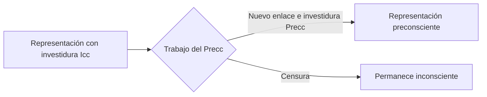
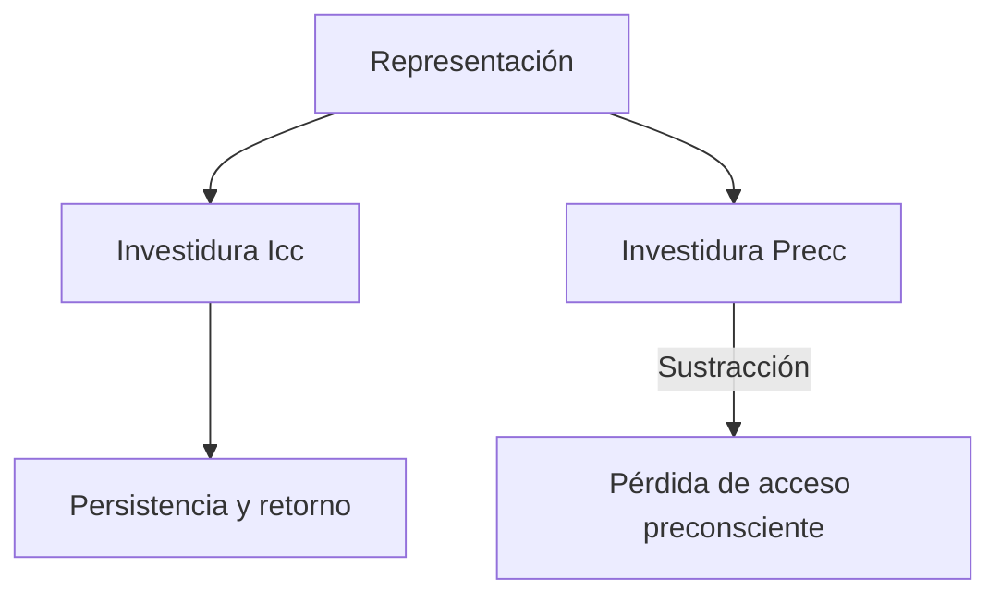
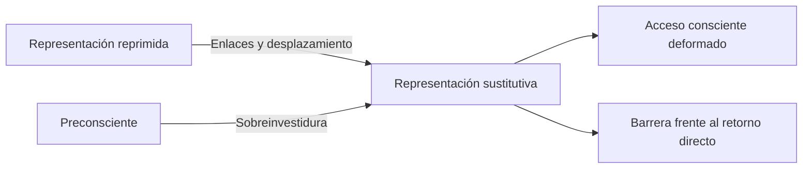
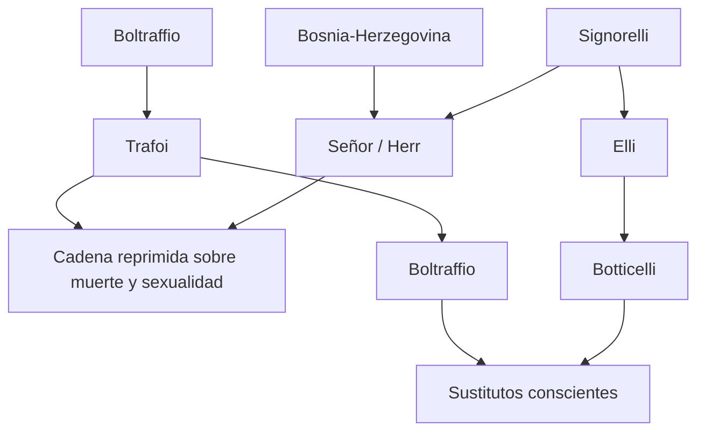
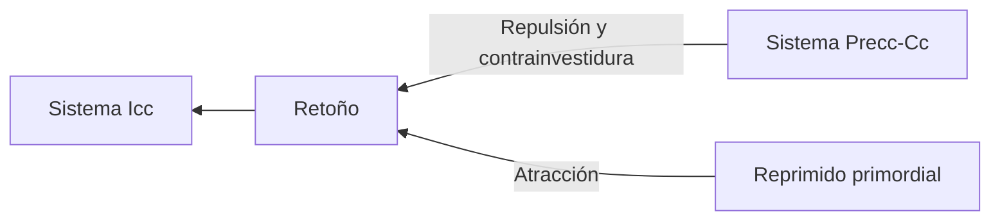

# Tópica y dinámica de la represión

## Pensar un proceso, no una ubicación

Decir que una representación “está en el inconsciente” no alcanza para explicar la represión. Freud necesita articular tres perspectivas metapsicológicas:

- \concept{tópica}: relaciones entre sistemas y localidades psíquicas;
- \concept{dinámica}: conflicto y cooperación entre fuerzas;
- \concept{económica}: distribución y desplazamiento de investiduras.

> **Fórmula de trabajo.** La metapsicología explica dónde se produce un proceso, qué fuerzas intervienen y cómo se distribuye la energía.

## Investidura

Una representación no actúa sólo por su contenido. Su eficacia depende de una \concept{investidura}: una carga que le aporta intensidad y capacidad de entrar en relaciones.

Las notas distinguen investidura inconsciente e investidura preconsciente. El pasaje entre sistemas requiere algo más que mover una representación idéntica de un lugar a otro.

## Dos hipótesis sobre el pasaje

Freud considera dos posibilidades para explicar cómo una representación inconsciente llega al preconsciente.

### Hipótesis tópica de doble inscripción

La representación produciría una segunda copia en otra localidad. Existirían una inscripción inconsciente y otra preconsciente.

El problema clínico es evidente: si el analista comunica al paciente la copia consciente del supuesto contenido, la representación inconsciente eficaz no desaparece.

### Hipótesis funcional

La misma representación cambia de estado al recibir nuevos enlaces e investiduras. No basta conocer palabras equivalentes: debe producirse una transformación en su modo de funcionamiento.

| Doble inscripción | Cambio funcional |
|---|---|
| Se agrega una copia | Se modifica el estado de la representación |
| La inscripción Icc permanece intacta | Nuevos enlaces alteran su funcionamiento |
| Saber comunicado desde afuera | Trabajo psíquico del analizante |

> **Tesis clínica.** *Tener oído* una interpretación no equivale a *haberla vivenciado*. La comunicación consciente no cancela por sí misma la eficacia inconsciente.

## Sustracción de investidura

En la represión propiamente dicha, una representación que había recibido investidura preconsciente puede perderla. La \concept{sustracción de investidura preconsciente} impide su acceso, pero no explica por sí sola por qué permanece reprimida.

La representación conserva investidura inconsciente. Esa carga sostiene su eficacia y su tendencia al retorno.

## Contrainvestidura

El sistema preconsciente debe emplear energía para protegerse del retorno. Freud llama \concept{contrainvestidura} a esa fuerza defensiva.

En la represión primordial, donde no había una investidura preconsciente que sustraer, la contrainvestidura constituye el mecanismo específico. En la represión secundaria puede combinarse con la sustracción.

| Represión primordial | Represión secundaria |
|---|---|
| No existe investidura Precc previa para retirar | Puede sustraerse investidura Precc |
| Contrainvestidura como mecanismo específico | Sustracción más contrainvestidura |
| Mantiene la fijación primordial | Mantiene alejados los retoños |

## Formación sustitutiva y sobreinvestidura

Una representación sustitutiva puede recibir una carga adicional y funcionar como barrera frente al retorno. Esa \concept{sobreinvestidura} explica por qué un elemento aparentemente secundario adquiere intensidad desproporcionada.

La formación sustitutiva no es idéntica al síntoma. Puede participar en él, pero nombra ante todo una sustitución en el plano representativo.

## Signorelli como modelo

En el olvido del nombre Signorelli, los nombres Botticelli y Boltraffio aparecen como sustitutos. No son ocurrencias arbitrarias: conservan fragmentos sonoros y enlaces con las cadenas reprimidas.

El ejemplo muestra:

- sustracción del nombre buscado;
- persistencia de investidura inconsciente;
- desplazamiento hacia fragmentos;
- sustitutos sobreinvestidos que llegan a conciencia.

## Atracción y repulsión

La dinámica completa combina fuerzas en la misma dirección regresiva:

La censura no es un guardia situado en una puerta. Es una manera figurada de nombrar relaciones dinámicas y económicas entre sistemas.

## La represión exige gasto

La movilidad de la represión significa que el equilibrio puede cambiar. Un aumento de investidura inconsciente, una disminución de contrainvestidura o una deformación suficiente pueden facilitar el retorno.

Por eso mantener reprimido requiere gasto. La resistencia clínica es un indicio actual de ese gasto defensivo.

> **Articulación clínica.** La \concept{resistencia} que aparece durante la asociación libre permite inferir la fuerza que mantiene una representación bajo \concept{represión}.

## Qué conviene poder responder

Una respuesta sobre tópica y dinámica debería:

1. distinguir sistemas de lugares anatómicos;
2. definir investidura;
3. comparar doble inscripción y cambio funcional;
4. explicar sustracción de investidura;
5. definir contrainvestidura en ambas fases;
6. diferenciar formación sustitutiva y síntoma;
7. usar Signorelli para mostrar el mecanismo, no sólo narrar el ejemplo.

