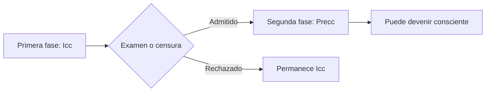
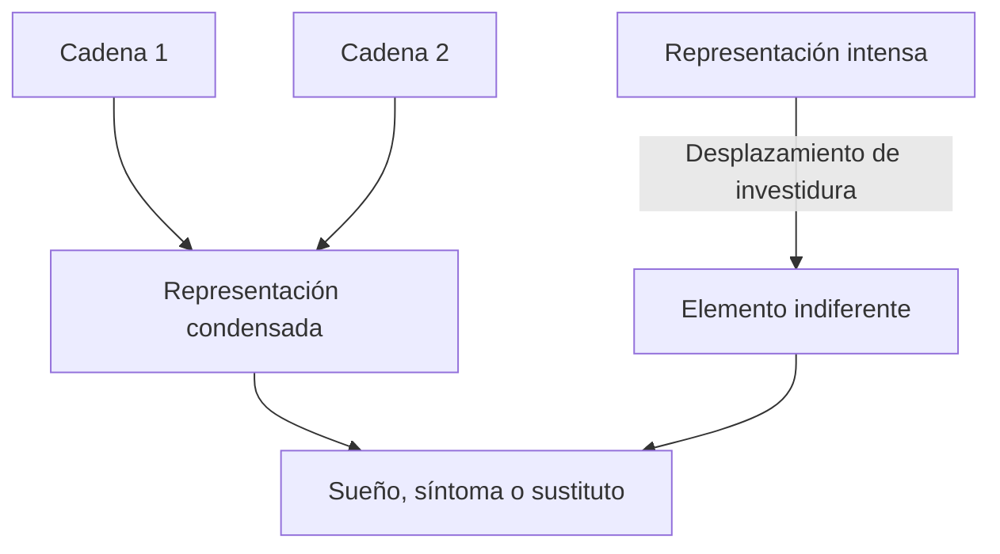
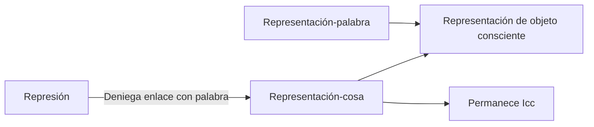

# El sistema inconsciente

## Más que falta de conciencia

En el lenguaje cotidiano, inconsciente puede significar simplemente “aquello de lo que no me doy cuenta”. Freud distingue varias acepciones porque la ausencia actual de conciencia no explica la eficacia de lo reprimido.

> **Tesis central.** Lo \concept{inconsciente} no es sólo una cualidad negativa. En sentido sistemático, nombra un modo de funcionamiento con legalidad propia.

## Tres sentidos

| Sentido | Definición | Ejemplo |
|---|---|---|
| \concept{Descriptivo} | Algo no está actualmente en la conciencia. | Recuerdo disponible pero no presente. |
| \concept{Dinámico} | Algo permanece inconsciente por efecto de fuerzas represivas. | Representación que retorna en un síntoma. |
| \concept{Sistemático} | Un sistema psíquico posee reglas específicas. | Trabajo del sueño y proceso primario. |

Lo preconsciente es inconsciente en sentido descriptivo, pero puede acceder a conciencia sin vencer una resistencia intensa. Lo reprimido es inconsciente en sentido dinámico y pertenece al sistema Icc.

## El acto psíquico y la censura

Las notas reconstruyen dos fases posibles de un acto psíquico:

La censura no decide según verdad o falsedad. Expresa la compatibilidad de una representación con las exigencias del sistema preconsciente.

## El núcleo del inconsciente

Freud describe el núcleo del sistema como compuesto por representantes de pulsión que buscan descargar su investidura. Cada moción persigue su meta sin organizarse según una unidad consciente.

Esto explica por qué en el inconsciente pueden coexistir mociones que serían contradictorias para la conciencia.

## Ausencia de contradicción y negación

En el sistema inconsciente no hay negación en el sentido del juicio consciente. Las mociones no se cancelan mutuamente por ser lógicamente incompatibles.

> **Definición de trabajo.** La ausencia de contradicción no significa armonía. Significa que mociones opuestas pueden coexistir y buscar expresión sin someterse a una síntesis lógica.

La negación aparece cuando un contenido alcanza una forma más próxima al juicio consciente. Decir “no pensé en mi madre” puede permitir que la representación aparezca mientras se mantiene una distancia defensiva.

## Proceso primario

El \concept{proceso primario} se caracteriza por energía móvil y dos operaciones principales:

- \concept{condensación}: una representación reúne investiduras provenientes de varias cadenas;
- \concept{desplazamiento}: la intensidad pasa de una representación importante a otra aparentemente secundaria.

Estas operaciones permiten que algo reprimido se exprese deformadamente.

## Atemporalidad

Los procesos inconscientes no se ordenan cronológicamente ni se desgastan por el paso del tiempo. Una moción infantil puede conservar actualidad y eficacia décadas después.

Esto no significa que “el inconsciente vive en el pasado”. Significa que sus contenidos no reciben espontáneamente una fecha que los vuelva pretéritos.

> **Fórmula de trabajo.** Lo infantil reprimido no retorna como recuerdo de algo que ya pasó; puede actualizarse como si estuviera ocurriendo ahora.

La transferencia ofrece la demostración clínica más clara: una modalidad amorosa infantil se instala en la relación presente con el analista.

## Realidad psíquica

En el inconsciente, la realidad exterior puede ser sustituida por la \concept{realidad psíquica}. Fantasías y deseos producen efectos aunque no reproduzcan fielmente un acontecimiento.

No se afirma que realidad y fantasía sean lo mismo para todos los fines. Se sostiene que la eficacia sintomática depende de la inscripción y la investidura, no sólo de la comprobación histórica.

## Principio de placer y proceso secundario

El sistema inconsciente funciona bajo predominio del \concept{principio de placer}. Busca descarga y satisfacción sin atender inmediatamente a condiciones externas.

El preconsciente introduce \concept{proceso secundario}:

- liga investiduras;
- inhibe descargas inmediatas;
- establece orden temporal;
- toma en cuenta la realidad;
- hace posibles pensamiento y acción diferida.

| Sistema Icc | Sistema Precc-Cc |
|---|---|
| Proceso primario | Proceso secundario |
| Energía móvil | Energía ligada |
| Atemporalidad | Orden temporal |
| Realidad psíquica | Examen de realidad |
| Principio de placer | Principio de realidad |

## Representación-cosa y representación-palabra

En el capítulo VII, Freud reformula la diferencia entre representación inconsciente y consciente.

La \concept{representación-cosa} consiste en investiduras de huellas derivadas de la cosa. La \concept{representación-palabra} aporta enlaces verbales.

> **Definición de trabajo.** Una \concept{representación consciente} requiere el enlace entre representación-cosa y representación-palabra.

En las neurosis de transferencia, la represión no destruye la representación-cosa; le deniega la traducción o enlace con palabras.

## Neurosis y psicosis

Freud estudia las alteraciones del lenguaje en la esquizofrenia porque allí las palabras pueden ser tratadas como cosas. Expresiones corporales y metáforas adquieren una literalidad singular.

Las notas contrastan:

- en la neurosis, uso metafórico y represión del enlace;
- en la psicosis, perturbación de las investiduras de objeto y tratamiento literal de las palabras.

Esta comparación no debe convertirse en una fórmula diagnóstica simple. Su función es esclarecer la composición de la representación consciente.

## Interpretar no es traducir con un diccionario

Si el acceso al preconsciente requiere nuevos enlaces, el analista no puede imponer desde afuera el “significado correcto”. Una interpretación puede ser oída y, sin embargo, permanecer ineficaz.

El trabajo analítico busca que el sujeto produzca asociaciones y enlaces capaces de modificar la posición de una representación.

> **Tesis clínica.** El psicoanálisis no completa un contenido faltante; trabaja las condiciones bajo las cuales algo puede adquirir palabras y otro sentido.

## Qué conviene poder responder

Una respuesta sobre el sistema inconsciente debería:

1. distinguir sentidos descriptivo, dinámico y sistemático;
2. explicar por qué lo preconsciente no equivale a lo reprimido;
3. desarrollar las propiedades del sistema Icc;
4. comparar proceso primario y secundario;
5. definir representación-cosa y representación-palabra;
6. relacionar el modelo con la eficacia o ineficacia de la interpretación.

