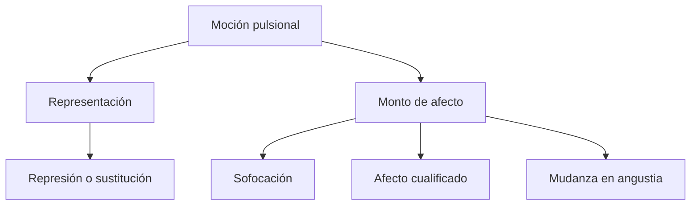
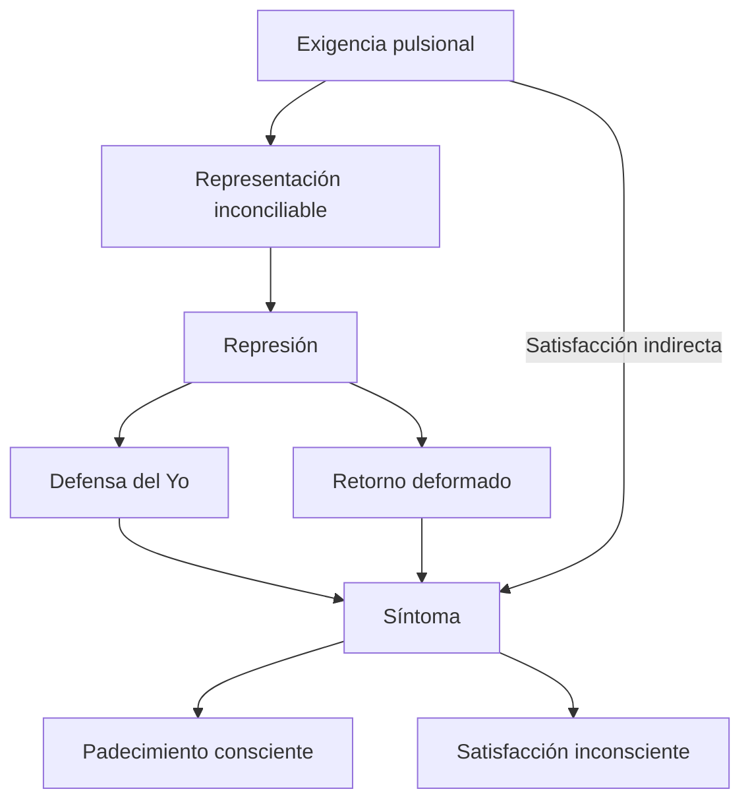
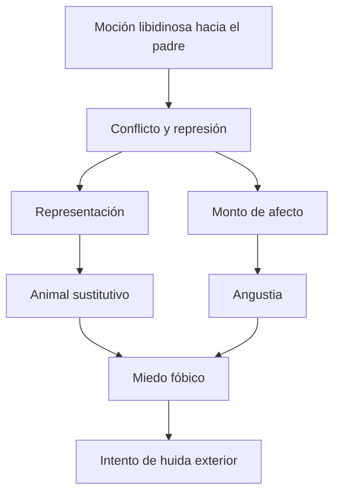
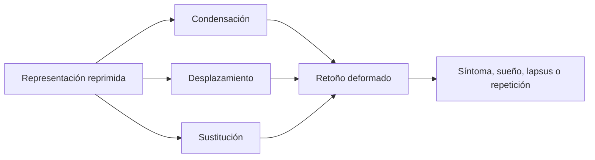

# Retorno, síntoma y destinos del afecto

## La represión no termina el conflicto

La represión mantiene una representación alejada de la conciencia, pero la pulsión continúa exigiendo satisfacción. El material reprimido conserva investidura, produce retoños y establece enlaces.

> **Tesis central.** El \concept{retorno de lo reprimido} no llega después de una represión completa: demuestra que la represión sólo puede mantener alejado aquello que permanece activo.

## Dos componentes, destinos diferentes

Freud distingue en la agencia representante:

- la representación;
- el \concept{monto de afecto} o factor cuantitativo.

El destino de la representación no permite inferir automáticamente el del afecto. Una represión puede parecer exitosa respecto del contenido y fracasar porque produce displacer o angustia.

## Tres destinos del afecto

### Sofocación

El afecto no aparece de manera reconocible. Desde el punto de vista de la finalidad defensiva, constituye el resultado más exitoso.

### Afecto cualitativamente coloreado

El monto aparece con una cualidad distinta, como culpa, vergüenza o malestar, desligado de la representación original.

### Angustia

El monto se muda en \concept{angustia}. La representación puede ser sustituida mientras el cuerpo manifiesta palpitaciones, sudoración o agitación sin un texto consciente que explique esa intensidad.

Esta articulación se completa en [Angustia y serie de las neurosis de transferencia](16-angustia-y-serie-de-las-neurosis-de-transferencia.md), a partir de la Conferencia 25 y la clase final de seminarios.

## Formación sustitutiva, síntoma y retorno

Estos términos se articulan, pero no son idénticos.

| Concepto | Acento |
|---|---|
| \concept{Retorno de lo reprimido} | Reaparición eficaz de aquello rechazado. |
| \concept{Formación sustitutiva} | Una representación ocupa el lugar de otra. |
| \concept{Síntoma} | Formación de compromiso que produce padecimiento y satisfacción. |
| \concept{Satisfacción sustitutiva} | Destino pulsional alojado en el síntoma. |

Una formación sustitutiva puede contribuir al síntoma, pero el síntoma incluye además defensa, afecto, satisfacción y consecuencias clínicas.

## El síntoma como compromiso

> **Definición integrada.** El \concept{síntoma} es una formación de compromiso: satisface parcialmente la defensa y, de manera sustitutiva, la exigencia pulsional reprimida.

Esta estructura explica por qué el síntoma no desaparece al comprender racionalmente que es perjudicial.

## “La práctica sexual del enfermo”

En *Tres ensayos de teoría sexual*, Freud afirma que los síntomas constituyen la práctica sexual de los enfermos. La fórmula enfatiza que las pulsiones parciales reprimidas encuentran expresión y satisfacción en el síntoma.

No significa que todo síntoma deba traducirse a una conducta genital oculta. “Sexual” tiene aquí el sentido ampliado de la teoría pulsional: zonas erógenas, metas parciales, fantasías y placer de órgano.

> **Fórmula de Freud trabajada por la cátedra.** Los síntomas son la práctica sexual de los enfermos.

## Histeria de angustia

La fobia permite seguir por separado representación y afecto. En el ejemplo trabajado en clase, una moción libidinosa dirigida al padre entra en conflicto.

La representación del padre es reprimida y sustituida por un animal. El monto de afecto se muda en angustia y luego se liga como miedo al sustituto.

La fobia crea una ventaja defensiva: frente a una exigencia interna de la que no puede huirse, construye un peligro exterior evitable.

## Tres fases defensivas de la fobia

Las notas de prácticos reconstruyen:

1. surgimiento de angustia sin que se reconozca su origen;
2. formación de un sustituto mediante contrainvestidura;
3. organización de medidas protectoras para impedir el desarrollo de angustia.

La fobia no elimina la angustia: intenta localizarla y controlarla mediante evitación.

## Síntoma y ganancia

El síntoma resuelve parcialmente un conflicto y puede aportar beneficios secundarios en la vida del sujeto. Sin embargo, conviene no confundir toda satisfacción pulsional con “ganancia secundaria”.

- la \concept{satisfacción sustitutiva} pertenece a la estructura pulsional del síntoma;
- la \concept{ganancia de la enfermedad} designa ventajas o funciones que el estado de enfermedad puede adquirir.

El desarrollo de ganancia primaria y secundaria queda pendiente de las clases finales.

## Retorno y deformación

Para alcanzar expresión, un retoño debe establecer suficiente distancia respecto de lo reprimido. Condensación, desplazamiento, sustitución y enlace con elementos indiferentes producen esa deformación.

El retorno nunca es una reproducción transparente del original. Se reconoce reconstruyendo sus enlaces.

## Del síntoma a la transferencia

La misma lógica reaparece en la cura. Lo reprimido no se presenta únicamente como relato o recuerdo: se actualiza en el vínculo con el analista.

Inhibiciones, rasgos de carácter, síntomas y modalidades amorosas pasan a integrar una \concept{neurosis de transferencia}. La repetición es otra forma del retorno.

> **Puente conceptual.** Retorno de lo reprimido, síntoma y transferencia no son tres fenómenos aislados. Son modos diferentes en que una exigencia reprimida conserva eficacia y busca expresión.

## Qué conviene poder responder

Una respuesta integrada debería:

1. distinguir representación y monto de afecto;
2. desarrollar los tres destinos del afecto;
3. diferenciar retorno, formación sustitutiva, síntoma y satisfacción sustitutiva;
4. explicar el síntoma como compromiso;
5. utilizar la fobia para seguir representación y angustia;
6. mostrar por qué el retorno prepara el problema de la transferencia.
