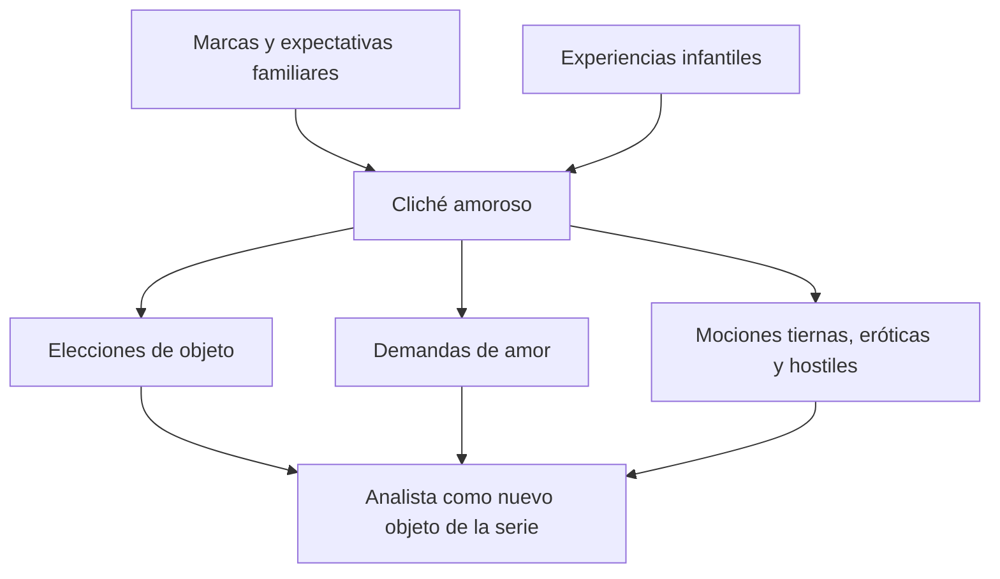
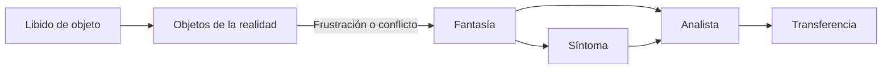
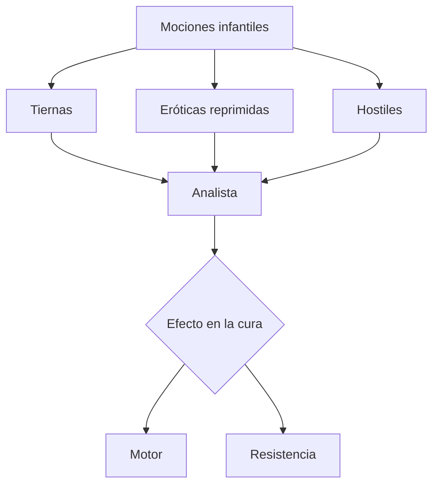
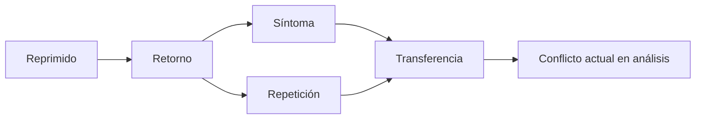

# La dinámica de la transferencia

## El conflicto entra en el análisis

La transferencia no es un accidente interpersonal que a veces interfiere con una cura. Aparece necesariamente cuando una persona inicia un análisis, porque las modalidades infantiles de amar, esperar, rivalizar y defenderse no permanecen como recuerdos inertes: buscan actualizarse en vínculos presentes.

> **Tesis central.** La \concept{transferencia} inserta al analista en una serie psíquica previa y vuelve actual el conflicto que sostenía la neurosis.

Esta tesis enlaza técnica y metapsicología. Lo reprimido retorna no sólo como síntoma o recuerdo deformado, sino también como una manera de relacionarse con el analista.

## El cliché

Freud llama \concept{cliché} a una especificidad de la vida amorosa: un modo relativamente estable de elegir objetos, formular demandas y buscar satisfacción.

Las notas distinguen dos fuentes:

- disposiciones o marcas anteriores al sujeto;
- influencias y experiencias infantiles.

El cliché no es una plantilla consciente. Se repite porque reúne mociones que no fueron plenamente tramitadas y condiciones infantiles de satisfacción.

## Las “disposiciones innatas” no son un programa biológico simple

La lectura de la cátedra amplía la idea de disposición. Incluye el lugar en el que un sujeto fue esperado antes de nacer: nombre, expectativas, pérdidas familiares y proyectos depositados sobre él.

Esas marcas no determinan mecánicamente una biografía, pero forman parte de la serie en la que se inscriben elecciones e identificaciones posteriores.

El concepto enlaza transferencia y narcisismo: aquello que los otros esperaron del niño participa en sus ideales y en las condiciones bajo las cuales buscará ser amado.

## Libido y objeto

La transferencia supone libido disponible para investir objetos. Freud había distinguido libido yoica y libido de objeto; ahora esa economía permite explicar por qué el analista puede convertirse en un objeto particular.

El analista no es investido por sus cualidades personales aisladas. Es incluido en una configuración anterior y recibe mociones dirigidas a objetos infantiles.

> **Distinción decisiva.** La transferencia no se explica por “cómo es” el analista, aunque su posición tenga efectos. Se produce porque el dispositivo ofrece un lugar donde el cliché puede actualizarse.

## Transferencia fuera y dentro del análisis

Las transferencias existen en la vida cotidiana: maestros, médicos, parejas y autoridades pueden ser incluidos en series anteriores. Lo específico del análisis no es crear el fenómeno, sino aislarlo y utilizarlo como campo de trabajo.

| Fuera del análisis | Dentro del análisis |
|---|---|
| La repetición se vive principalmente como realidad del vínculo | Puede reconocerse como actualización de una serie |
| El otro responde desde su propio lugar | El analista sostiene abstinencia y atención flotante |
| El conflicto puede repetirse sin elaboración | La repetición puede convertirse en material analítico |

## Tres vertientes

La cátedra organiza las mociones transferenciales en tres vertientes:

| Vertiente | Estado frecuente | Función |
|---|---|---|
| \concept{Transferencia positiva tierna} | Consciente | Confianza e interés que sostienen el trabajo. |
| \concept{Transferencia positiva erótica} | Reprimida o actuada | Demanda de amor; puede detener asociaciones. |
| \concept{Transferencia negativa} | Hostilidad | Oposición, desafío o rechazo; puede operar como resistencia. |

“Positiva” no significa siempre favorable a la cura. La transferencia erótica es positiva por su tonalidad amorosa, pero puede convertirse en uno de los principales obstáculos.

## Raíz edípica de las mociones

Las notas señalan que las mociones amorosas y hostiles poseen una organización infantil y edípica. Aunque el complejo de Edipo todavía no sea el tema central de este parcial, permite nombrar la coexistencia de amor, rivalidad y prohibición.

El analista recibe esa ambivalencia:

## Neurosis de transferencia y neurosis narcisistas

La posibilidad de investir al analista distingue las \concept{neurosis de transferencia} de las llamadas \concept{neurosis narcisistas}.

En histeria, fobia y neurosis obsesiva, la libido puede desplazarse hacia el analista. En paranoia, esquizofrenia y melancolía, el modelo freudiano de esta época supone una retirada libidinal que dificulta ese movimiento.

> **Eje del parcial.** La diferencia no es meramente diagnóstica: explica por qué el dispositivo basado en transferencia resulta posible para ciertas neurosis y encuentra límites en otras.

## Actualizar no es reproducir idénticamente

La transferencia repite una estructura, pero no copia una escena como una grabación. El analista ocupa un lugar en la serie y el presente aporta nuevas condiciones.

La actualización puede producir algo nuevo porque la respuesta analítica no coincide con las respuestas habituales. La abstinencia interrumpe la repetición automática y permite leerla.

## Puente con el retorno de lo reprimido

La transferencia es así una forma privilegiada del retorno. Aquello que no puede recordarse se presenta como relación, afecto y acto.

## Qué conviene poder responder

Una respuesta sobre dinámica de la transferencia debería:

1. definir cliché;
2. explicar la inserción del analista en una serie previa;
3. articular libido, objeto, fantasía y síntoma;
4. distinguir las tres vertientes transferenciales;
5. explicar por qué el fenómeno no es exclusivo del análisis;
6. relacionarlo con retorno y repetición;
7. incluir la diferencia entre neurosis de transferencia y narcisistas.

