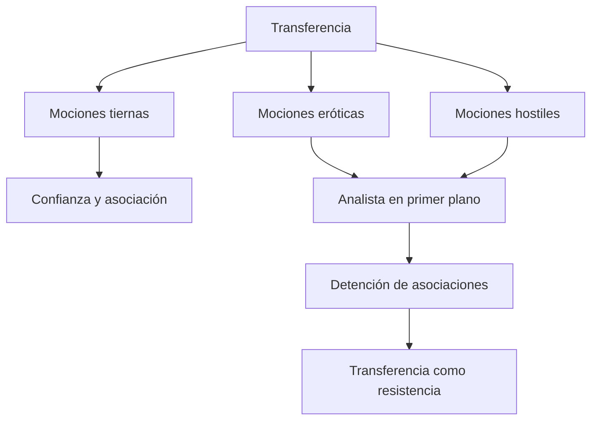
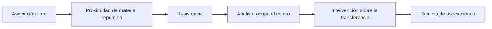
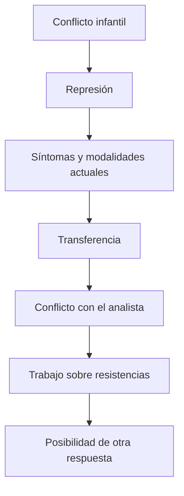

# Transferencia: motor, obstáculo y resistencia

## La paradoja técnica

Sin transferencia no hay análisis: la confianza y el interés permiten hablar, asociar y aceptar intervenciones. Pero cuando mociones eróticas u hostiles colocan al analista en primer plano, la asociación puede detenerse.

> **Fórmula de la cátedra.** La \concept{transferencia} es *motor y obstáculo* de la cura.

No se trata de dos transferencias diferentes. El mismo fenómeno que sostiene el trabajo puede convertirse en resistencia.

## ¿Cuándo se vuelve resistencia?

La transferencia no es resistencia en todo momento. Se convierte en ella cuando interrumpe la regla fundamental y reemplaza el trabajo asociativo por una actuación dirigida al analista.

Una declaración de amor, una decepción intensa o el desafío a una intervención pueden parecer plenamente referidos al presente. El análisis pregunta qué repetición se actualiza allí.

## Cierre del inconsciente

Las notas describen una secuencia clínica:

1. las asociaciones avanzan;
2. aparece una detención;
3. surge la persona del analista como contenido dominante;
4. al interpretar la transferencia, pueden reiniciarse las asociaciones.

La transferencia sale al paso de la asociación porque ofrece una vía para actuar lo que se vuelve difícil de decir.

## Resistencia como relación entre fuerzas

La \concept{resistencia} no es falta de voluntad ni desobediencia consciente. Es el modo en que las fuerzas que sostuvieron la represión reaparecen dentro del tratamiento.

> **Articulación metapsicológica.** La resistencia clínica es un indicio actual de la fuerza que mantiene una representación reprimida.

Cuanto más se aproxima el trabajo a un núcleo conflictivo, mayor puede ser la resistencia. Por eso su aparición no significa necesariamente que el análisis vaya mal: señala un punto de eficacia.

## La regla fundamental

La \concept{asociación libre} exige decir lo que aparece sin seleccionar según importancia, coherencia o vergüenza. La censura cotidiana tiende a descartar precisamente los elementos que podrían conducir hacia enlaces inconscientes.

“No se me ocurre nada” no es ausencia de material. Puede ser una formación producida por resistencia. También pueden funcionar como resistencia:

- elegir temas previamente preparados;
- omitir algo por considerarlo irrelevante;
- hablar sólo del analista;
- convertir la sesión en debate intelectual;
- actuar en lugar de asociar.

## Atención flotante

La contrapartida del analista es la \concept{atención flotante}: escuchar sin privilegiar de antemano un elemento según expectativas teóricas o personales.

| Paciente | Analista |
|---|---|
| Asociación libre | Atención flotante |
| Suspende selección consciente | Suspende selección consciente |
| Dice incluso lo incómodo o trivial | Escucha enlaces sin imponer una jerarquía previa |

Ambas reglas intentan reducir el dominio de la censura consciente para permitir que aparezcan conexiones inesperadas.

## ¿Cuándo intervenir?

*Sobre la iniciación del tratamiento* advierte contra interpretaciones prematuras. Comunicar un contenido antes de que exista transferencia suficiente puede producir rechazo intelectual o aumentar resistencia.

> **Regla técnica de trabajo.** El analista interviene sobre la transferencia cuando esta se vuelve resistencia y bloquea la asociación.

Esto no significa esperar pasivamente. Implica reconocer el momento en que la intervención puede entrar en un proceso ya desplegado por el paciente.

## Conflicto actual

Una neurosis relatada sólo como pasado no puede ser trabajada plenamente. El conflicto debe volverse actual en el análisis.

La actualidad transferencial no borra la historia. La vuelve operante y accesible en una situación donde puede recibir una respuesta distinta.

## Discernir y actuar

Las notas organizan una lucha dentro del análisis:

| Discernir | Actuar o repetir |
|---|---|
| Poner en palabras | Poner en escena |
| Hacer enlaces | Descargar en la relación |
| Reconocer la repetición | Vivirla como presente literal |

El objetivo no es eliminar toda actuación antes de que ocurra. La repetición aporta el material que luego podrá discernirse.

## Motor y obstáculo no se cancelan

Podría parecer que la solución consiste en conservar sólo la transferencia tierna y eliminar las vertientes conflictivas. Pero las mociones eróticas y hostiles son precisamente aquello que debe trabajarse.

> **Paradoja de la cura.** Lo que obstaculiza la asociación constituye, al mismo tiempo, el material necesario para transformar la neurosis.

La resistencia no es exterior al análisis; es una condición de su trabajo.

## Qué conviene poder responder

Una respuesta sobre transferencia y resistencia debería:

1. explicar la fórmula motor/obstáculo;
2. precisar cuándo la transferencia se vuelve resistencia;
3. describir la detención de asociaciones;
4. relacionar resistencia clínica y represión;
5. desarrollar asociación libre y atención flotante;
6. justificar el momento de intervención;
7. mostrar por qué el conflicto debe actualizarse.

