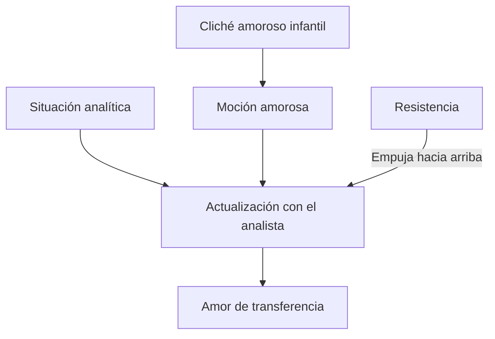
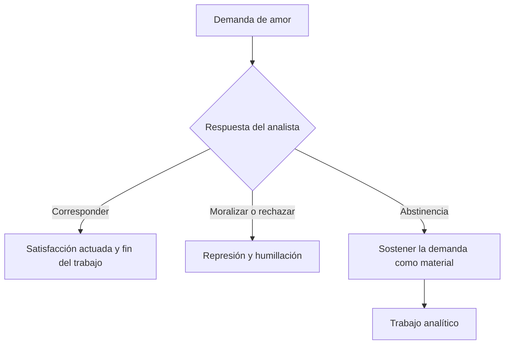
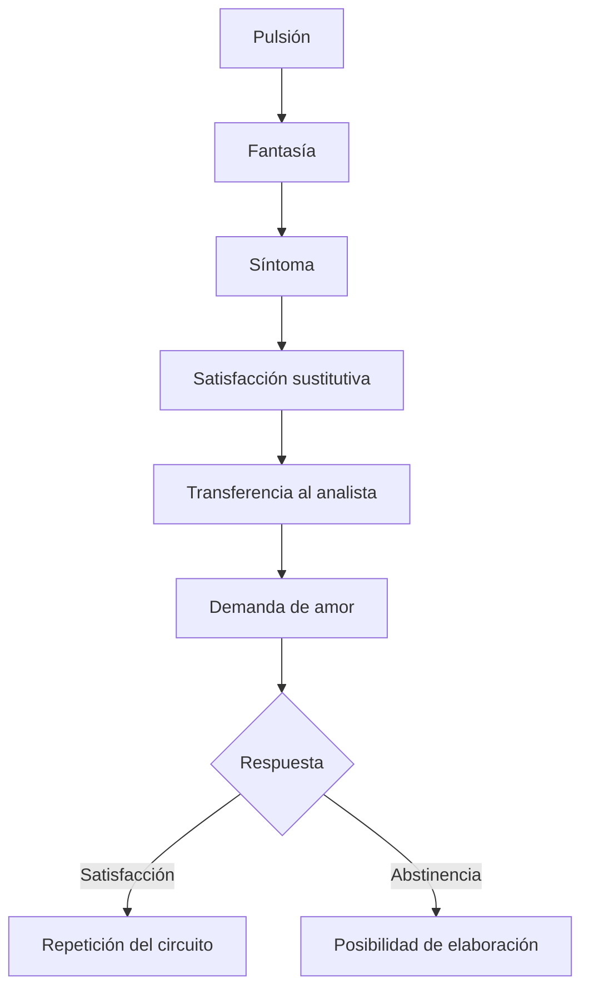

# Amor de transferencia y abstinencia

## El problema

Una paciente declara estar enamorada del analista y exige correspondencia. ¿Se trata de un amor falso producido artificialmente por el dispositivo? ¿Debe el analista rechazarlo, corresponderlo o interpretarlo?

*Puntualizaciones sobre el amor de transferencia* responde desplazando la pregunta moral hacia una pregunta técnica.

> **Tesis de Freud.** El \concept{amor de transferencia} es genuino como cualquier otro enamoramiento y, al mismo tiempo, posee condiciones singulares de producción dentro del análisis.

## ¿Es genuino?

Freud ofrece dos argumentos principales.

### La resistencia no crea el amor

La resistencia utiliza y empuja hacia arriba una moción amorosa disponible, pero no la produce desde la nada. El amor pertenece al cliché y a las condiciones infantiles de elección.

### Todo amor repite

Que el amor transfiera modelos infantiles no lo vuelve menos auténtico. Los enamoramientos fuera del análisis también reeditan condiciones tempranas.

> **Distinción decisiva.** Transferencial no significa falso. Significa que el amor se actualiza bajo condiciones que permiten reconocer su estructura repetitiva.

## Tres singularidades

La cátedra destaca:

1. está provocado por la situación analítica y su escucha atenta;
2. es empujado hacia arriba y utilizado por la resistencia;
3. carece de miramiento por la realidad objetiva.

La falta de miramiento aparece en su intensidad, urgencia y exigencia de satisfacción. La realidad concreta de quién es el analista pesa menos que el lugar que ocupa en la serie.

## El dispositivo ofrece algo excepcional

La escucha analítica suspende respuestas habituales. El paciente encuentra una atención que no exige reciprocidad inmediata, consejo, juicio ni intercambio simétrico.

Esa situación puede reactivar demandas infantiles de amor y exclusividad. El analista parece ofrecer aquello largamente buscado, aunque su función no sea satisfacer la demanda.

## Dos respuestas que fracasan

### Corresponder

Responder amorosamente satisface la demanda en el plano acostumbrado y abandona la posición analítica. La repetición se consuma en lugar de volverse interpretable.

### Sofocar o moralizar

Rechazar el amor como impropio humilla al paciente, refuerza la represión y pierde un material central. El análisis no busca imponer renuncia moral.

## Abstinencia

La \concept{abstinencia} no equivale a indiferencia, crueldad ni ausencia de afecto. Consiste en no ofrecer a la pulsión la satisfacción sustitutiva habitual que busca en el dispositivo.

> **Definición de trabajo.** La abstinencia sostiene la tensión necesaria para que la demanda pueda desplegarse, asociarse e interpretarse sin ser satisfecha ni sofocada por el analista.

El analista debe reconocer dónde la pulsión busca satisfacción dentro del análisis. Si responde desde su narcisismo o deseo personal, deja de utilizar la transferencia como campo de trabajo.

## Asociación libre y demanda de amor

El amor se vuelve resistencia cuando reemplaza el decir por una exigencia dirigida al analista.

La intervención no declara que el amor “no es real”. Muestra cómo aparece en un momento preciso y qué función cumple en el tratamiento.

## Ética y asimetría

La abstinencia protege una asimetría necesaria. El paciente habla desde su padecimiento y el analista ocupa una función, no el lugar de una pareja potencial.

Esta asimetría no autoriza poder arbitrario. Impone mayor responsabilidad al analista:

- no explotar la dependencia;
- no buscar gratificación narcisista;
- no imponer ideales personales;
- tratar sus propias respuestas fuera de la relación con el paciente;
- conservar el objetivo analítico.

## Amor y satisfacción sustitutiva

El arco conceptual del parcial reaparece completo:

El amor de transferencia no es un apéndice romántico de la técnica. Es una modalidad concreta mediante la cual la pulsión intenta encontrar satisfacción en el análisis.

## Qué conviene poder responder

Una respuesta sobre amor de transferencia debería:

1. explicar por qué es genuino;
2. desarrollar sus tres singularidades;
3. distinguir producción, actualización y uso por la resistencia;
4. explicar por qué corresponder y moralizar fracasan;
5. definir abstinencia;
6. relacionar amor, demanda, satisfacción y asociación libre;
7. justificar la responsabilidad ética del analista.

