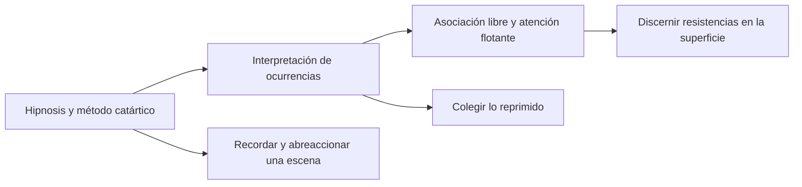
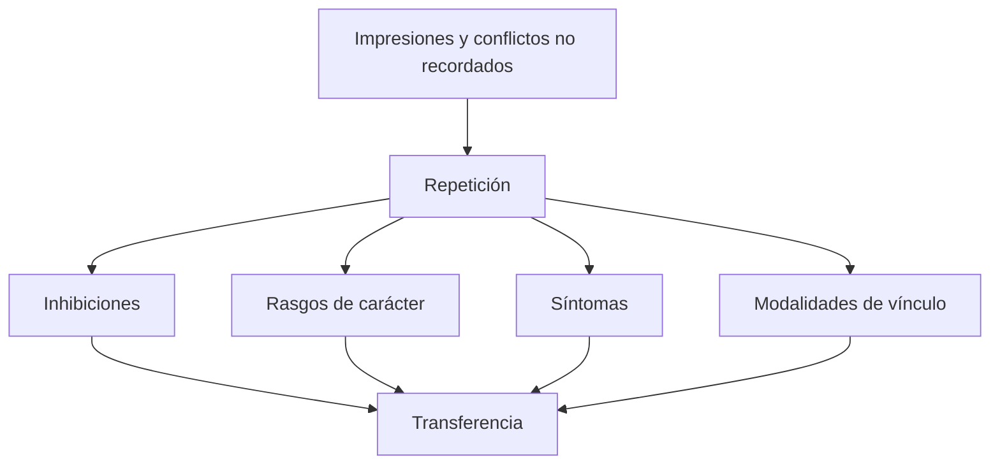
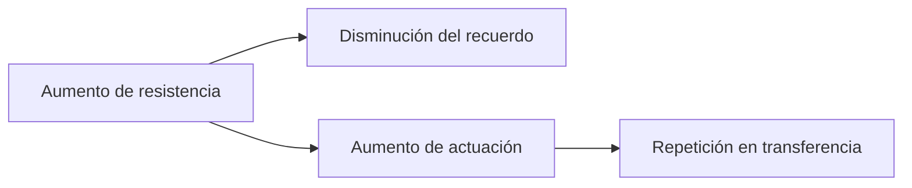
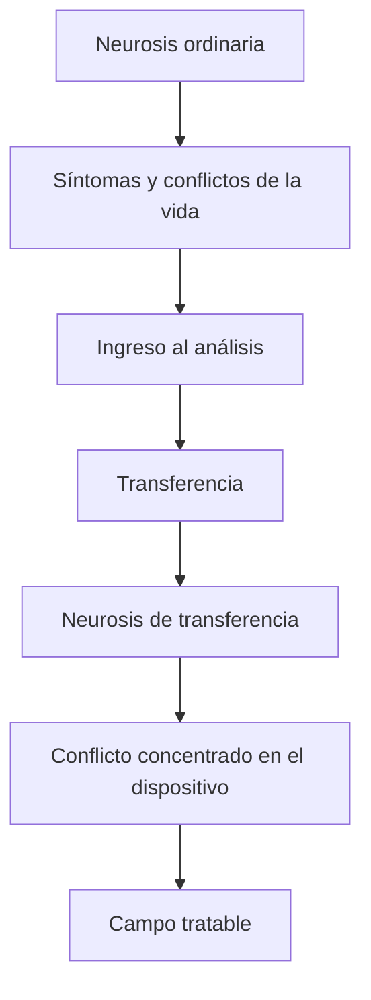
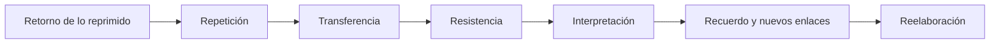

# Recordar, repetir y reelaborar

## La técnica cambia con la teoría

Freud no conserva un único método mientras agrega conceptos. La técnica se transforma según cambia su concepción del inconsciente, la defensa y la transferencia.

*Recordar, repetir y reelaborar* reconstruye tres momentos.

## Primer momento: método catártico

Mediante hipnosis se buscaba recuperar la escena de formación del síntoma y descargar el afecto estrangulado. El pasado aparecía como escena separada del presente.

La meta era recordar y abreaccionar. El terapeuta dirigía la búsqueda hacia un punto causal específico.

## Segundo momento: interpretación

Al abandonar la hipnosis, Freud intenta colegir lo reprimido a partir de sueños, ocurrencias y síntomas. La interpretación gana centralidad, aunque el foco continúa puesto en encontrar aquello oculto detrás del síntoma.

## Tercer momento: superficie psíquica

La técnica madura deja de buscar directamente un núcleo profundo. Trabaja con lo que el paciente presenta en la superficie: silencios, interrupciones, ocurrencias, resistencias y transferencia.

> **Tesis técnica.** Lo reprimido no está simplemente escondido en una profundidad espacial; aparece deformado en el texto y en los actos actuales del paciente.

La tarea inmediata consiste en discernir resistencias y restablecer la asociación.

## Dos formas de olvido

Las notas distinguen:

### Bloqueo de un recuerdo

Existe una representación que podría retornar si se vence la resistencia.

### Amnesia infantil

No hay un recuerdo narrativo disponible que alguna vez haya sido consciente de la misma manera. Permanecen impresiones y marcas corporales.

| Olvido corriente | Amnesia infantil |
|---|---|
| Recuerdo bloqueado | Ausencia de texto autobiográfico original |
| Puede recuperarse como representación | Retorna principalmente en acto y repetición |
| La resistencia impide acceso | El cuerpo conserva impresiones sin relato |

Los \concept{recuerdos encubridores} ofrecen escenas posteriores que representan y ocultan esas marcas tempranas.

## Repetir es recordar en acto

El paciente no recuerda todo lo olvidado y reprimido: lo actúa. Freud utiliza *agieren* para nombrar esta puesta en acto.

> **Fórmula de Freud trabajada por la cátedra.** El analizante repite sin saber que repite; la \concept{repetición} es una manera de recordar en acto.

El cuerpo y la relación recuerdan allí donde falta un texto autobiográfico.

## El análisis comienza con una repetición

Desde el inicio, el paciente inserta al analista en su cliché. Esa repetición inaugura la transferencia y hace posible el análisis.

No debe esperarse primero un recuerdo completo para después trabajar la relación. La relación misma es el modo en que algo se presenta.

> **Paradoja técnica.** La repetición es un límite al recuerdo y, al mismo tiempo, la vía mediante la cual aquello no recordable ingresa en el tratamiento.

## Compulsión de repetición y resistencia

En este texto, repetir y recordar se encuentran en relación inversa: cuanto mayor es la resistencia, más ampliamente el recordar es sustituido por actuar.

La tarea no consiste en prohibir toda repetición. El analista ofrece un campo delimitado donde pueda desplegarse y ser reconducida al trabajo.

## Neurosis de transferencia

La \concept{neurosis de transferencia} es una nueva versión de la neurosis ordinaria organizada alrededor del analista.

No es una enfermedad agregada artificialmente. Concentra las mociones de la neurosis en una relación actual y modificable.

## Una palestra para la repetición

Freud concede a la repetición un ámbito donde desplegarse bajo condiciones analíticas. La transferencia funciona como una zona intermedia entre enfermedad y vida.

Allí el paciente puede repetir, pero la respuesta del analista no confirma automáticamente el circuito habitual. La abstinencia y la interpretación introducen diferencia.

## Recordar

Recordar no significa recuperar una película fiel del pasado. Implica producir palabras, enlaces y temporalidad para aquello que se actualizaba sin reconocimiento.

El objetivo es llenar lagunas en sentido dinámico: vencer resistencias que impiden establecer conexiones.

## Reelaborar

Comunicar una resistencia no la elimina. El paciente necesita tiempo para conocerla, encontrarla en distintas formas y atravesar su fuerza repetidamente.

> **Definición de trabajo.** La \concept{reelaboración} es el trabajo sostenido mediante el cual el analizante atraviesa las resistencias que persisten aun después de haber sido discernidas.

La reelaboración distingue al análisis de métodos sugestivos que buscan una modificación rápida por autoridad del terapeuta.

## Nadie puede ser ajusticiado *in absentia*

La fórmula indica que un conflicto no puede resolverse cuando sus fuerzas no están presentes. Debe actualizarse en transferencia para ser trabajado.

> **Fórmula de Freud.** Nadie puede ser ajusticiado *in absentia* o *in effigie*.

El análisis necesita que amor, hostilidad, defensa y satisfacción se vuelvan actuales. Sólo entonces puede producirse una respuesta diferente.

## El arco completo

La secuencia no ocurre una sola vez. El análisis vuelve sobre ella mientras aparezcan nuevas formas de la resistencia.

## Qué conviene poder responder

Una respuesta sobre recordar, repetir y reelaborar debería:

1. reconstruir los tres momentos de la técnica;
2. distinguir olvido y amnesia infantil;
3. definir repetición como recuerdo en acto;
4. explicar su relación con resistencia;
5. definir neurosis de transferencia;
6. justificar por qué se permite desplegar la repetición;
7. diferenciar reconocimiento intelectual y reelaboración;
8. articular técnica con retorno de lo reprimido.

