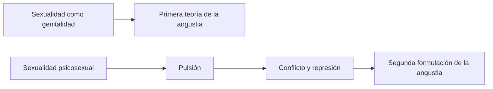
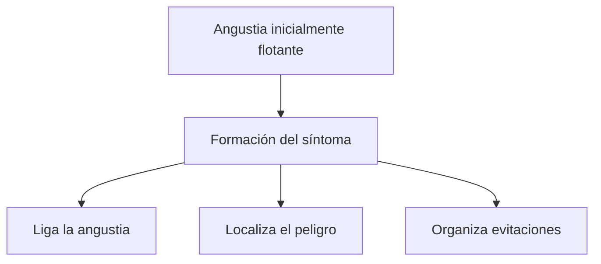
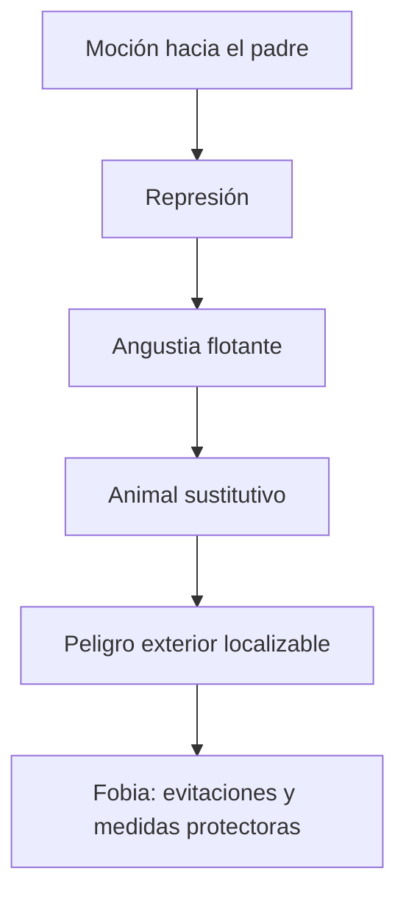
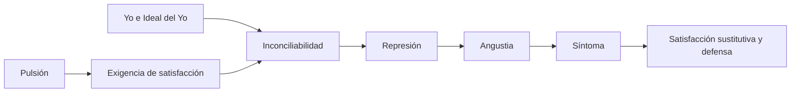

# Angustia y serie de las neurosis de transferencia

## El viraje que organiza el tema

La angustia no conserva el mismo lugar a lo largo de la obra de Freud. La clase de seminarios del 20/08 organiza el pasaje entre dos formulaciones: primero, una cantidad sexual somática que queda fuera del conflicto psíquico; luego, un afecto producido en la articulación entre pulsión y represión.

El cambio depende de la ampliación del concepto de sexualidad. Cuando la sexualidad deja de equivaler a genitalidad y se piensa mediante la \concept{Pulsión}, Freud debe revisar también la etiología del síntoma, el aparato psíquico y la angustia.

## Primera teoría: neurosis actuales

En la primera formulación, la angustia se vincula con una alteración de la sexualidad *actual*:

- no interviene un conflicto psíquico;
- no opera la \concept{Represión};
- la cantidad no está representada psíquicamente;
- la excitación permanece en el plano somático;
- por eso no resulta abordable mediante interpretación psicoanalítica.

La palabra *actual* no significa simplemente “contemporánea”. Señala que la etiología se busca en el ejercicio presente de la sexualidad y no en una historia infantil representada y reprimida.

> **Distinción decisiva.** La neurosis de angustia de la primera teoría no debe confundirse con la angustia que participa en las neurosis de transferencia.

## Por qué *Sobre el psicoanálisis silvestre* importa

El médico del texto reduce la sexualidad a descarga genital. Frente a la angustia de una mujer separada, le prescribe tres alternativas: volver con su marido, tomar un amante o satisfacerse por sí misma.

Su error no consiste solamente en dar un consejo inconveniente. Desconoce la sexualidad ampliada, el conflicto, la pulsión y la represión. Supone que una necesidad sexual consciente puede resolverse mediante una descarga directa.

> **Lectura de la cátedra.** Llamar “sexual” a una etiología no basta para producir una explicación psicoanalítica. Es necesario reconstruir la sexualidad como pulsional, conflictiva y sometida a represión.

## El punto de enlace con *La represión*

La \concept{agencia representante de la pulsión} permite distinguir dos componentes:

1. la representación;
2. el \concept{monto de afecto} o factor cuantitativo.

La represión rechaza la representación y deja abierto el problema del monto de afecto. Este puede:

1. ser sofocado;
2. aparecer cualitativamente coloreado como otro afecto;
3. mudarse en angustia.

La angustia conserva manifestaciones corporales —palpitaciones, sudoración, agitación, dificultad para respirar— y carece de un texto consciente que explique por sí mismo esa intensidad. Lo nuevo es su origen metapsicológico: ahora puede ser efecto del conflicto y la represión.

> **Fórmula de la cátedra.** La angustia es el afecto por excelencia: el modo en que el factor cuantitativo de la función pulsional afecta al yo.

## La serie común

La clase fija como núcleo de la segunda formulación esta serie:

> **Serie central de examen.** Exigencia pulsional → represión → angustia → síntoma.

Es una serie común a las \concept{neurosis de transferencia}. La forma concreta varía entre histeria de conversión, histeria de angustia y neurosis obsesiva, pero se conserva la articulación entre exigencia pulsional, defensa, afecto y formación sintomática.

La fórmula corresponde a esta etapa de la teoría freudiana: **la represión produce angustia**. No debe mezclarse sin aclaración con la reformulación posterior de *Inhibición, síntoma y angustia*, donde la relación causal será revisada.

## Qué hace el síntoma con la angustia

El síntoma no es sólo el último elemento cronológico de la serie. Cumple una función defensiva: intenta **ligar, acotar o evitar** el desarrollo de angustia.

Esto no elimina la satisfacción pulsional. Como formación de compromiso, el síntoma articula simultáneamente defensa, padecimiento y satisfacción sustitutiva.

## Conferencia 25: angustia realista

Freud define la \concept{angustia realista} como una reacción frente a un peligro exterior. Puede conducir a la huida, pero cuando su desarrollo es limitado funciona como:

- señal;
- apronte;
- anticipación o preparación para la acción.

Si la angustia desborda esa función preparatoria, puede perturbar la acción más adecuada. Por eso conviene distinguir el apronte angustiado del desarrollo pleno de angustia.

## El factor común: angustia ante un peligro

La pregunta de la Conferencia 25 es qué comparten la angustia realista y la neurótica. La respuesta trabajada por la cátedra es que ambas son **angustia ante algo** y ponen en juego un intento de huida.

| Tipo de angustia | Peligro | Huida |
|---|---|---|
| Realista | Peligro exterior | Acción motriz posible. |
| Neurótica | Exigencia pulsional interna | No existe huida directa; intervienen represión y síntoma. |

La dificultad neurótica consiste en que el peligro proviene del interior. El sujeto no puede alejarse motrizmente de su propia exigencia pulsional. La defensa procura entonces tratarla como si fuera exterior.

## La fobia hace visible la serie

En la histeria de angustia, una moción dirigida al padre —libidinosa en el caso del caballo, agresiva en el ejemplo de los lobos trabajado en clase— entra en conflicto y es reprimida. La angustia resultante se liga a un objeto exterior.

La fobia obtiene una ventaja defensiva: transforma un peligro pulsional interno, del cual no se puede huir, en un peligro exterior frente al cual pueden organizarse distancias, prohibiciones y recorridos de evitación.

> **Función de la fobia.** El animal no constituye el peligro originario. Permite representar, localizar y evitar exteriormente una exigencia pulsional interna.

## Angustia, yo y conflicto

En esta formulación, el conflicto se establece entre el yo y la exigencia pulsional. La angustia afecta al yo, y el síntoma participa de su respuesta defensiva.

Este punto enlaza el arco completo del parcial:

La angustia pasa así de quedar fuera del alcance analítico a ocupar un lugar central en las neurosis de transferencia.

## Qué conviene poder responder

Una respuesta sólida debería poder:

1. distinguir las dos formulaciones de la angustia;
2. explicar por qué la introducción de la pulsión obliga a Freud a revisar el problema;
3. diferenciar neurosis de angustia y angustia en las neurosis de transferencia;
4. reconstruir representación y monto de afecto;
5. desarrollar la serie exigencia pulsional → represión → angustia → síntoma;
6. explicar cómo el síntoma liga, acota o evita la angustia;
7. señalar el factor común entre angustia realista y neurótica;
8. utilizar la fobia para mostrar la transformación de un peligro interno en uno exterior.

## Respuesta concentrada posible

> En la primera teoría, Freud explica la angustia como una excitación sexual actual que no alcanza representación psíquica: es somática, no intervienen conflicto ni represión y por eso queda fuera del tratamiento analítico. Con la teoría de la pulsión y la sexualidad psicosexual, la angustia ingresa en la metapsicología. La represión separa la representación del monto de afecto, y este último puede mudarse en angustia. La serie común de las neurosis de transferencia es exigencia pulsional, represión, angustia y síntoma. El síntoma intenta ligar o evitar esa angustia. La Conferencia 25 permite agregar que tanto la angustia realista como la neurótica son reacciones ante un peligro; en la neurótica, el peligro es una exigencia pulsional interna. La fobia permite tratar ese peligro interno como uno exterior y organizar medidas de evitación.
