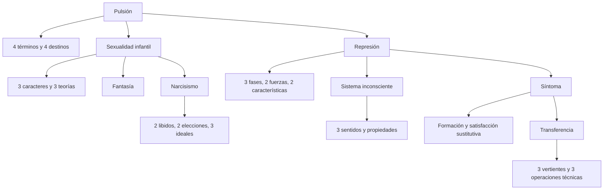

# Inventario de distinciones, series y enumeraciones

## Cómo usar este capítulo

Esta es una referencia rápida. Sirve para recuperar una enumeración olvidada, pero no reemplaza el desarrollo conceptual.

Cada lista indica:

- sus elementos;
- a qué concepto pertenece;
- una advertencia contra confusiones frecuentes.

## Dos ternas que suelen mezclarse

### Sentidos de “inconsciente”

1. \concept{Descriptivo}: algo no está actualmente en la conciencia.
2. \concept{Dinámico}: algo permanece inconsciente por efecto de la represión.
3. \concept{Sistemático}: el sistema Icc posee legalidad propia.

### Perspectivas metapsicológicas

1. \concept{Tópica}: relaciones entre sistemas o localidades psíquicas.
2. \concept{Dinámica}: conflicto y cooperación entre fuerzas.
3. \concept{Económica}: distribución, aumento y desplazamiento de investiduras.

> **No confundir.** “Descriptivo, dinámico y sistemático” son sentidos de *inconsciente*. “Tópico, dinámico y económico” son perspectivas de la *metapsicología*.

## Pulsión

### Cuatro términos

1. \concept{Fuente}: proceso excitatorio en un órgano o zona.
2. \concept{Esfuerzo}: empuje constante y exigencia de trabajo.
3. \concept{Objeto}: medio contingente por el cual alcanza la meta.
4. \concept{Meta}: satisfacción.

### Cuatro destinos

1. Trastorno hacia lo contrario.
2. Vuelta hacia la propia persona.
3. \concept{Represión}.
4. \concept{Sublimación}.

### Pulsión frente a estímulo

| Pulsión | Estímulo exterior |
|---|---|
| Origen interno | Origen externo |
| Fuerza constante | Fuerza de choque |
| No admite huida | Admite huida |
| Exige trabajo psíquico | Puede cancelarse mediante una acción |

## Sexualidad infantil

### Tres características de sus exteriorizaciones

1. \concept{Apuntalamiento}.
2. \concept{Autoerotismo}.
3. \concept{Imperio de una zona erógena}.

### Desarrollo en dos tiempos

1. Afloramiento sexual infantil.
2. Período de latencia.
3. Reactivación puberal.

Se habla de *dos tiempos* porque infancia y pubertad son los dos momentos de organización separados por la latencia.

### Tres diques

1. Asco.
2. Vergüenza.
3. Moral.

### Tres teorías sexuales infantiles

1. \concept{Premisa universal del pene}.
2. \concept{Teoría de la cloaca}.
3. \concept{Concepción sádica del coito}.

## De la teoría traumática a la sexualidad pulsional

### Dos factores

1. *Accidental*: adulto seductor y acontecimiento exterior.
2. *Constitutivo*: sexualidad infantil pulsional universal.

### Lo que cae y lo que permanece

| Cae | Permanece reformulado |
|---|---|
| Adulto seductor como condición universal | Importancia de la infancia |
| Escena real uniforme | Eficacia de realidad psíquica y fantasía |
| Sexualidad como accidente patógeno | Etiología sexual pulsional |

## Fantasía

### Tres tiempos del fantaseo

1. Ocasión presente.
2. Deseo o vivencia infantil pasada.
3. Figuración futura de la satisfacción.

### Dos recursos del creador literario

1. Variación y encubrimiento del carácter egoísta de la fantasía.
2. Prima de placer formal o estética.

### Dos destinos generales

1. Fantasía consciente o sueño diurno.
2. Fantasía reprimida e inconsciente, capaz de participar en el síntoma.

## Narcisismo

### Serie lógica

1. \concept{Autoerotismo}.
2. Nuevo acto psíquico e \concept{identificación}.
3. \concept{Narcisismo}.
4. \concept{Elección de objeto}.

### Dos localizaciones de la libido

1. \concept{Libido yoica}.
2. \concept{Libido de objeto}.

### Dos formas de narcisismo

1. \concept{Narcisismo primario}: anterioridad lógica, no observable directamente.
2. \concept{Narcisismo secundario}: retirada al yo de libido antes dirigida a objetos.

### Dos tipos de elección de objeto

1. \concept{Anaclítica} o por apuntalamiento.
2. \concept{Narcisista}.

### Cuatro modalidades narcisistas

Se ama:

1. lo que uno es;
2. lo que uno fue;
3. lo que uno quisiera ser;
4. a la persona que fue parte de uno.

### Tres términos del ideal

1. \concept{Yo actual}: organización presente.
2. \concept{Yo ideal}: imagen de completitud narcisista.
3. \concept{Ideal del Yo}: instancia que mide y orienta.

### Dos grandes grupos clínicos

1. \concept{Neurosis de transferencia}: histeria, fobia y neurosis obsesiva.
2. \concept{Neurosis narcisistas}: paranoia, esquizofrenia y melancolía en esta clasificación.

## Represión

### Condición

El displacer producido en otro sistema debe ser mayor que el placer de la satisfacción pulsional.

### Tres fases

1. \concept{Represión primordial}: fijación del representante.
2. \concept{Represión propiamente dicha}: recae sobre retoños.
3. \concept{Retorno de lo reprimido}: expresión deformada.

### Dos fuerzas

1. \concept{Atracción} desde lo reprimido primordial.
2. \concept{Repulsión} desde el Precc-Cc.

### Dos características

1. \concept{Individual}: cada retoño recibe un destino diferente.
2. \concept{Móvil}: requiere gasto continuo.

### Dos componentes de la agencia representante

1. Representación.
2. \concept{Monto de afecto}.

### Tres destinos del monto de afecto

1. Sofocación.
2. Aparición como afecto cualitativamente coloreado.
3. Mudanza en angustia.

### Mecanismos por fase

| Represión primordial | Represión secundaria |
|---|---|
| Contrainvestidura | Sustracción de investidura Precc |
| No hay investidura Precc previa que retirar | Puede sumar contrainvestidura |

## Sistema inconsciente

### Propiedades

1. Ausencia de contradicción y negación.
2. \concept{Proceso primario}.
3. Atemporalidad.
4. Sustitución de realidad exterior por realidad psíquica.
5. Predominio del principio de placer.

### Dos operaciones del proceso primario

1. \concept{Condensación}.
2. \concept{Desplazamiento}.

### Dos componentes de la representación de objeto consciente

1. \concept{Representación-cosa}.
2. \concept{Representación-palabra}.

### Dos hipótesis sobre el pasaje Icc → Precc

1. Tópica o doble inscripción.
2. Funcional o cambio de estado.

## Síntoma

### Dos dimensiones

1. \concept{Formación sustitutiva}: sustitución representativa.
2. \concept{Satisfacción sustitutiva}: satisfacción pulsional indirecta.

### Dos resultados simultáneos

1. Padecimiento consciente.
2. Satisfacción inconsciente.

### Dos condiciones destacadas para el síntoma histérico

1. \concept{Solicitación somática}: vía corporal disponible.
2. \concept{Fantasía}: determinación psíquica y organización de satisfacción.

Esta última pareja queda pendiente de cotejo con la transcripción completa de la clase de repaso.

## Transferencia

### Tres vertientes

1. Positiva tierna.
2. Positiva erótica.
3. Negativa u hostil.

### Dos funciones

1. Motor.
2. Obstáculo o resistencia.

### Tres singularidades del amor de transferencia

1. Provocado por la situación analítica.
2. Empujado hacia arriba por la resistencia.
3. Sin miramiento por la realidad objetiva.

### Dos reglas correlativas

1. Paciente: \concept{asociación libre}.
2. Analista: \concept{atención flotante}.

### Tres operaciones técnicas

1. \concept{Recordar}.
2. \concept{Repetir}.
3. \concept{Reelaborar}.

### Tres momentos históricos de la técnica

1. Hipnosis y método catártico.
2. Interpretación de ocurrencias para colegir lo reprimido.
3. Asociación libre y trabajo sobre resistencias en la superficie psíquica.

## Angustia — inventario provisional

### Dos grandes formulaciones vistas hasta ahora

1. Primera teoría: excitación sexual somática no ligada, sin represión.
2. Articulación metapsicológica: destino del monto de afecto bajo represión.

### Dos dimensiones que persisten

1. Manifestación somática.
2. Falta de representación o texto consciente.

El inventario deberá completarse después de trabajar íntegramente la Conferencia 25 y las clases finales.

## Mapa ultrarrápido

